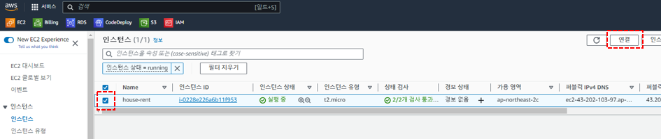
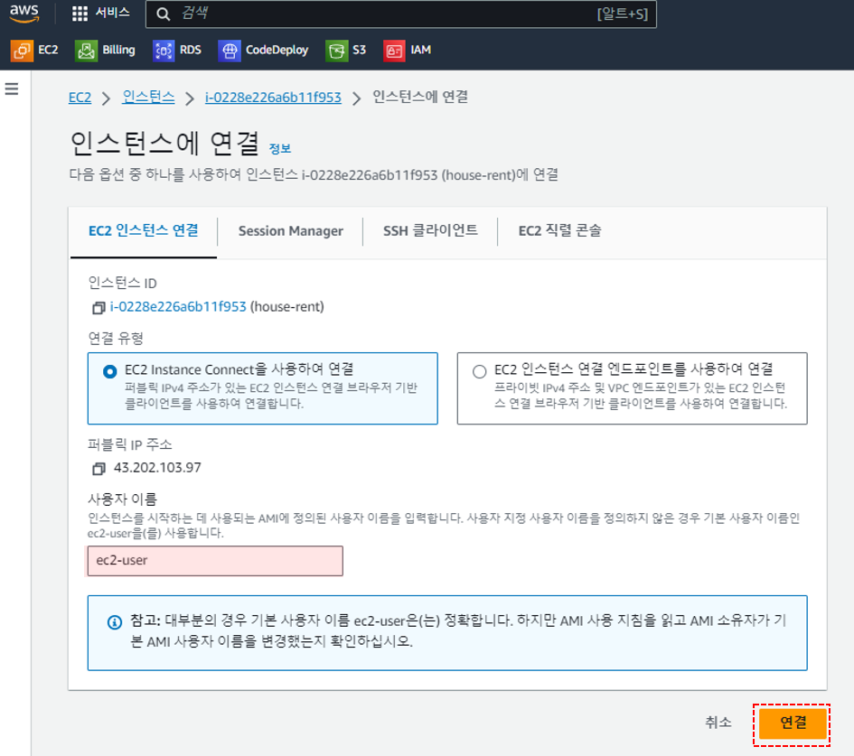
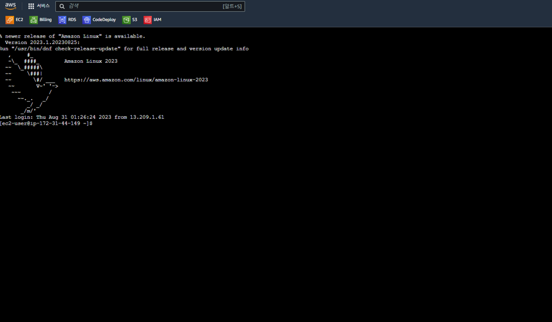
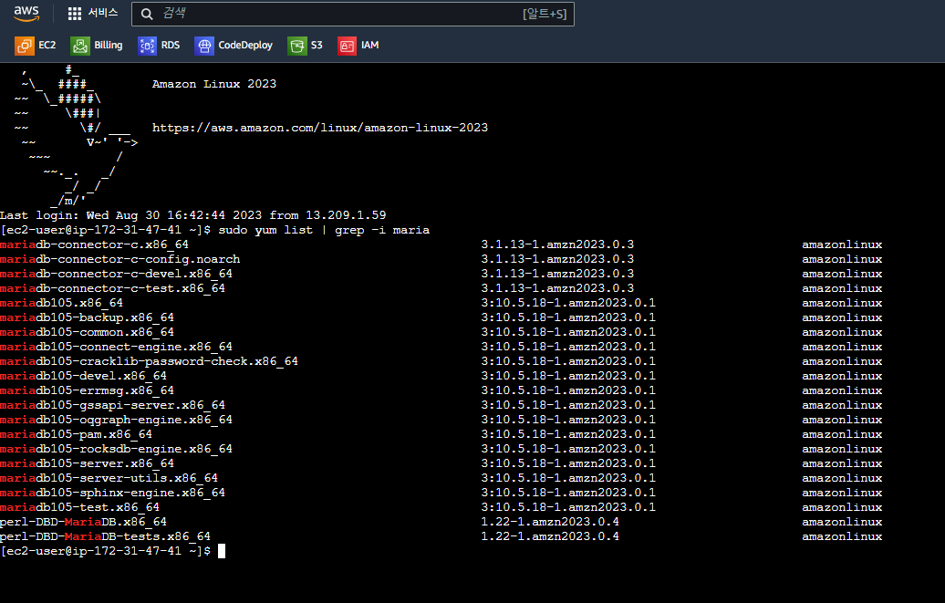
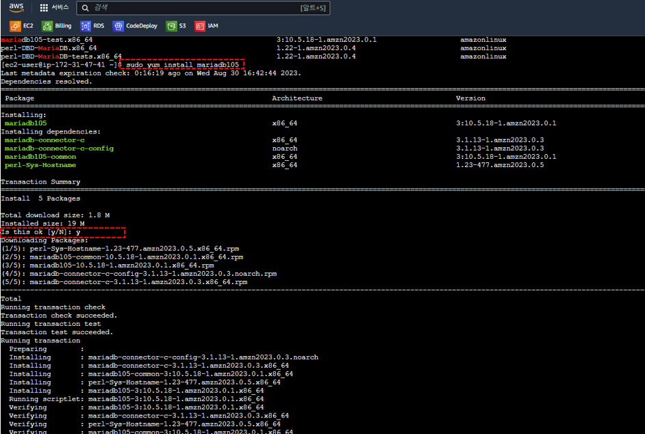
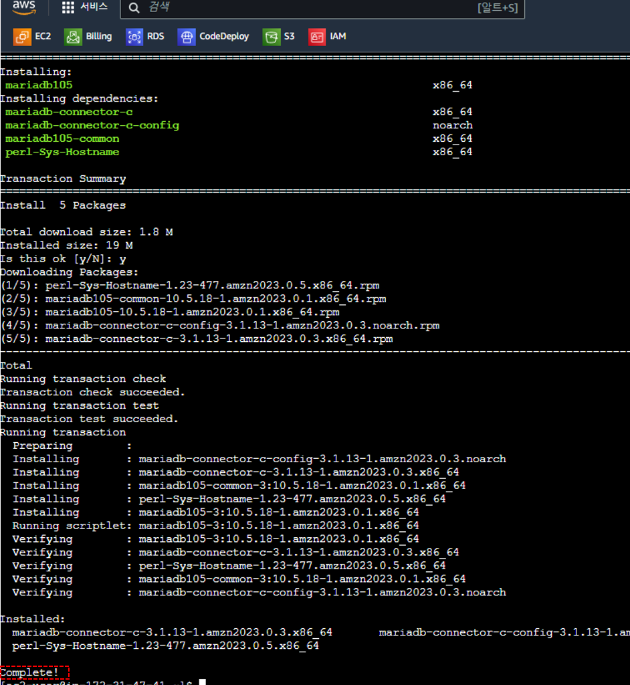
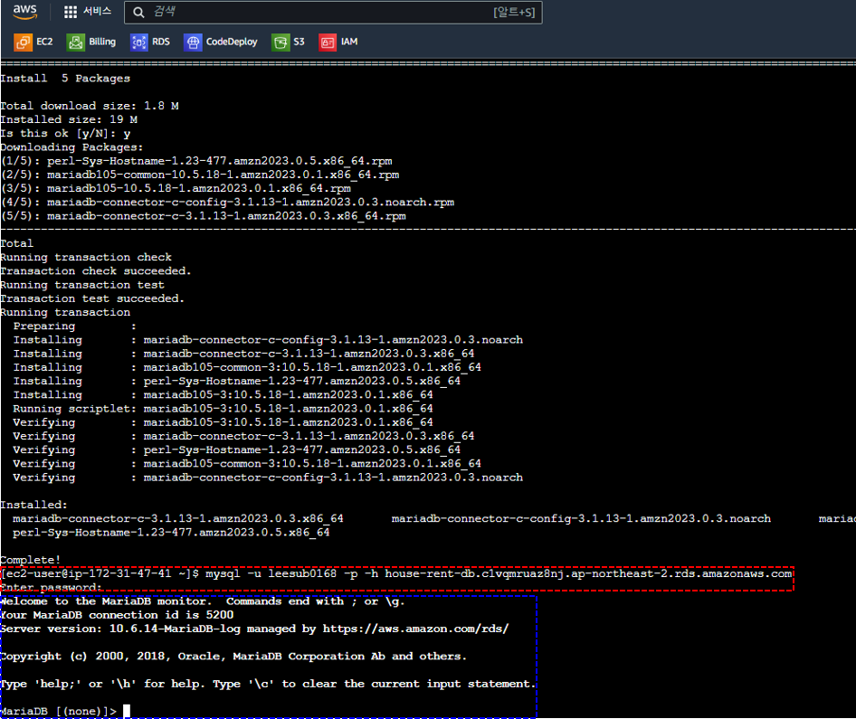

# EC2 - RDS 접근확인
: EC2와 RDS를 각각 생성하고 나면, EC2에서 RDS에 정상적으로 접근이 되고있는지 확인하는 과정이 필요합니다.

## EC2에서 RDS 접근 가능한지 확인하는 방법
※ 우선 EC2의 인스턴스에 접속해야 합니다. 인스턴스에 접속하는 방법은 크게 두가지가 있는데, AWS EC2 콘솔에서 접속하는 방법과 본인의 컴퓨터에서 접속하여 창을 띄우는 방법이 있습니다. 
   각자의 컴퓨터에서 접속하는 방법은 OS에 따라 차이가 있는데 Mac인 경우 터미널에서 접속하시면 되고, Window의 경우 따로 putty라는 프로그램을 설치하여야합니다. 
   최근에는 AWS EC2 콘솔에서 인스턴스에 접속할 수 있도록 지원해주기 때문에 이 방법을 사용하도록 하겠습니다.

1. EC2 콘솔에서 접속할 인스턴스를 체크하고 `연결` 버튼을 클릭합니다.

2. 해당 화면에서 `EC2 Instance Connect을 사용하여 연결`을 선택하시고 사용자 이름을 따로 설정하신 경우, 설정하신 사용자 이름을 입력하시고 따로 설정하지 않은 경우는 기본값인 `ec2-user`로 사용하시면 됩니다. 
   입력을 완료하신 후 `연결` 버튼을 클릭합니다.

3. 연결을 클릭한 후 다음과 같은 터미널 화면이 뜨면 정상적으로 인스턴스에 접속된 것입니다.

4. 터미널에서 `sudo yum list | grep -i maria`를 입력하여 설치 가능한 mariadb 리스트를 확인합니다.

5. 설치가능한 버전을 확인하시고 `sudo yum install mariadb` + `버전`을 입력하시면 설치할 패키지 리스트 명이 표시되며 `y`를 눌러 설치를 진행합니다.

6. `Complete!`가 뜨면 설치가 완료된 것입니다.

7. 설치가 정상적으로 완료되면 `mysql -u RDS유저명 -p -h RDS엔드포인트 주소`를 입력하시고, 패스워드 입력 안내가 뜨면 비밀번호를 입력합니다. 
   화면처럼 Welcome 멘트가 나온다면 RDS에 정상적으로 접근된 것입니다.

  

### References 
스프링 부트와 AWS로 혼자 구현하는 웹 서비스 - 이동욱님 
[mariadb-installation-issue](https://repost.aws/questions/QUZbE_KKvUTsGORUDoT0YMdQ/mariadb-installation-issue-in-amazon-linux-ec2-instance)
