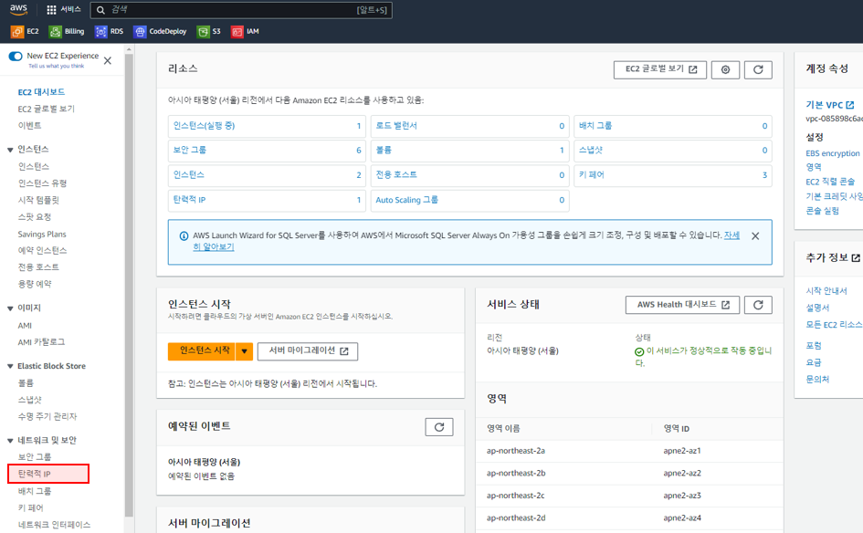
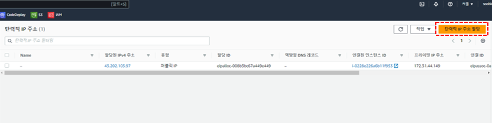
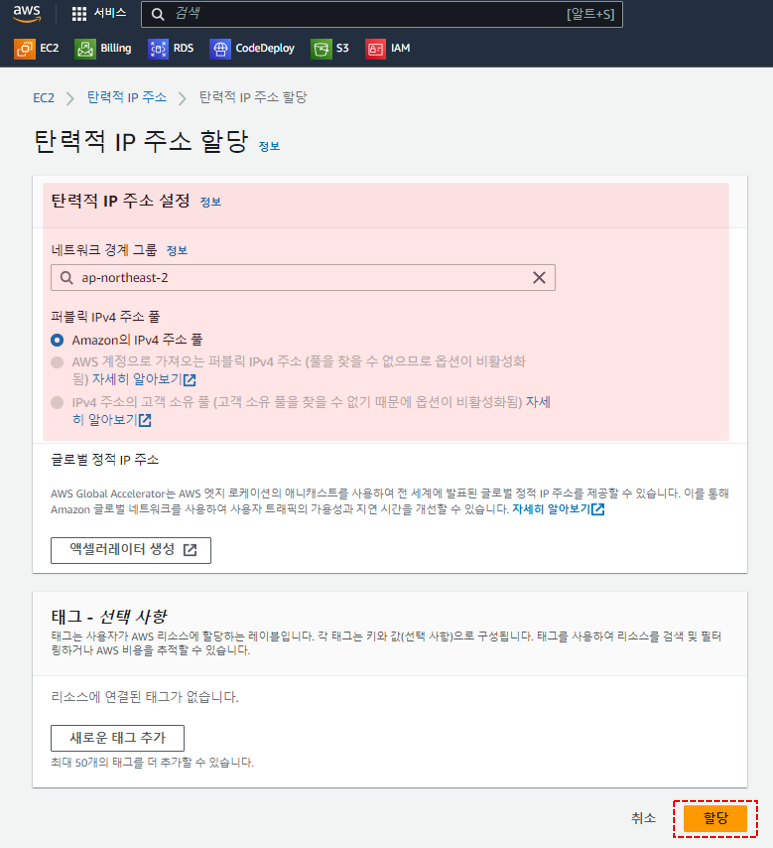
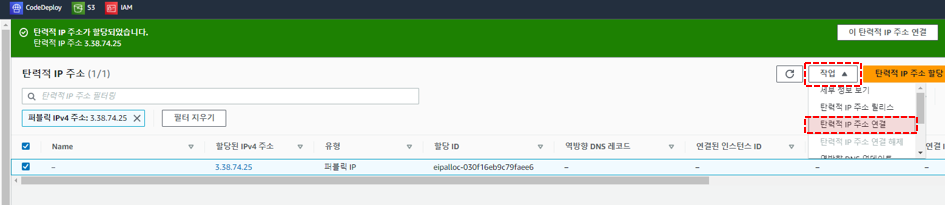
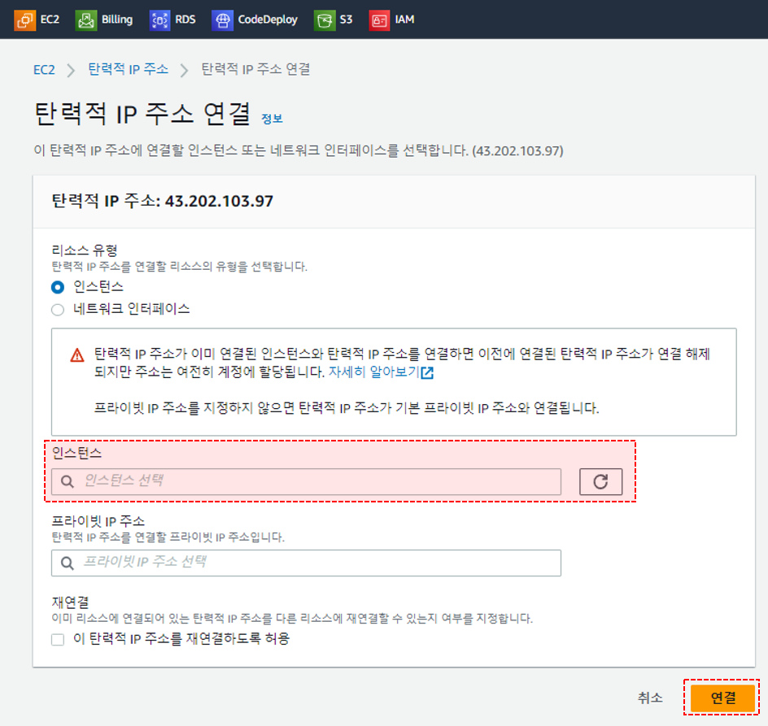
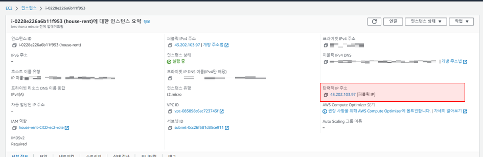

#EC2 - 탄력적 IP 할당
: 외부에서 EC2를 호출하거나 접속해야하는 경우, 고정적인 주소로 접속할 수 있도록 생성한 EC2에 고정IP(= Elastic IP, 탄력적 IP) 할당이 필요합니다.

## 탄력적 IP 할당 순서
1. EC2 콘솔 왼쪽 메뉴의 탄력적 IP를 클릭합니다.

2. 탄력적 IP 화면에서 `탄력적 IP 주소 할당`을 클릭합니다.

3. 해당 화면에서 따로 입력할 부분은 없으며, 내용을 확인한 후 `할당` 버튼을 클릭합니다.

4. 다음으로 EC2에 할당받은 IP 주소를 연결하기위해 할당 받은 IP를 체크하고, 오른쪽 상단의 `작업`버튼을 눌러 `탄력적 IP 주소 연결`을 클릭합니다.

5. 해당 화면의 `인스턴스`에서 IP를 할당하고자 하는 EC2 인스턴스를 선택하고, `연결` 버튼을 클릭합니다.

6. 연결이 완료된 후, EC2 인스턴스의 요약정보에 `탄력적 IP 주소`란에 IP가 정상적으로 연결되었는지 확인할 수 있습니다.

