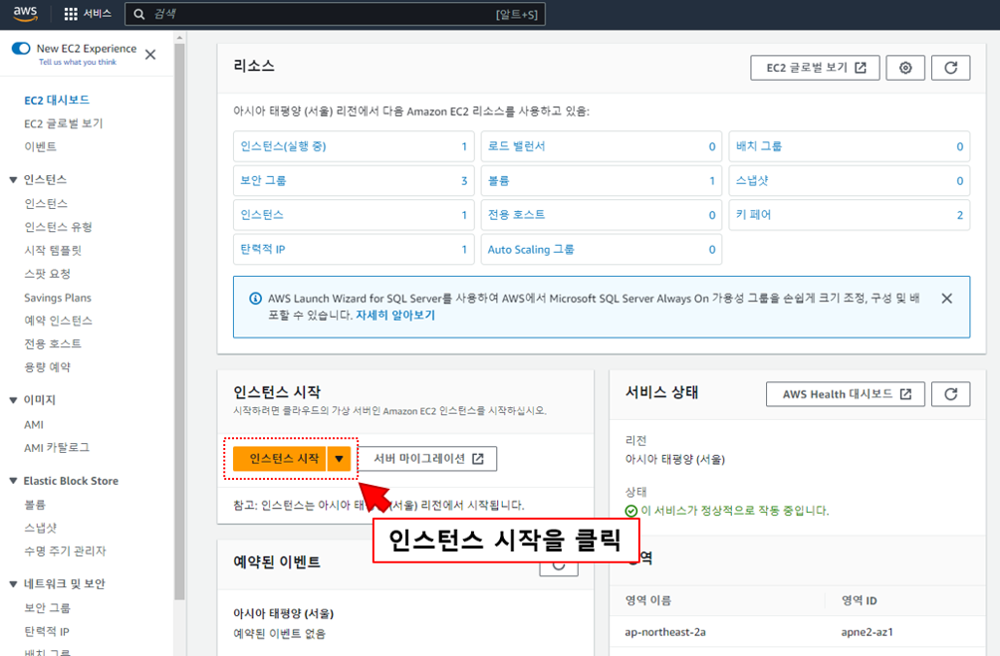
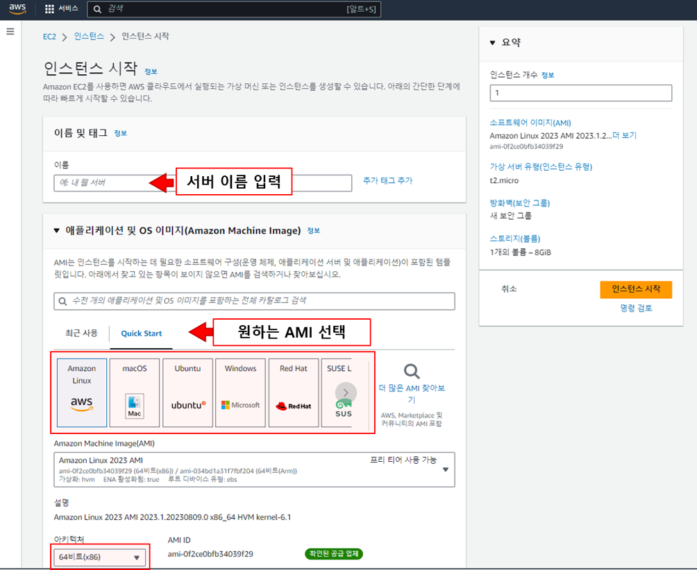
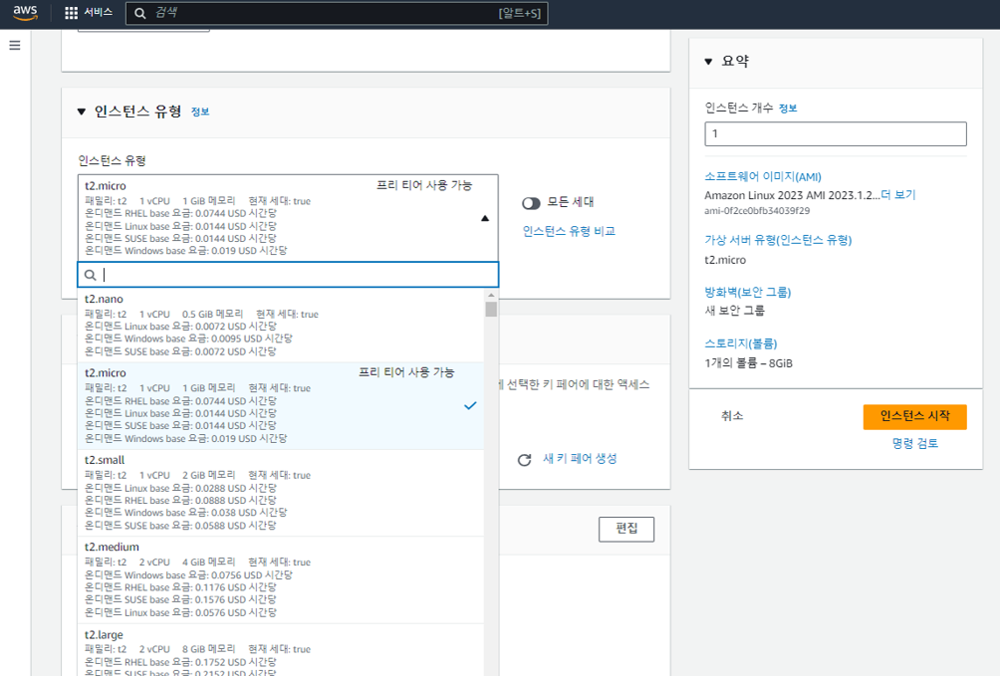
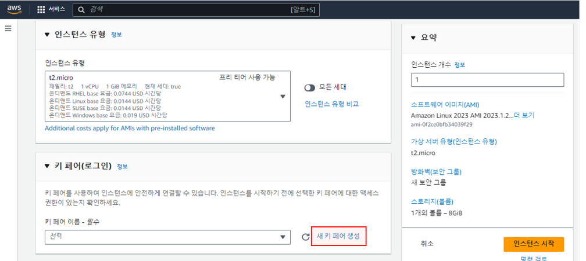
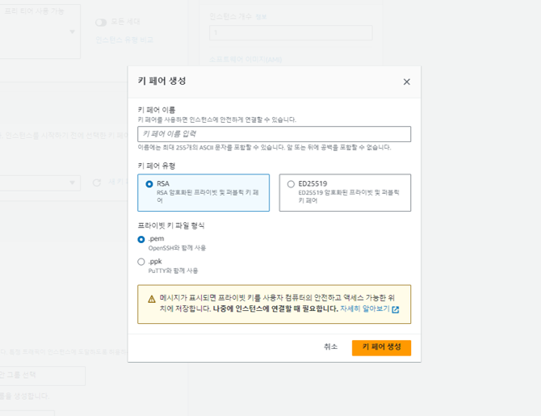
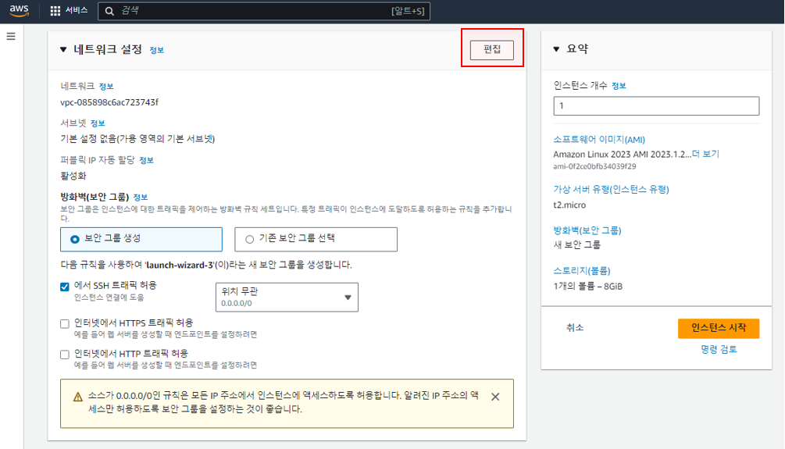
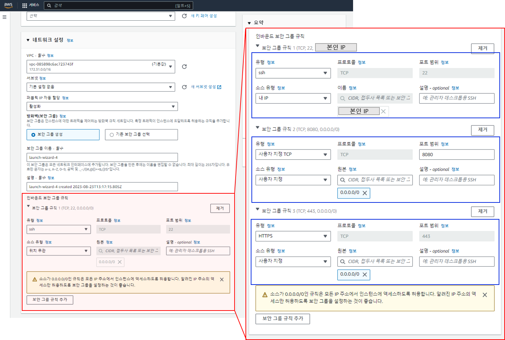
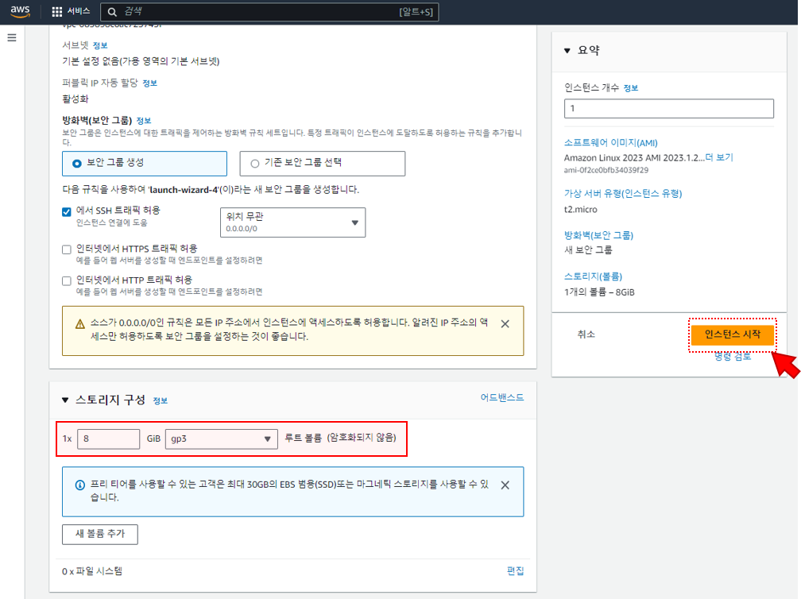
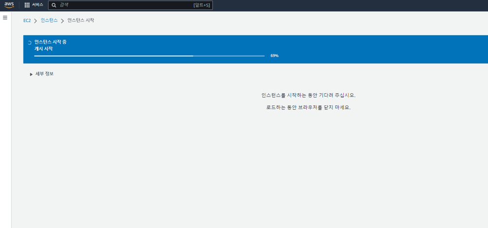
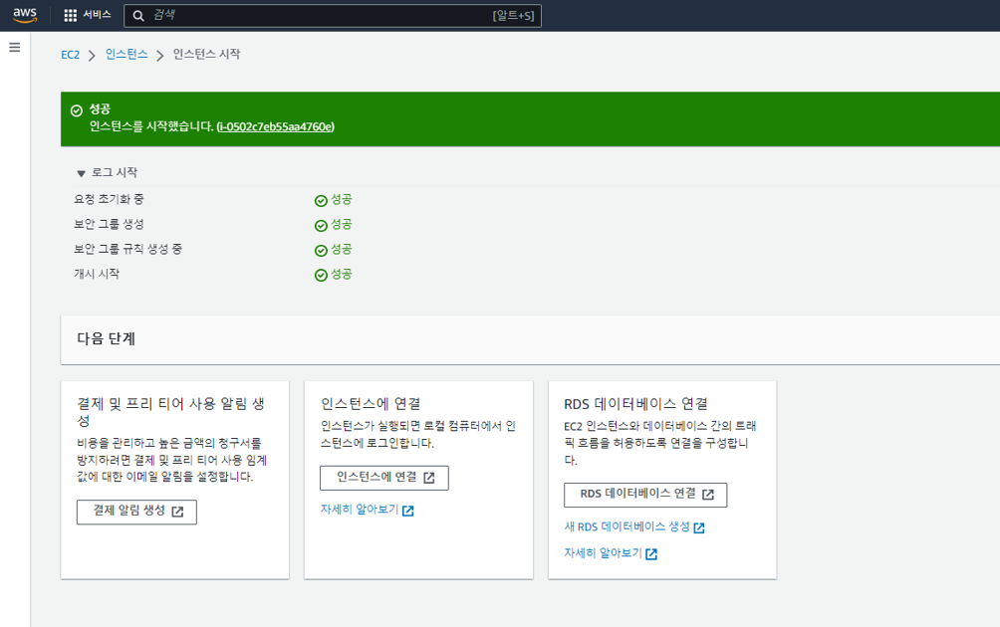

# AWS - EC2 세팅 

## EC2란?
: EC2란 Elastic Coumpute Cloud의 약자로, AWS에서 제공하는 일종의 서버 입니다. 성능과 용량을 유동적으로 선택할 수 있으며 
리눅스, 윈도우 등 운영체제부터 서버의 용량까지 사용자가 원하는 대로 선택하여 생성할 수 있습니다. 

## EC2 생성
1. AWS 서비스 가입 후, EC2 서비스를 검색 -> EC2 대시보드에 있는 인스턴스 시작을 클릭합니다.

2. 인스턴스의 이름을 원하는 이름으로 설정하고, AMI를 선택합니다. 
> AMI란 Amazon Machine Image의 약자로, EC2의 인스턴스를 시작할 때 필요한 정보를 이미지화 하여 만들어 둔 것을 말합니다.
> 즉 인스턴스를 실행할 때 어떤 운영체제를 사용할지, 운영체제의 비트는 몇비트로 설정할지 미리 템플릿화하여 만들어두고 
> 인스턴스를 실행하면 해당 설정대로 환경을 세팅하도록 하는 것입니다.

3. 인스턴스의 유형을 선택합니다. 각 유형에 따라 cpu 수, 메모리 용량등이 달라지며 요금과 시스템의 규모를 고려하여 선택하면 됩니다. 
   저의 경우 테스트용 인스턴스이므로, 프리티어로 사용가능한 t2.micro를 선택했습니다.

4. 다음으로는 키 페어를 설정해줘야 합니다. 만약 기존에 사용하는 키페어가 이미 있다면 사용하던 키페어로 세팅해도 무관하며, 키페어가 따로 없다면 새로 생성후 세팅해야합니다.

5. 새로 생성할 키페어의 이름을 입력하고, 키 페어의 암호화 유형을 선택합니다.  
키 파일 형식은 `Mac`에서 개발하시는 경우 `pem 형식`, `윈도우 환경`에서 개발하는 경우 putty를 통해 접속해야하므로 `ppk 형식`을 권장합니다.

6. 네트워크 설정의 편집을 누릅니다.

7. 보안 그룹 이름을 유의미한 이름으로 설정하고, 설명을 적습니다. 그 후 보안 그룹 규칙을 3가지 추가해야합니다.
   1. EC2에 터미널로 접속하기 위한 ssh 설정
   2. EC2에 프로젝트를 올릴 예정인 경우 프로젝트의 기본 포트도 함께 세팅해줍니다. 저의 경우 8080 포트를 쓰는 프로젝트를 올릴 예정이므로 8080 세팅 추가

8. 마지막으로 스토리지 구성까지 세팅한 후 인스턴스를 시작하면 인스턴스 생성 작업은 끝입니다. 
 참고로 프리티어로 사용가능한 스토리지는 최대 30GB이며, 범용 SSD까지만 프리티어로 사용가능합니다. 그 이외의 경우 추가 요금이 발생할 수 있습니다.

9. 인스턴스 생성 & 완료

### References
스프링 부트와 AWS로 혼자 구현하는 웹 서비스 - 이동욱님