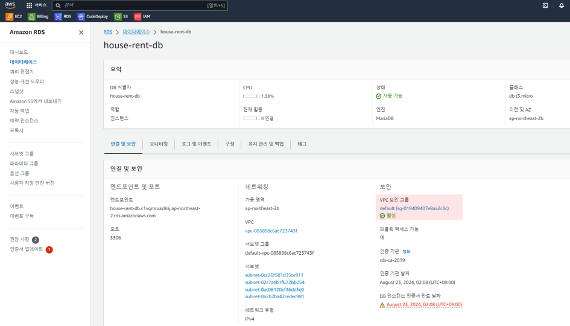
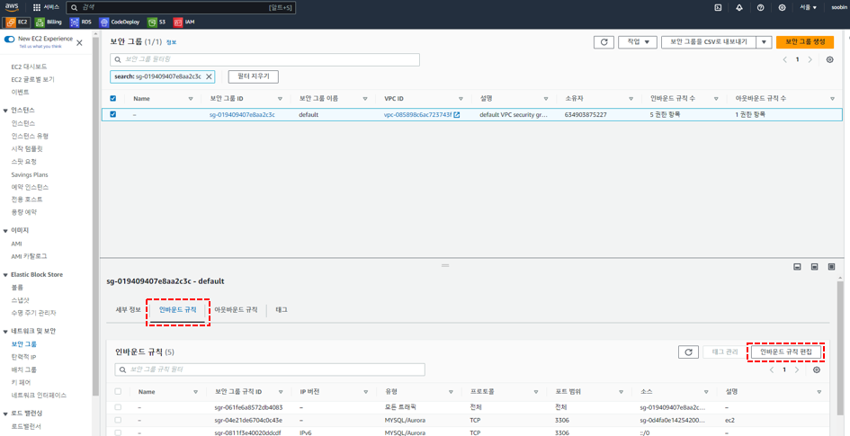
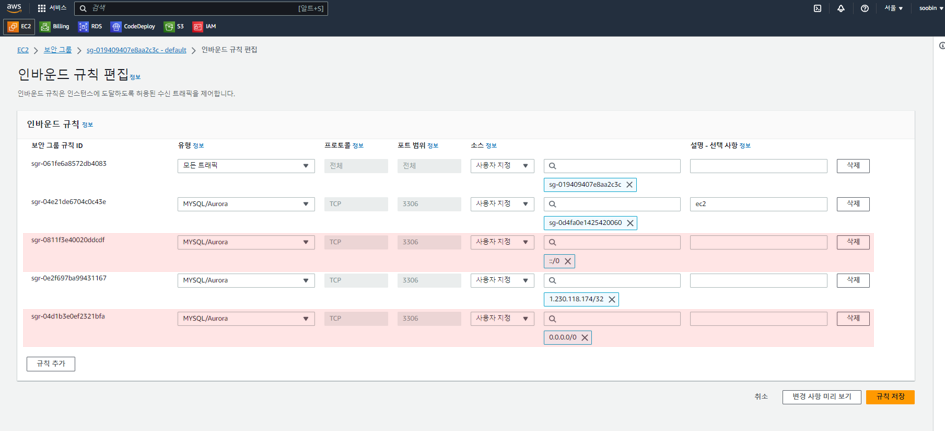
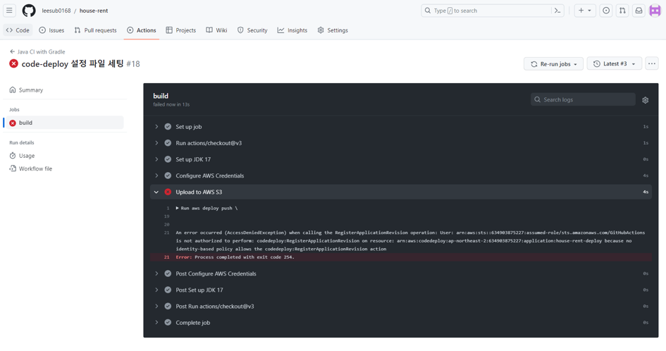
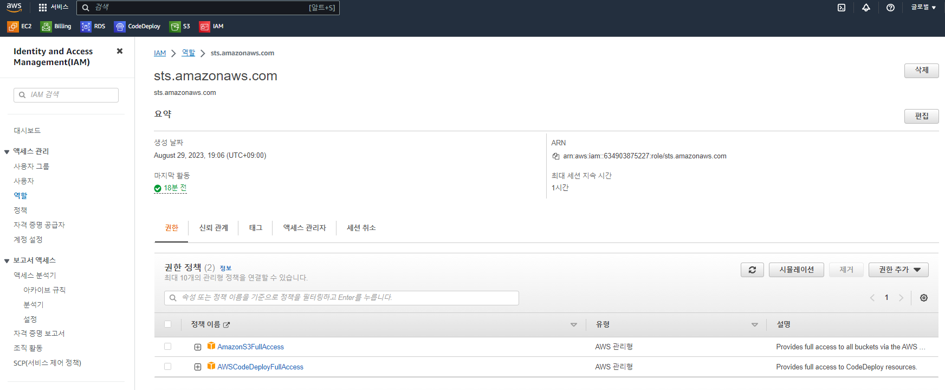

# GitHub-Actions 과 AWS CodeDeploy 구축중 발생했던 에러와 해결방법 기록 

## GitHub-Actions 실행 중 빌드에 실패하는 경우 (DB 커넥션 실패)
AWS RDS를 사용하는 경우 외부에서 접근하기 위해서는 인바운드 규칙을 설정해줘야함. GitHub-Actions 을 통해 CI/CD를 할 경우 빌드 중 테스트 수행과정에서 DB 접근시 접근이 불가하여
빌드에 실패함. 따라서 아래의 규칙을 추가한 후 빌드를 시도하면 정상적으로 빌드 완료됩니다. 

1. RDS의 보안 > 보안 그룹 선택

2. 보안 그룹의 `인바운드 > 인바운드 규칙 편집` 클릭 

3. 인바운드 규칙에 `MYSQL/Aurora > ::/0` , `MYSQL/Aurora > 0.0.0.0/0` 이 두가지 규칙을 추가한 후 규칙을 저장합니다.

## GitHub-Actions 실행 중 S3 업로드 실패 
GitHub-Actions 실행 중 권한 문제로 s3에 빌드 파일 업로드가 실패하는 현상 발생. AWS Credential에 사용된 role의 권한 세팅으로 인해 발생한 현상으로, 
`AmazonS3FullAccess`, `AWSCodeDeployFullAccess` 모두 FullAccess 권한으로 세팅해주면 정상적으로 업로드 된다.

### References