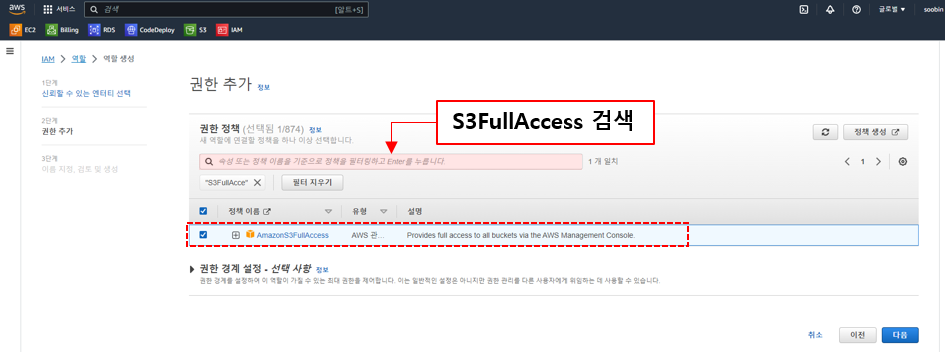
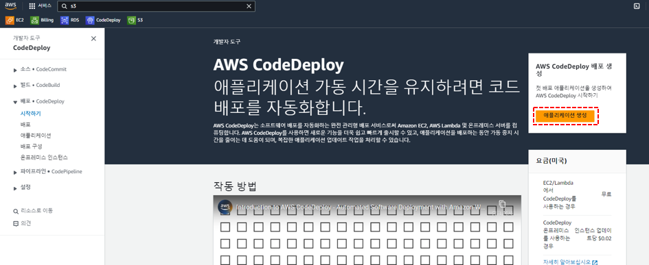
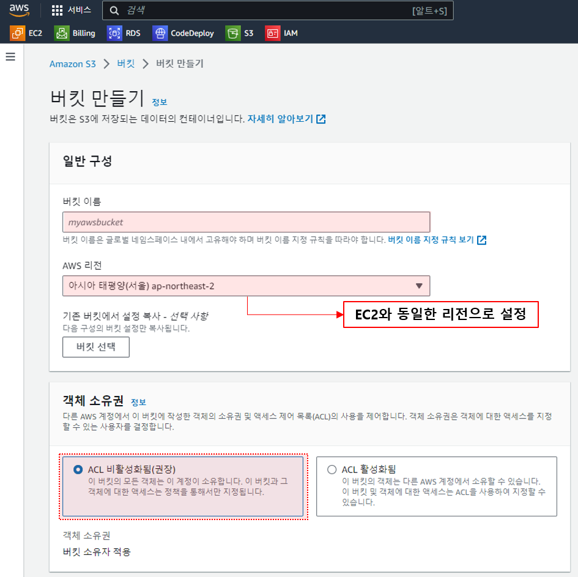
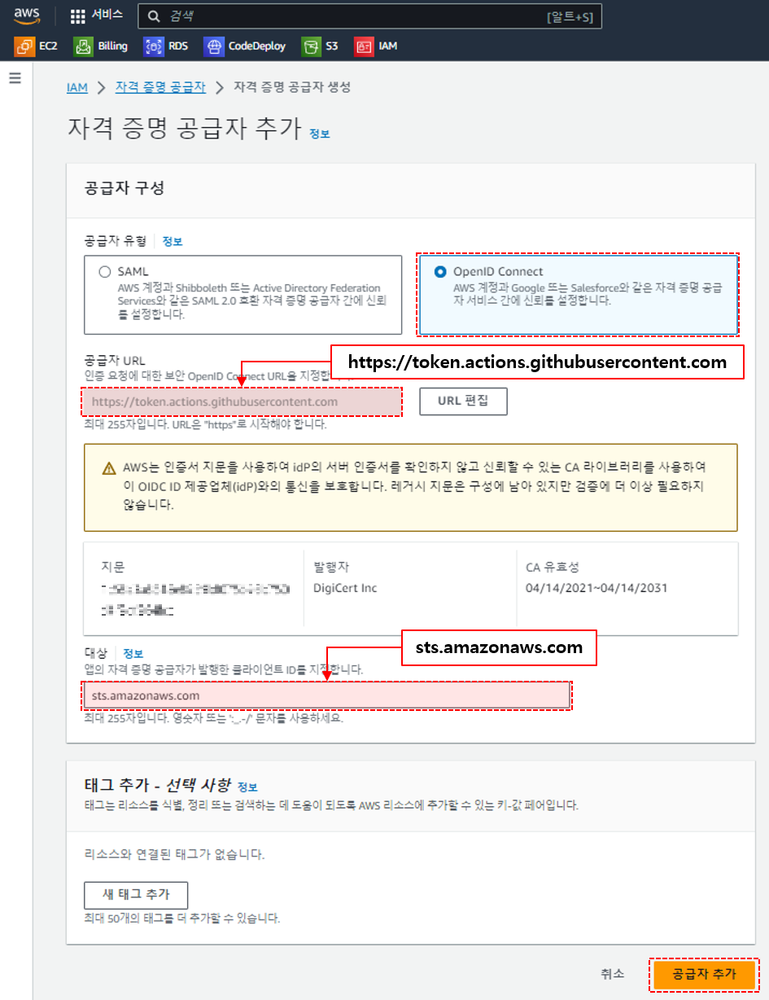

# GitHub-Actions 과 AWS CodeDeploy 를 이용한 CI/CD 구축
: GitHub-Actions과 AWS CodeDeploy를 이용하여 CI/CD 환경을 구축하기 위해서는 다음과 같은 세팅이 필요합니다. 
1. [어플리케이션이 실행될 EC2에 AWS CodeDeploy Agent 설치](#1-ec2에-aws-codedeploy-agent-설치)
2. [AWS CodeDeploy 를 위한 역할 생성](#2-aws-codedeploy-를-위한-역할-생성)
3. [EC2에서 S3에 접근할 수 있는 역할 생성 & 할당](#3-ec2에서-s3에-접근할-수-있는-역할-생성--할당)
4. [AWS CodeDeploy 생성 & 배포그룹 생성](#4-aws-codedeploy-생성--배포그룹-생성)
5. [GitHub-Actions 으로 빌드한 파일을 업로드할 AWS S3 생성](#5-github-actions-으로-빌드한-파일을-업로드할-aws-s3-생성)
6. [GitHub-Actions - AWS Credentials 을 위한 자격 증명 공급자, 역할 생성](#6-github-actions---aws-credentials-을-위한-자격-증명-공급자-역할-생성)
7. [GitHub-Actions 생성](#7-github-actions-생성)

## 1. 어플리케이션이 실행될 EC2에 AWS CodeDeploy Agent 설치 
1. EC2 터미널에 접속한 후, `sudo yum update`로 먼저 패키지를 업데이트 하고 `sudo yum install ruby` 명령어로 루비를 설치합니다.


2. `sudo yum install wget` 명령어를 실행하고, `cd /home/ec2-user`로 경로를 이동한 후, `wget https://[본인리전의 버킷명].s3.[리전-식별자].amazonaws.com/latest/install`을 입력합니다.
   리전의 버킷명과 식별자는 해당 링크에서 확인할 수 있습니다. https://docs.aws.amazon.com/ko_kr/codedeploy/latest/userguide/resource-kit.html#resource-kit-bucket-names
3. `chmod +x ./install` -> install 파일에 대한 실행 권한을 설정합니다.
4. `sudo ./install auto` -> 최신 버전의 CodeDeploy 에이전트 설치


5. `sudo service codedeploy-agent status` -> CodeDeploy 에이전트가 정상적으로 설치되어 실행 중인지 확인, 'The AWS CodeDeploy agent is running' 메시지가 뜨면 정상적으로 설치된 것입니다.


## 2. AWS CodeDeploy 를 위한 역할 생성
1. AWS 콘솔화면에서 `IAM` -> `역할` -> `역할만들기`를 클릭합니다.


2. 신뢰할 수 있는 엔티티에서 `AWS 서비스`를 선택하고, `CodeDeploy`를 검색하여 선택한 후 `다음`을 클릭합니다.


3. 세팅 된 권한을 확인하고 `다음`을 클릭합니다.


4. 의미있는 이름으로 역할 이름을 입력하고, 역할을 생성합니다.


## 3. EC2에서 S3에 접근할 수 있는 역할 생성 & 할당

1. 위에서 했던 것과 동일하게 AWS 콘솔화면에서 `IAM` -> `역할` -> `역할만들기`를 클릭합니다.


2. 이번에는 `AWS 서비스`를 선택한 후 `EC2`를 선택하여 `다음`을 클릭합니다.


3. 그리고 EC2에서 S3에 접근할 수 있도록 `AmazonS3FullAccess` 권한을 검색하여 선택한 뒤 `다음`을 클릭합니다.



4. 역할에 대한 의미있는 이름을 입력하고 역할을 생성합니다.


5. EC2 대시보드 화면으로 이동하여 역할을 부여할 EC2 인스턴스를 선택하고, `작업` -> `보안` -> `IAM 역할 수정`을 클릭합니다.


6. IAM 역할에서 위에서 추가한 역할을 선택하고 `IAM 역할 업데이트`를 클릭합니다.


7. 연결 완료 메세지가 뜨면 역할이 정상적으로 연결된 것으로 이제 EC2에서 S3에 정상적으로 접근할 수 있습니다.


## 4. AWS CodeDeploy 생성 & 배포그룹 생성 
1. AWS 서비스중 CodeDeploy를 검색하여 애플리케이션 생성을 클릭합니다.



2. 의미있는 deploy 애플리케이션 이름을 입력하고 컴퓨팅 플랫폼은 EC2/온프레미스를 선택하여 `애플리케이션 생성`을 클릭합니다.


3. 그러면 애플리케이션이 생성되었다는 메세지가 뜨는 것을 확인할 수 있습니다.


4. 다음으로는 배포를 위한 배포그룹을 생성해야 합니다. 위에서 생성한 deploy 애플리케이션으로 들어가서 `배포 그룹` -> `배포 그룹 생성`을 클릭합니다.


5. 배포 그룹 이름을 입력하고, 위에서 생성한 AWS CodeDeploy를 위한 역할을 서비스 역할에 입력합니다. 배포 방법은 `현재 위치`로 선택합니다. 


6. 환경 구성은 `Amazon EC2 인스턴스`를 클릭하고 원하는 EC2의 태그 그룹 키값을 입력합니다. 
   - EC2의 태그는 EC2 > 인스턴스 > 애플리케이션 > 태그 > 태그 관리에서 추가할 수 있습니다.


7. AWS CodeDeploy 에이전트의 최신버전 유지를 위해 14일 주기로 업데이트 되도록 설정했고, 배포 구성은 `AllAtOnce`로 설정했습니다.<br>
   저의 경우 로드 밸런싱을 하지 않는 환경이므로 `로드 밸런싱 활성화`는 체크 해제 후 `배포 그룹 생성`을 클릭하면 됩니다.
   - 배포 구성에 대한 설명은 해당 링크를 참조하시면 됩니다. https://docs.aws.amazon.com/ko_kr/codedeploy/latest/userguide/deployment-configurations.html


8. 배포 그룹 생성 메세지가 뜨면 성공 적으로 생성 된 것입니다.


## 5. GitHub-Actions 으로 빌드한 파일을 업로드할 AWS S3 생성
1. AWS CodeDeploy 는 말그대로 배포를 담당하는 애플리케이션이기때문에 빌드를 통해 생성된 jar 파일을 저장할 저장소를 갖고 있지 않습니다. 따라서 jar 파일을 저장해 놓을 스토리지인 AWS S3가 필요합니다. <br>
   S3를 생성하기 위해서는 AWS 콘솔에 로그인 > S3 검색 > 버킷 만들기를 클릭합니다.


2. 버킷의 이름을 입력하고 리전은 EC2가 위치한 리전과 동일한 리전으로 선택해줍니다. 객체의 소유권은 기본 세팅된 옵션인 `ACL 비활성화됨` 으로 선택합니다.



3. 해당 스토리지는 빌드 파일을 업로드하는 용도이기때문에 외부에서 접근할 수 없도록 `모든 퍼블릭 액세스 차단`을 선택하고, 버전 관리도 `비활성화`로 선택합니다.


4. 암호화 세팅은 `SSE-S3를 사용한 서버측 암호화`를 선택하고 버킷키는 `비활성화`를 선택했습니다. 마지막으로 `버킷 만들기`를 클릭하면 S3가 생성됩니다.


## 6. GitHub-Actions - AWS Credentials 을 위한 자격 증명 공급자, 역할 생성
: 보통 GitHub-Actions을 이용하여 CI,CD를 구현하는 경우 AWS의 `사용자`를 생성하여 권한을 설정한 후 인증을 받도록 하는 경우가 많은데 <br> `사용자`를 사용하는 방법의 경우 Access Key ID와 Secret Access Key 정보의 유출 가능성이 존재하기 때문에 비교적 안전한 `자격 증명 공급자`와 `역할`을 이용하여 GitHub-Actions 빌드, 배포 세팅을 하였습니다.

1. 먼저 `자격 증명 공급자`를 생성해야합니다. `IAM` > `자격 증명 공급자`로 이동하여 `공급자 추가`를 클릭합니다.


2. 공급자 유형은 `OpenID Connect`를 선택하고 공급자 URL은 `https://token.actions.githubusercontent.com`을 입력하고 `지문 가져오기`를 클릭합니다.<br>
   그리고 해당 자격 증명에 대한 대상으로 `sts.amazonaws.com`을 입력한 후 `공급자 추가`를 클릭합니다.



3. 자격 증명 공급자가 제대로 생성되었음을 확인할 수 있습니다.


4. 이제 GitHub-Actions을 위한 역할을 생성해야합니다. `IAM` > `역할`로 이동하여 `역할 만들기`를 클릭합니다.


5. 엔티티 유형은 `웹 자격 증명`을 선택하시고, 자격 증명 공급자는 위에서 추가했던 `token.actions.githubusercontent.com`을 선택합니다. Audience는 `sts.amazonaws.com` 을 선택하시면 되고 <br>
   Github 조직은 본인의 github repository명을 입력해주면 됩니다. 그리고 `다음`을 클릭합니다.


6. 권한은 `AmazonS3FullAccess`와 `AWSCodeDeployFullAccess`를 선택하신 후 `다음`을 클릭하시면 됩니다.


7. 역할의 이름을 입력하신 후 권한 내용을 확인하시고 `역할 생성`을 클릭하시면 됩니다. <br>
   ※ 주의할 점은 신뢰 정책에 `Federated` 부분에 이전에 추가한 자격 증명 공급자의 ARN 값이 세팅되어있는지 확인하셔야합니다.


8. 역할이 정상적으로 생성되었는지 확인하시면 됩니다. 


## 7. GitHub-Actions 생성


1. CI/CD를 구축할 프로젝트의 GitHub 리포지토리에 접속하여, `Actions` 탭을 클릭하고 프로젝트의 세팅에 적합한 유형을 선택합니다. 저의 경우 프로젝트에 Java와 Gradle을 사용했기 때문에 해당 유형을 선택합니다.


2. GitHub-Actions을 사용하기 위해서는 프로젝트내에 `/.github/workflows` 패키지를 생성하고, 해당 패키지에 `yaml` 파일을 생성해줘야합니다. 위에서 `Actions` 탭에서 유형을 선택하는 경우 자동으로 패키지와 파일을 생성해줍니다.


3. 다음으로는 위에서 생성한 `yaml` 파일에 빌드와 배포를 위한 스크립트 내용을 작성해야합니다. <br>
   스크립트의 내용은 `on (언제 동작할지)` - `env (환경변수 선언)` - `permissions (권한)` - `jobs (작업)`의 구조로 이루어져있습니다. 스크립트의 내용은 다음과 같습니다.

```yaml
# This workflow uses actions that are not certified by GitHub.
# They are provided by a third-party and are governed by
# separate terms of service, privacy policy, and support
# documentation.
# This workflow will build a Java project with Gradle and cache/restore any dependencies to improve the workflow execution time
# For more information see: https://docs.github.com/en/actions/automating-builds-and-tests/building-and-testing-java-with-gradle

name: Java CI with Gradle

on:
  push: #언제 Actions을 동작할지
    branches: [ "master" ] # 대상 브랜치

env:
  AWS_REGION: ap-northeast-2
  S3_BUCKET_NAME: house-rent-s3
  CODE_DEPLOY_APPLICATION_NAME: house-rent-deploy
  CODE_DEPLOY_DEPLOYMENT_GROUP_NAME: house-rent-deploy-agent
 
# 권한  
permissions:  
  id-token: write
  contents: read

jobs:
  build:

    runs-on: ubuntu-latest
    steps: # 자바 버전 세팅
    - uses: actions/checkout@v3
    - name: Set up JDK 17
      uses: actions/setup-java@v3
      with:
        java-version: '17'
        distribution: 'temurin'

    # gradle 파일에 실행 권한 추가
    - name: Run chmod to make gradlew executable
      run: chmod +x ./gradlew

    # gradle 빌드전에 clean 작업
    - name: Gradle Clean
      run: ./gradlew clean

    # gradle 빌드
    - name: Build with Gradle
      run: ./gradlew build
    
    # AWS 인증 세팅
    - name: Configure AWS Credentials
      uses: aws-actions/configure-aws-credentials@v3
      with:
        aws-region: ${{env.AWS_REGION}}
        role-to-assume: arn:aws:iam::634903875227:role/sts.amazonaws.com

    # AWS S3에 업로드
    - name: Upload to AWS S3
      run: |
        aws deploy push \
          --application-name ${{ env.CODE_DEPLOY_APPLICATION_NAME }} \
          --ignore-hidden-files \
          --s3-location s3://$S3_BUCKET_NAME/$GITHUB_SHA.zip \
          --source .

    # AWS EC2에 Deploy
    - name: Deploy to AWS EC2 from S3
      run: |
        aws deploy create-deployment \
          --application-name ${{ env.CODE_DEPLOY_APPLICATION_NAME }} \
          --deployment-config-name CodeDeployDefault.AllAtOnce \
          --deployment-group-name ${{ env.CODE_DEPLOY_DEPLOYMENT_GROUP_NAME }} \
          --s3-location bucket=$S3_BUCKET_NAME,key=$GITHUB_SHA.zip,bundleType=zip

```
4. yaml 파일까지 세팅이 끝나면 GitHub-Actions 세팅은 완료되며 스크립트에 세팅해놓은 대로 `master` 브랜치에 push가 일어나면 Actions이 동작합니다.push가 일어날 때 마다 `Actions`란에 `workflow`가 하나씩 생성되며 빌드 > 빌드파일 s3 업로드 > deploy의 단계로 job이 동작합니다. <br>
   모든 단계가 정상적으로 실행 후 완료되면, `workflow`에 초록색의 체크 모양이 표시됩니다. CodeDeploy를 통한 배포가 정상적으로 되었는지 확인하려면 AWS 콘솔에서 배포내역을 확인할 수 있습니다. 


### References
[Spring(Gradle)/MySQL + github action + AWS(S3, EC2, CodeDeploy) 사용하여 CI/CD 구축하기](https://velog.io/@donghokim1998/SpringMySQL-github-action-AWSS3-EC2-CodeDeploy-%EC%82%AC%EC%9A%A9%ED%95%98%EC%97%AC-CICD-%EA%B5%AC%EC%B6%95%ED%95%98%EA%B8%B0#12-codedeploy-%EC%83%9D%EC%84%B1) <br>
[Github Action과 AWS CodeDeploy를 사용한 CI/CD 구축 방법](https://chae528.tistory.com/100) <br>
[CodeDeploy 에이전트 설치](https://docs.aws.amazon.com/ko_kr/codedeploy/latest/userguide/codedeploy-agent-operations-install.html) <br>
[Configuring OpenID Connect in Amazon Web Services](https://docs.github.com/en/actions/deployment/security-hardening-your-deployments/configuring-openid-connect-in-amazon-web-services) <br>

