# AWS - RDS 세팅(파라미터 그룹 세팅)
: RDS 생성 후 사용을 위해서는 몇가지 설정이 필요합니다. TimeZone, Character Set을 따로 세팅해줘야합니다.

## 파라미터 그룹 생성

1. RDS 대시보드 왼쪽의 파라미터 그룹을 클릭합니다.

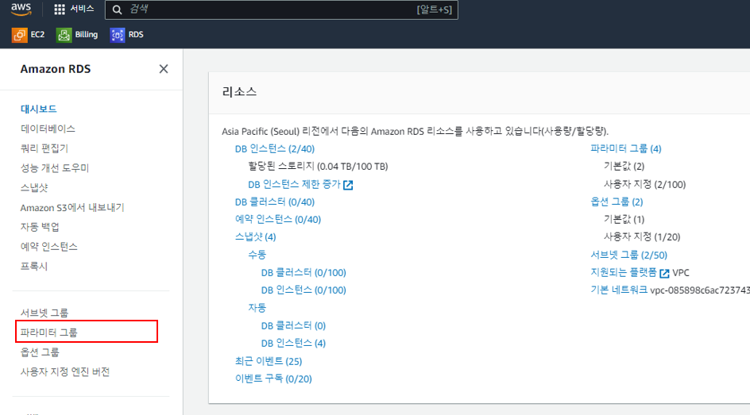

2. 사용자 지정탭에서 파라미터 그룹 생성을 클릭합니다.

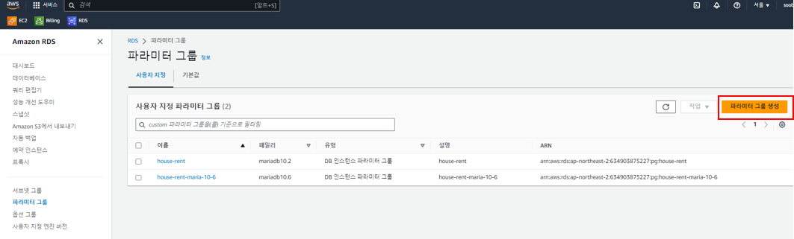

3. 앞서 생성했던 RDS의 데이터베이스 엔진 버전에 해당되는 파라미터 그룹 패밀리를 선택하고, 해당 그룹에 대한 이름과 설명을 입력후 생성합니다.

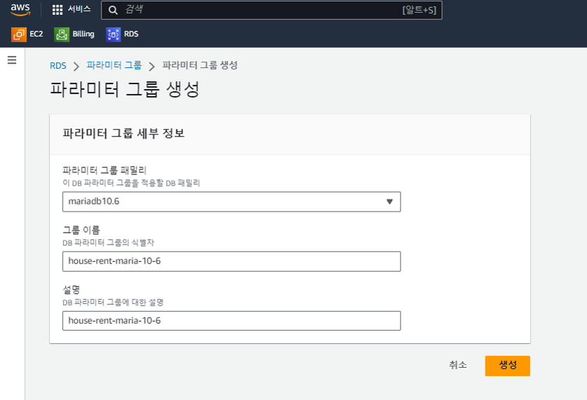

4. 새로 생성한 파라미터 그룹의 세부정보에서 오른쪽 상단 `편집` 버튼을 클릭합니다.

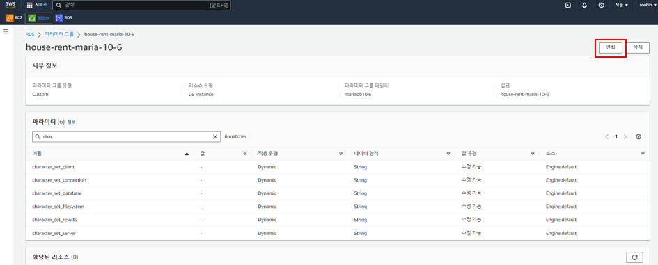

5. 먼저 time_zone 값을 Asia/Seoul로 입력 후 저장합니다.

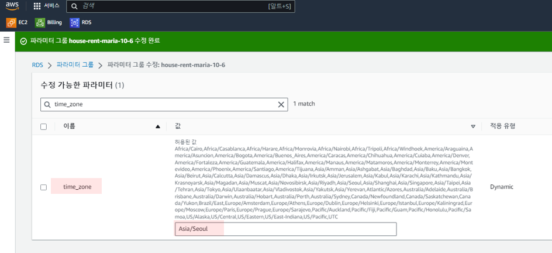

6. 이후 Character Set에 대한 설정을 입력 후 저장합니다.
   - character_set_client, character_set_connection, character_set_database, character_set_filesystem, character_set_results => `utf8mb4` 로 세팅 (utf8mb4는 uft8과 달리 이모지를 저장할 수 있습니다.)
   - collation_connection, collation_server => `utf8mb4_general_ci` 로 세팅

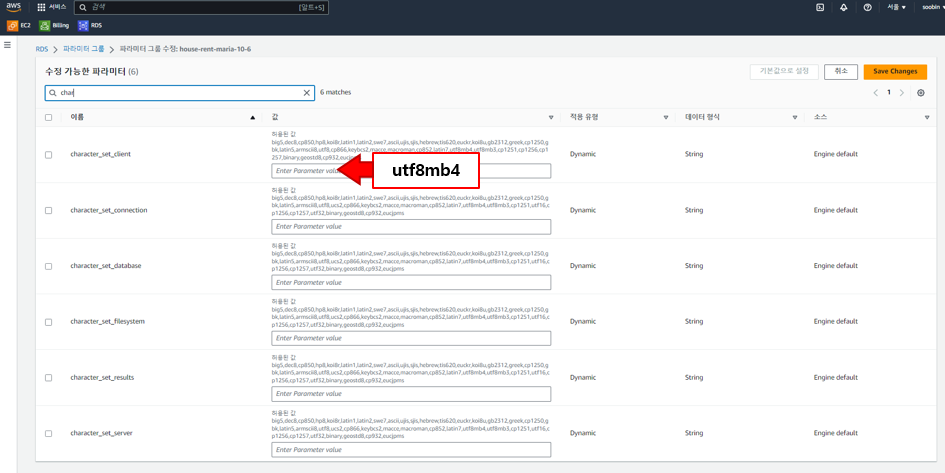

7. 수정 사항을 모두 저장합니다.

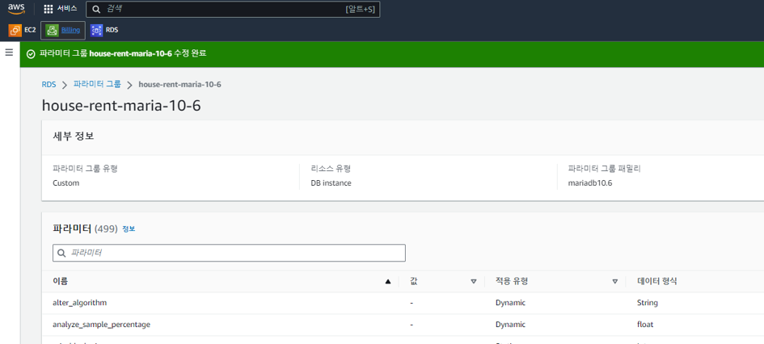

8. 새로 생성한 파라미터 그룹을 RDS에 적용시키기 위해 데이터베이스 화면으로 이동하여, 변경할 RDS를 선택하고 `수정`버튼을 클릭합니다.

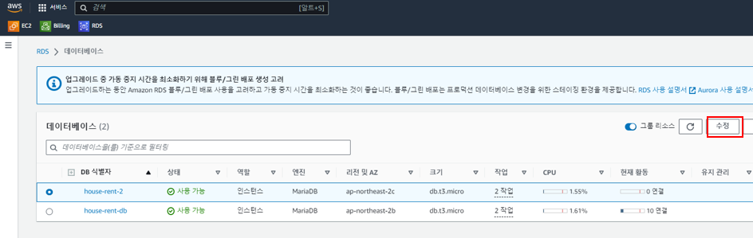

9. RDS 인스턴스 정보 항목중 하단의 `추가 구성`에서 `DB 파라미터 그룹`에서 위에서 새로 생성한 파라미터 그룹으로 변경하고, `계속` 버튼을 클릭합니다.
   - 참고로, 수정할 `RDS의 DB 엔진 버전과 파라미터 그룹에서 설정한 버전이 동일`해야 파라미터 그룹 목록에 표시됩니다. 

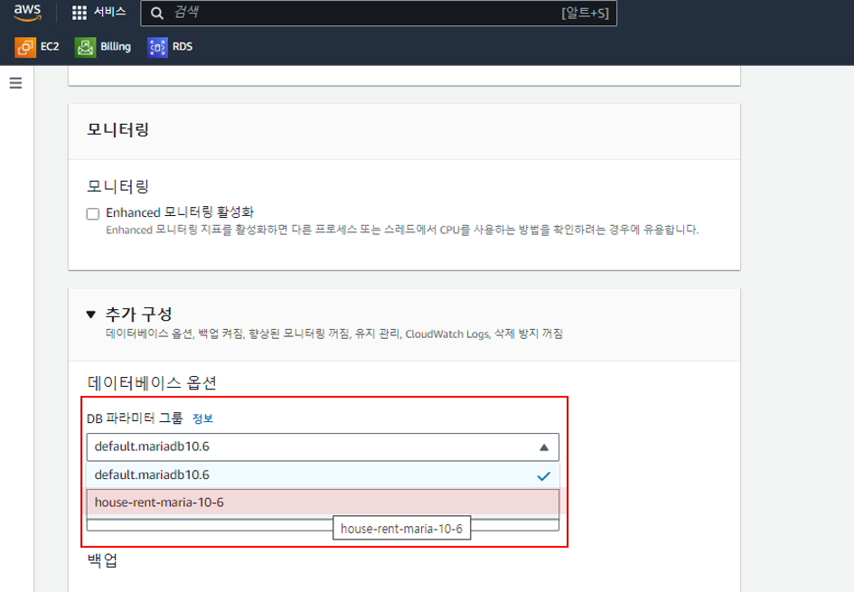

10. 수정 사항을 `즉시 적용` 선택한 후 `DB 인스턴스 수정`을 클릭합니다.

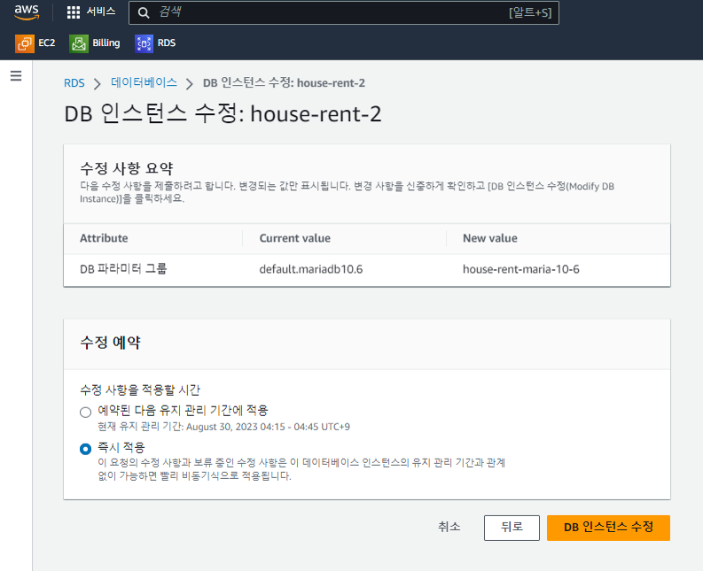

11. 데이터베이스 목록에서 인스턴스 수정 완료 표시가 뜨면 정상적으로 수정된 것으로 볼 수 있습니다.

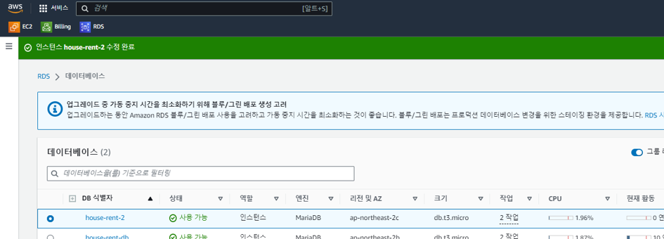

12. RDS 인스턴스의 세부 정보에서 `구성`탭을 확인해보시면 파라미터 그룹이 변경되었음을 확인할 수 있습니다.

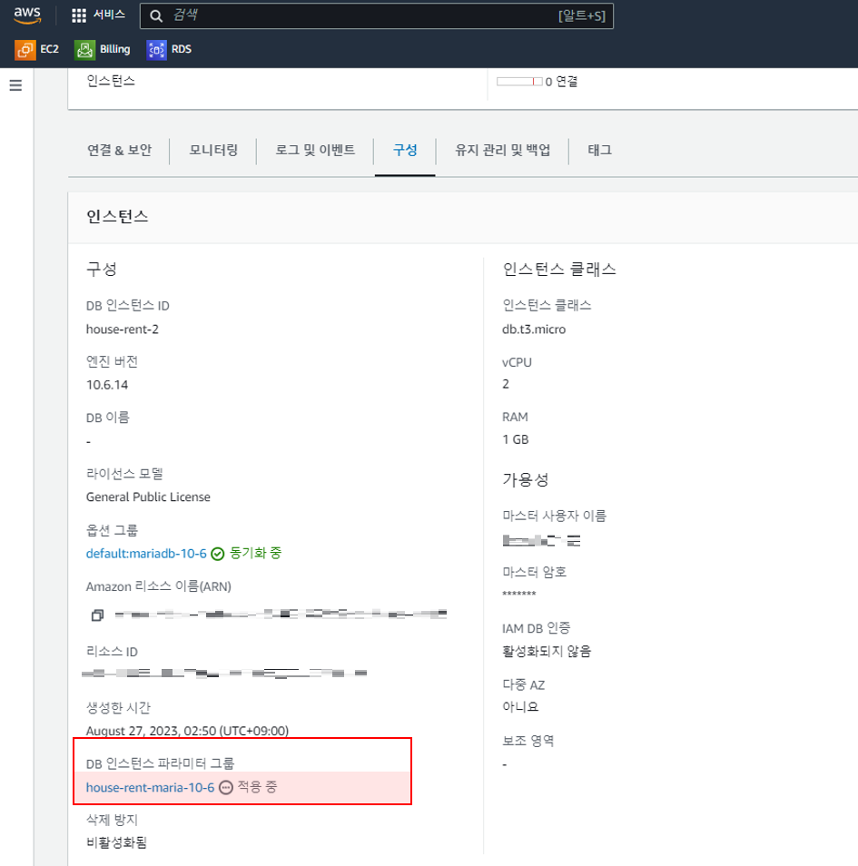

## References
스프링 부트와 AWS로 혼자 구현하는 웹 서비스 - 이동욱님 