# AWS - RDS 세팅(생성)

## RDS란?
: Relational Database Service(RDS)의 약자로, Amazon에서 제공하는 클라우드에서 간편하게 데이터베이스를 설치, 운영 및 확장할 수 있는 관리형 서비스입니다. Amazon Aurora(MySQL 호환), Amazon Aurora(PostgreSQL 호환), MySQL, MariaDB, PostgreSQL, Oracle 등 원하는 데이터베이스 엔진을 선택하여 생성할 수 있습니다.

## RDS 생성
1. AWS 서비스 가입 후, RDS 서비스를 검색 -> RDS 대시보드에 있는 데이터베이스 생성을 클릭합니다.

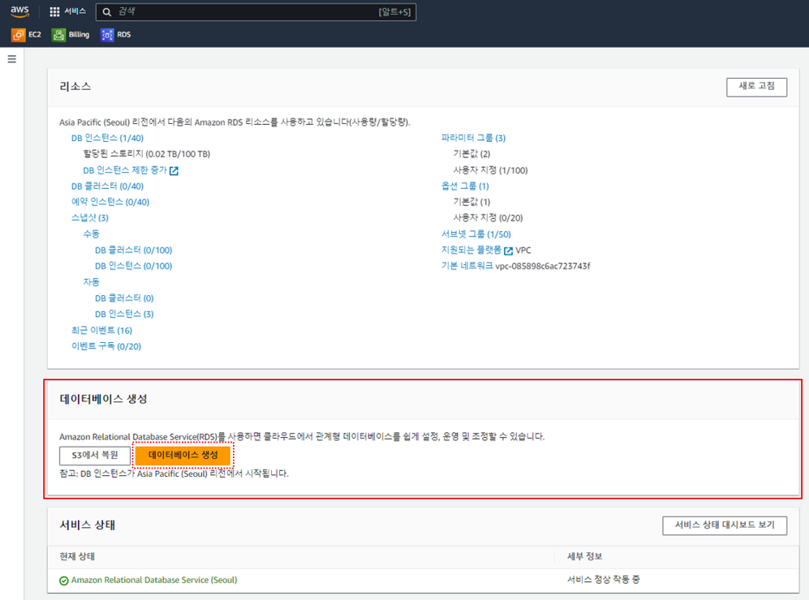

2. 표준 생성을 선택한 후, 원하는 데이터베이스 엔진과 엔진 버전을 선택합니다. 저는 평소 자주 사용했던 MySQL 기반의 MariaDB를 선택했습니다.  
버전은 AWS RDS에서 쓰기 최적화를 지원하는 10.6.14 버전을 선택했습니다.

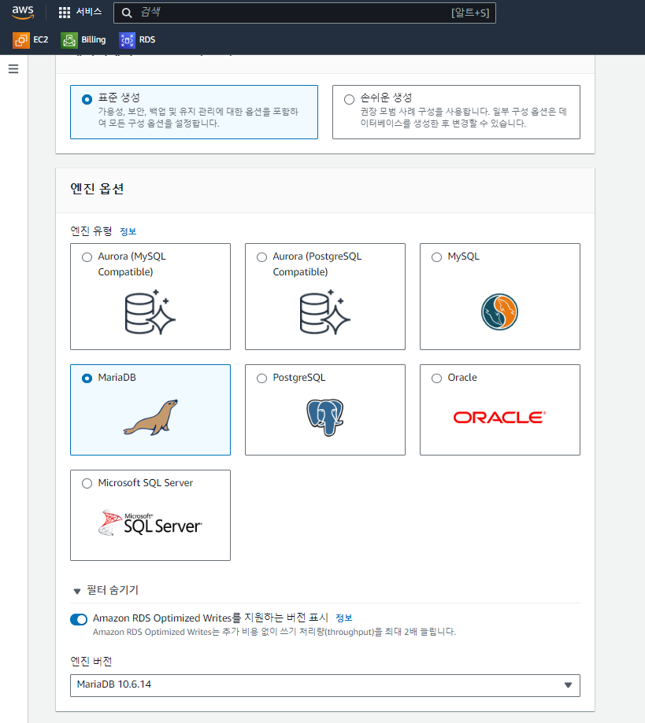

3. RDS의 템플릿을 선택합니다. 저는 테스트용 프로젝트를 위한 DB이므로 프리티어로 선택했습니다. 

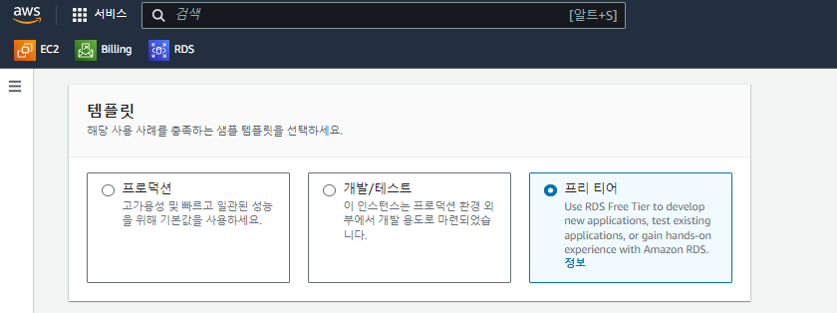

4. 식별가능한 DB 이름을 입력하고, 데이터베이스 마스터 계정 이름과 비밀번호를 입력합니다. 해당 정보는 추후 DB에 접속할 때 계속 사용하게되므로 따로 저장해두셔야합니다.

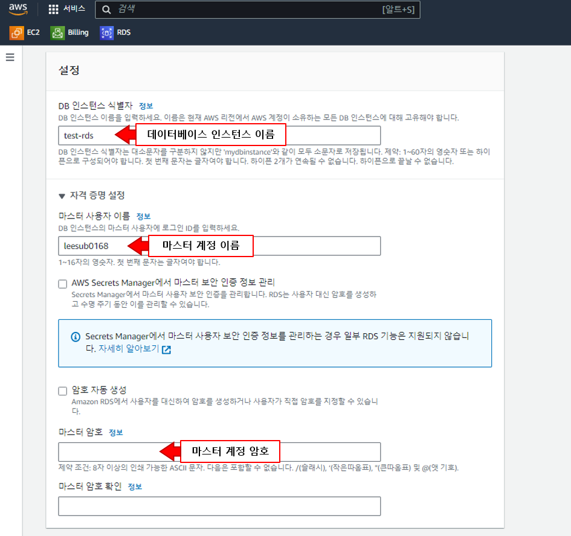

5. 다음으로는 인스턴스 구성을 선택합니다. EC2에서 인스턴스 유형을 선택했던 것과 비슷하며 어떤 구성을 선택하냐에 따라 CPU와 RAM 용량이 달라집니다. 
단 선택할 수 있는 인스턴스 구성은 위에서 선택했던 템플릿에 따라 달라지며 저는 프리티어에서 선택할 수 있는 가장 기본 구성인 `db.t3.micro`를 선택했습니다.

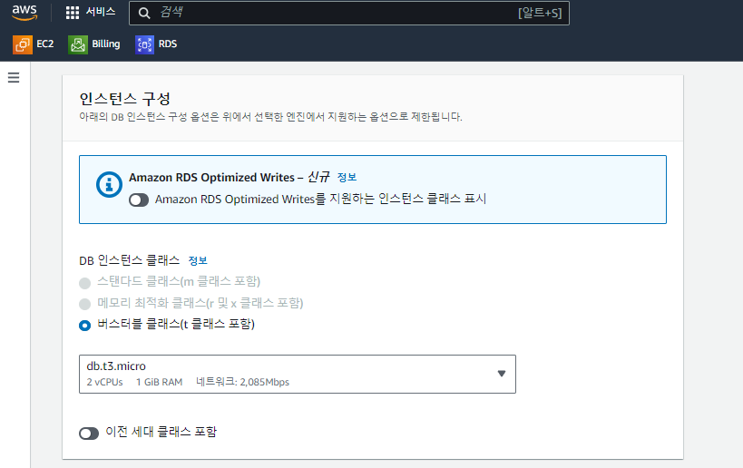

6. 스토리지의 경우 저는 테스트 생성이므로 기본 세팅인 범용 SSD, 20GB으로 설정하였으며 추가적인 비용이 발생할 수 있는 스토리지 자동 조정 활성화 옵션을 체크 해제하였습니다.

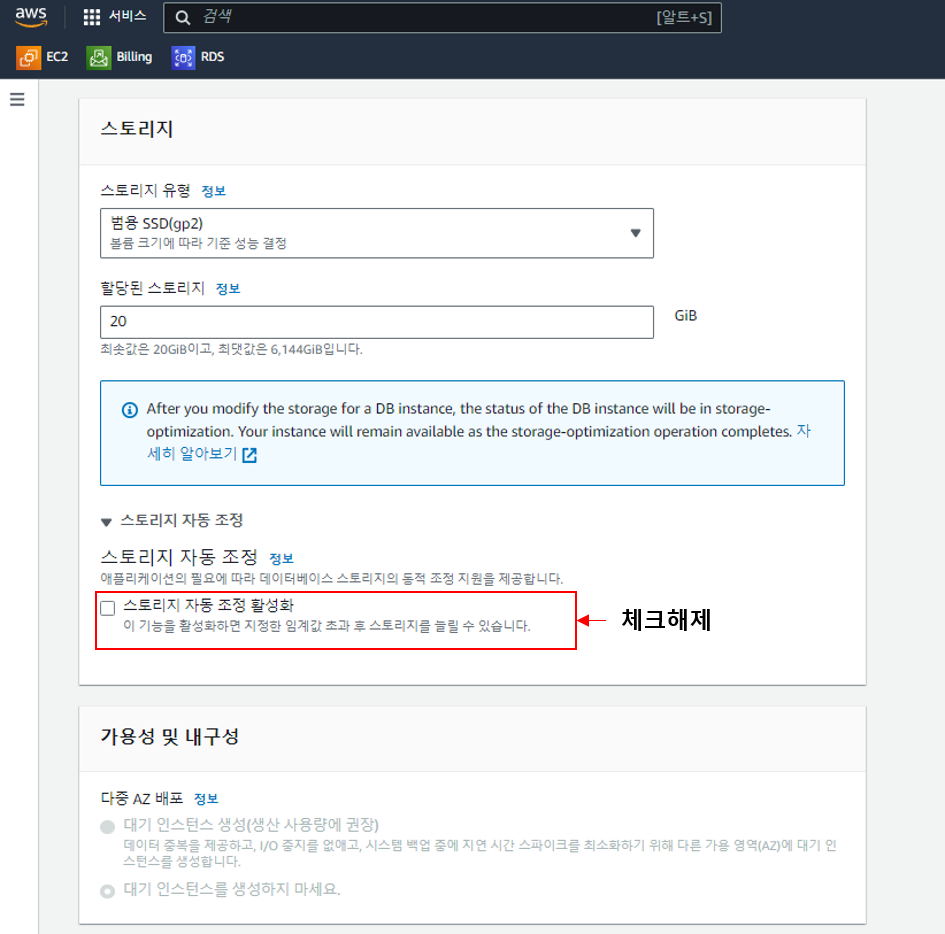

7-1. 연결 정보를 세팅합니다. AWS에서 EC2와 바로 연결하는 기능을 지원하나 이번의 경우 책 내용을 기반으로 하므로 EC2 리소스와 연결하지 않는 버전으로 진행하겠습니다. 
다른 부분은 기본 세팅을 따라가면 되며, 데이터베이스 접근을 위해 퍼블릭 액세스는 `예`로  설정하셔야합니다. 

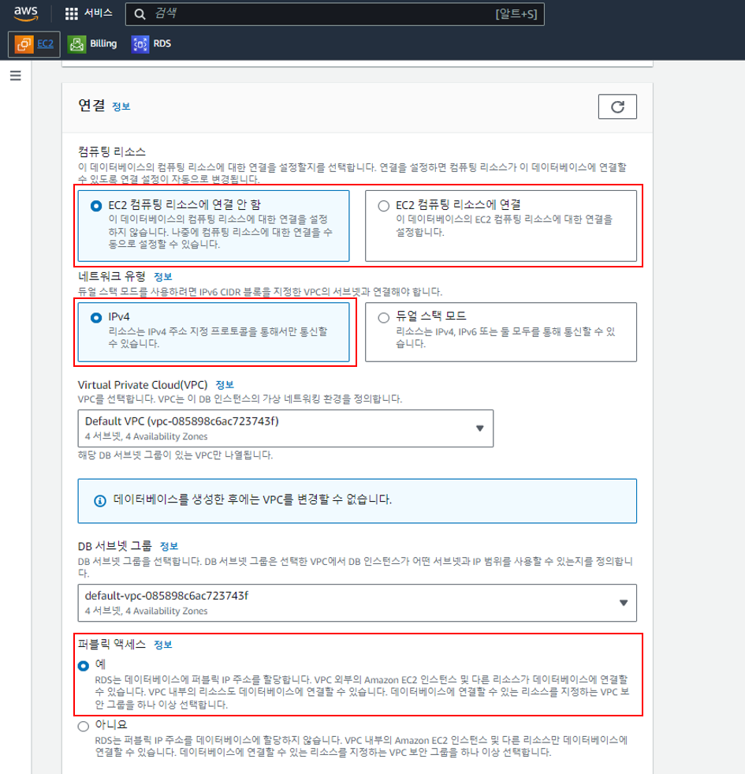

7-2. 데이터베이스에 대한 액세스를 허용할 보안 그룹을 새로 생성합니다. 식별가능한 보안그룹명을 입력합니다.
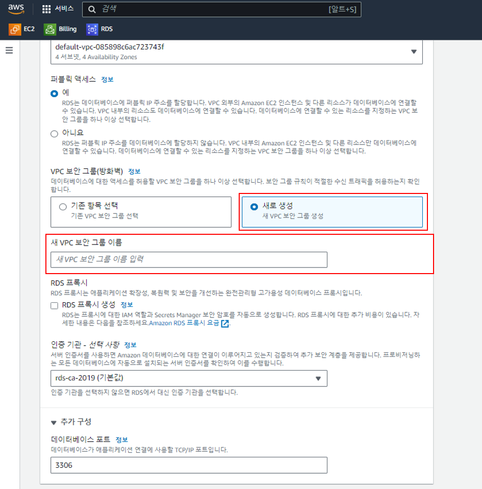

8. 데이터베이스 인증 방식은 암호인증을 선택하시고, 추가 구성에서 원하는 초기 데이터베이스명을 입력하시면 됩니다. 

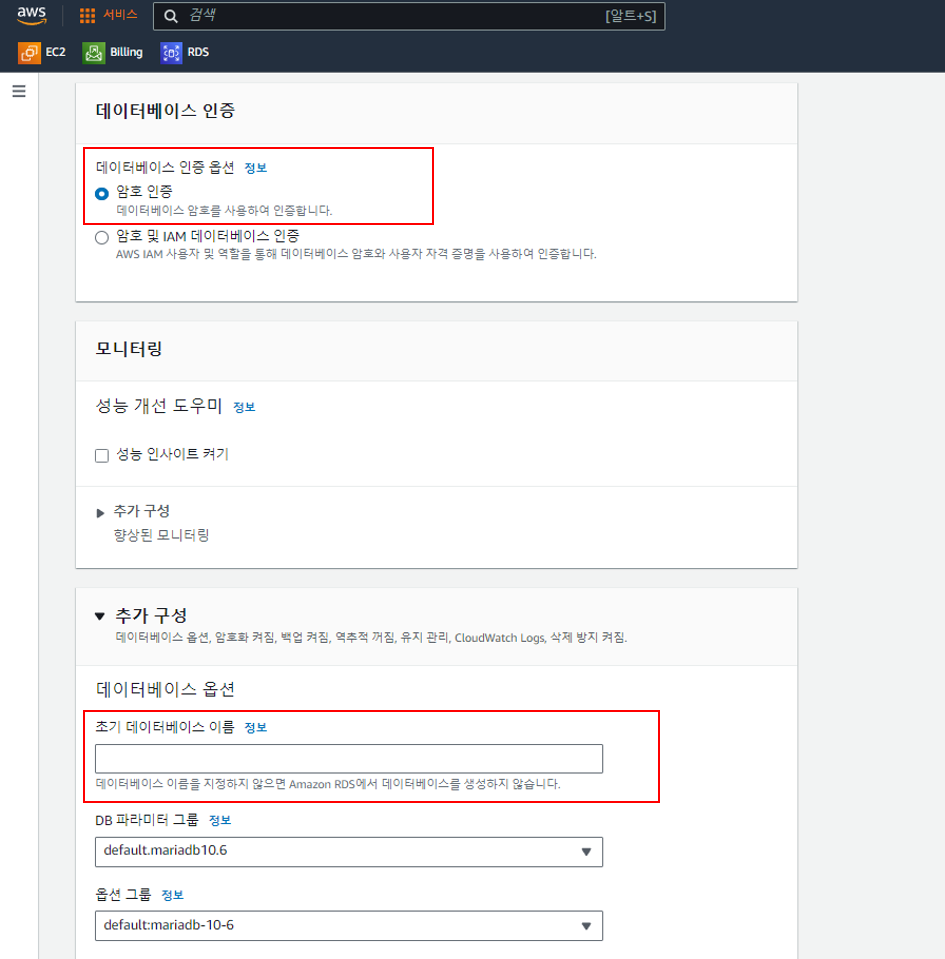

9. 끝으로 데이터베이스 생성을 완료하시면 됩니다. 데이터베이스 생성이 완료되는데는 시간이 몇분 정도 소요될 수 있습니다.

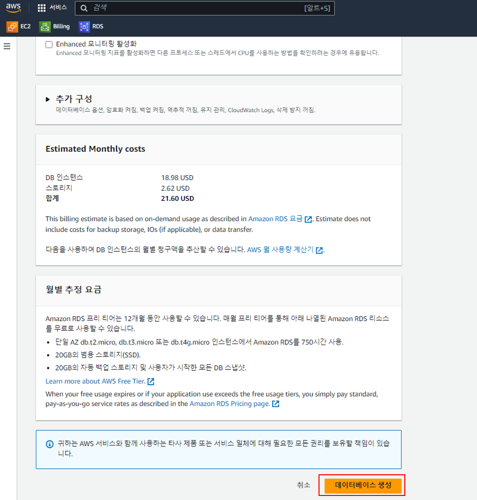
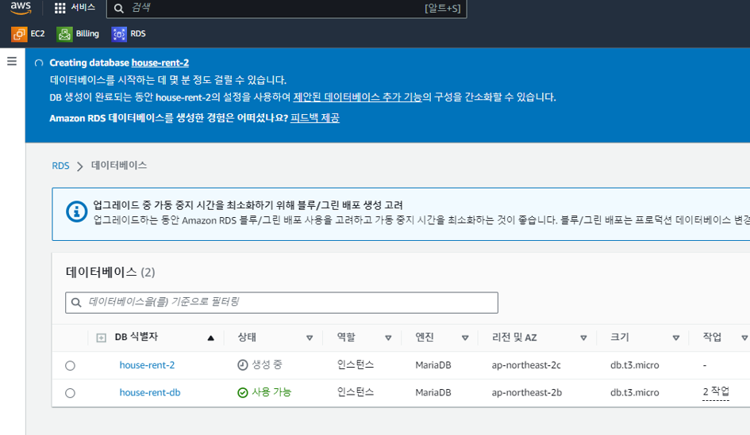
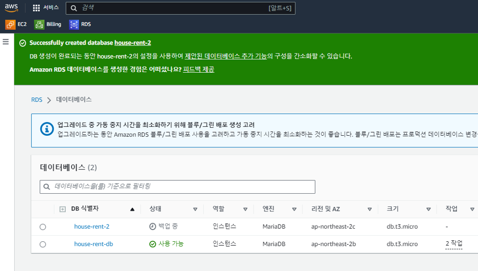

## References
스프링 부트와 AWS로 혼자 구현하는 웹 서비스 - 이동욱님 
[What is Amazon RDS?](https://aws.amazon.com/ko/rds/#)
