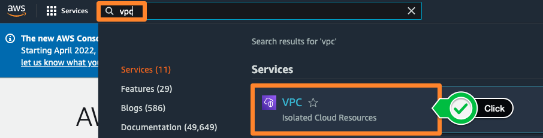

# VPC 생성
## VPC 서비스로 이동
1. AWS Management Console 에 로그인 후, Service 메뉴에서 **VPC** 를 선택합니다.

## VPC 마법사를 이용한 VPC 생성

1. **VPC Dashboard(대시보드)** 를 선택하고, **Launch VPC Wizard(VPC 마법사 시작)** 을 클릭하여 VPC 생성 마법사를 시작합니다.

2. 본 실습에 사용되는 자원들을 프로비저닝할 공간을 생성하기 위해, VPC와 Subnet을 생성할겁니다. **Resource to create**은 **VPC, subnets, etc**를 선택하고 **이름 태그**는 **VPC-Lab**으로 변경합니다. IPv4 CIDR block은 기본 설정을 그대로 둡니다.

3. 고가용성을 고려한 아키텍처를 설계하기 위해 서브넷을 생성할 공간을 **2**로 두고 **Customize AZs**에서 가용 영역은 **2a**와 **2c**를 선택합니다. 그리고 인터넷과 직접적으로 통신이 가능한 퍼블릭 서브넷의 CIDR 값은 각각 아래의 화면과 같이 설정합니다. 프라이빗 서브넷의 CIDR 값도 화면과 같이 설정합니다.

4. 프라이빗 서브넷의 인스턴스가 VPC 외부의 서비스에 연결할 수 있지만 외부 서비스에서 이러한 인스턴스와의 직접적인 연결을 시작할 수 없도록 **NAT 게이트웨이**를 사용할 수 있습니다. 본 실습에서는 비용 절감 차원에서 하나의 가용 영역에만 NAT 게이트웨이를 생성합니다. 또한, DNS 옵션의 경우, **DNS hostnames**와 **DNS resolution**을 둘다 **활성화**합니다. 설정 값을 확인 후, **Create VPC** 버튼을 클릭합니다.

5. VPC가 생성되면서 아래 화면과 같이 네트워크 관련 리소스들이 생성되는 프로세스를 확인할 수 있습니다. NAT Gateway의 경우, 다른 리소스 대비 프로비저닝 시간이 오래 걸릴 수 있습니다.

6. 생성된 VPC의 정보를 확인할 수 있습니다. **CIDR** 값, route table, network ACL 등 관련 정보를 확인합니다. 방금 설정한 값들이 올바른지 확인합니다.
    

----------------------------------------
# 현재까지의 아키텍쳐 구성
VPC 마법사를 통해서 VPC가 완성 되었다면, 현재까지 구성된 환경은 아래와 같습니다.

----------------------------------------------------------------------------------

# (옵션) VPC 엔드포인트 
## VPC 엔드 포인트
1. VPC 대시보드에서 **엔드포인트**를 선택하십시오. **엔드포인트 생성**을 클릭합니다.

2. 이름은 화면과 같이 **s3 endpoint**로 작성한 후, 어떤 서비스를 위한 게이트웨이를 생성할 것인지 선택하는 옵션에서 **AWS services**를 클릭합니다. 아래의 검색 창에서 **s3**를 입력하고, 가장 위에 있는 목록을 선택합니다.

3. S3 VPC 엔드 포인트의 경우, **gateway** 타입과 **interface** 타입이 있습니다. 본 실습에서는 **gateway** 타입을 선택합니다. 그리고 배포할 위치는 본 실습에서 생성한 **VPC-Lab-vpc**를 선택합니다.

4. 엔드포인트를 반영할 라우팅 테이블을 선택합니다. 아래와 같이 두 개의 프라이빗 서브넷을 선택합니다. 선택된 라우팅 테이블에는 엔드포인트를 사용하기 위한 별도의 라우팅 정보가 자동으로 추가됩니다.

5. 아래와 같이 엔드포인트에 대한 접근 통제를 위한 정책을 구성할 수도 있습니다.

※ VPC 엔드 포인트 정책을 이용해 AWS 서비스에 대해 전체 액세스를 허용하거나 사용자 지정(Custom) 정책을 만들 수 있습니다. [VPC 엔드 포인트 정책](https://docs.aws.amazon.com/vpc/latest/privatelink/vpc-endpoints-access.html#vpc-endpoint-policies) 에 대해 자세히 알아보세요.

6. 앞서 지정한 **프라이빗 라우트 테이블**에 게이트웨이 엔드포인트를 통해 Amazon S3로 접근하기 위한 라우팅이 자동으로 추가되었음을 확인합니다.

※ VPC 엔드포인트는 AWS 네트워크 내부 통신이며 엔드포인트를 통한 트래픽을 제어할 수 있다는 보안 및 컴플라이언스상 이점이 있습니다. 또한 NAT 게이트웨이가 아닌 VPC 엔드포인트를 통해 데이터를 전송할 경우 데이터 처리 비용을 최적화할 수 있습니다.