# 데이터베이스 – Amazon Aurora
AWS에서 사용하실 수 있는 여러 Database 옵션 중, Amazon RDS(Relational Database Service)는 구성과 운영이 간편하고 확장이 손쉬운 클라우드 기반의 데이터베이스 서비스입니다. Amazon RDS는 비용 효율적이고 손쉽게 용량을 조절할 수 있으며, 시간 소모가 많은 관리 작업을 줄여 사용자가 비지니스와 어플리케이션에 보다 집중할 수 있게 합니다.

--------------------------------
## 목표 구성도

본 Database 실습은 VPC-Lab 내에 RDS Aurora 인스턴스를 배포하고, 이미 생성된 Auto Scaling Group 내 인스턴스의 Web Service(Apache+PHP)가 RDS Aurora(MySQL)를 사용할 수 있도록 구성합니다. 데이터베이스와의 연결 설정이 완료되면, 기존 커스텀 AMI의 새로운 버전을 생성하고, Auto Scaling Group에서 새로운 AMI를 사용하도록 업데이트 합니다. 그리고 Web Browser를 통하여 RDS DB에 저장된 단순한 주소록에 연락처를 추가/수정/삭제 하는 테스트를 진행해 봅니다.

## 실습 순서
* VPC 보안 그룹 생성
* RDS 인스턴스 생성
* RDS 크레덴셜 저장
* 웹앱 서버와 RDS 연결
* (옵션) RDS 관리 기능
* (옵션) RDS Aurora 연결

-------------------------------------

## VPC 보안 그룹 생성

RDS 서비스는 EC2와 동일한 보안 모델을 사용합니다. 가장 일반적인 사용 형식은 동일한 VPC 내에서 어플리케이션 서버로서 운영 중인 EC2 인스턴스에 데이터베이스 서버로서 데이터를 제공하거나, VPC 외부에 있는 DB 어플리케이션 Client에게 접근이 가능하도록 구성하는 것입니다. 적절한 접근 통제를 위하여 VPC 보안 그룹(Security Group)을 활용해야 합니다.

앞선 컴퓨트 – Amazon EC2 실습에서 Launch Template과 Auto Scaling 그룹을 이용하여 웹 서버 EC2 인스턴스들을 생성해 보았습니다. 이 인스턴스들에는 Launch Template을 이용하여 보안 그룹 ASG-Web-Inst-SG 를 적용해 둔 상태입니다. 이 정보들을 이용하여, Auto Scaling 그룹 내의 웹 서버 인스턴스들만 RDS 인스턴스에 접속할 수 있도록 보안 그룹을 생성하겠습니다.

1. VPC 대시보드  좌측에서 Security Groups를 선택 후 Create Security Group을 선택하십시오.

2. 아래와 같이 Security group name, Description 을 입력하고, 해당 그룹을 사용할 VPC 를 지정합니다. (VPC-Lab 태깅된 VPC 지정 확인)

3. 스크롤을 내려 Inbound rules란으로 이동합니다. Add rule을 눌러 앞서 Auto Scaling 그룹을 통해 생성한 EC2 Web Server들에서 RDS로의 접근을 허용하는 보안 그룹 정책을 생성합니다. Type 에서 MySQL/Aurora(3306) 을 선택합니다. 프로토콜과 포트 범위가 자동으로 지정됩니다. Source 항목에는 접근을 허용할 IP 대역(CIDR) 또는 접근할 EC2 인스턴스들이 사용하고 있는 다른 보안 그룹을 지정할 수 있습니다. 컴퓨트 – Amazon EC2 실습의 Auto Scaling Group의 Web Instance들에 적용되어 있는 보안 그룹( ASG-Web-Inst-SG )을 선택합니다.

4. 지정이 완료되면 가장 하단의 Create Security Group 을 눌러 보안 그룹을 생성합니다. 생성 완료된 보안 그룹을 확인합니다.

-------------------------------------

## RDS 인스턴스 생성

1. AWS Management Console에서 RDS(Relational Database Service) 로 이동하십시오.

2. 대시보드에서 Create Database 를 선택하여 RDS 인스턴스의 생성을 시작합니다.

3. 사용할 RDS 인스턴스의 데이터베이스 엔진을 선택합니다. Amazon RDS에서는 Open Source 기반의 Database 엔진 및 상용 Database 엔진을 선택할 수 있습니다. 본 Lab에서는 Amazon에서 제공하는 MySQL 호환 Database 엔진인 Amazon Aurora 를 사용하겠습니다. 데이터베이스 생성 방식 선택 란에서 Standard Create 을 선택합니다. Engine options 를 Amazon Aurora 로, Edition 은 Amazon Aurora with MySQL compatibility 를 선택하고, Version 은 Aurora (MySQL 5.7) 2.10.2 를 선택합니다.

4. Templates 에서 Production 을 선택합니다. Settings 항목에서는 RDS 인스턴스의 식별을 위한 정보 및 관리자 정보를 지정합니다. 아래의 정보를 입력하세요

5. DB instance size 와 Availability & durability 항목이 아래와 같은지 확인합니다. 메모리 최적화 인스턴스 클래스와 다른 가용 영역에 읽기 전용 복제 노드를 구성 하는 것이 기본값으로 설정되어 있습니다. 인스턴스 타입은 db.r5.large로 설정합니다.

6. Connectivity 란에서 네트워크 및 보안을 설정합니다. Virtual private cloud (VPC) 란에 앞서 생성한 VPC-Lab을 선택하고, RDS 인스턴스가 운영될 VPC, 서브넷, VPC 외부로부터의 접근 허용여부 및 보안 그룹을 지정합니다. 아래의 내용대로 설정하시면 됩니다.

7. 아래로 스크롤을 내려, Additional configuration 을 클릭합니다. 아래와 같이 데이터베이스 옵션을 설정합니다. Initial database name 대소문자에 유의하세요. 

8. 이후 항목인 Backup, Encryption, Backtrack, Monitoring, Log exports 등 항목은 모두 기본값을 그대로 사용하고, Create database 를 눌러 Database를 생성합니다.

9. 이제 새로운 RDS 인스턴스가 생성됩니다. 이 작업은 5분이상 소요될 수 있습니다. DB 인스턴스의 상태가 Available 이 되면 RDS 인스턴스를 사용할 수 있습니다.

----------------------------------
## 현재까지의 아키텍처 구성

## References
AWS-General Immersion Day