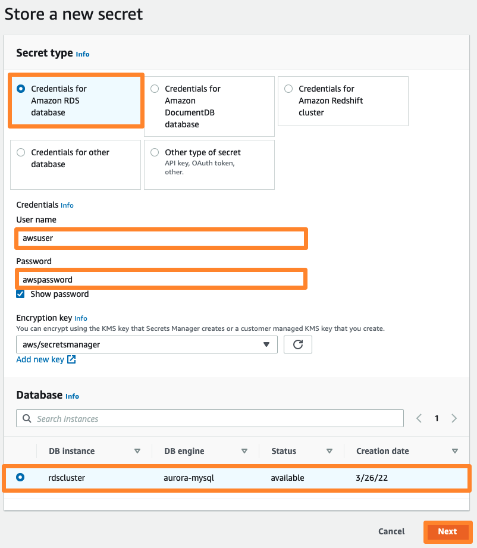

# 데이터베이스 – Amazon Aurora
AWS에서 사용하실 수 있는 여러 Database 옵션 중, Amazon RDS(Relational Database Service)는 구성과 운영이 간편하고 확장이 손쉬운 클라우드 기반의 데이터베이스 서비스입니다. Amazon RDS는 비용 효율적이고 손쉽게 용량을 조절할 수 있으며, 시간 소모가 많은 관리 작업을 줄여 사용자가 비지니스와 어플리케이션에 보다 집중할 수 있게 합니다.

--------------------------------
## 목표 구성도

본 Database 실습은 VPC-Lab 내에 RDS Aurora 인스턴스를 배포하고, 이미 생성된 Auto Scaling Group 내 인스턴스의 Web Service(Apache+PHP)가 RDS Aurora(MySQL)를 사용할 수 있도록 구성합니다. 데이터베이스와의 연결 설정이 완료되면, 기존 커스텀 AMI의 새로운 버전을 생성하고, Auto Scaling Group에서 새로운 AMI를 사용하도록 업데이트 합니다. 그리고 Web Browser를 통하여 RDS DB에 저장된 단순한 주소록에 연락처를 추가/수정/삭제 하는 테스트를 진행해 봅니다.

## 실습 순서
* VPC 보안 그룹 생성
* RDS 인스턴스 생성
* RDS 크레덴셜 저장
* 웹앱 서버와 RDS 연결
* (옵션) RDS 관리 기능
* (옵션) RDS Aurora 연결

-------------------------------------

## RDS 크레덴셜 저장

앞선 컴퓨트 실습에서 생성한 Web Server 인스턴스에는 RDS 사용을 위한 단순한 주소록을 생성하는 코드가 포함되어 있습니다. EC2 Web Server에서 RDS를 사용하기 위하여 아래의 실습을 진행합니다.

---------------------------------------
### RDS 크레덴셜 AWS Secrets Manager에 저장하기

구축한 웹 서버에는 주소록을 위한 샘플 코드가 포함되어 있습니다. 본 실습에서는 샘플 코드에 어떤 데이터 베이스를 사용할 것인지 그리고 어떻게 연결해야될지 명시하는 작업을 수행합니다. 해당 정보를 AWS Secrets Manager에 저장할 것입니다.

본 챕터에서 우리는 데이터 연결 정보를 포함한 secret을 생성할 것입니다. 추후, 우리는 웹 서버가 해당 secret를 불러올 수 있도록 적절한 권한을 부여할 것입니다.

--------------------------------------------

1. 콘솔 창에서 AWS Secrets Manager 를 열고, Store a new secret 버튼을 클릭합니다.

2. Secret Type 아래, Credentials for Amazon RDS database를 선택합니다. 데이터 베이스를 생성할 때 입력했던 user name과 password를 적습니다. 그리고 Database 아래에 방금 생성한 데이터베이스를 선택합니다. 그리고 Next 버튼을 클릭합니다.

3. secret 이름을 mysecret으로 입력합니다. 샘플 코드에는 해당 이름의 secret을 묻도록 입력했기 때문에 해당 이름 그대로 입력해야 합니다.

4. Secret rotation는 기본 값으로 두고 Next을 클릭합니다.

5. 마지막 페이지에서 설정한 값들을 확인한 후 Store 버튼을 클릭하여 시크릿 값을 저장합니다.

6. 아래와 같이 mysecret 이름으로 시크릿 값 리스트를 확인할 수 있습니다.

7. mysecret 하이퍼 링크를 클릭 후, Secret value 탭을 찾습니다. 그리고 Retrieve secret value 버튼을 클릭합니다.

8. Edit 버튼을 누른 후, key/value 항목에 dbname 및 immersionday 값이 있는지 확인합니다. 없다면 아래와 같이 추가한 후, 저장 버튼을 누릅니다.

-------------------------------------

## 웹앱 서버와 RDS 연결

Secret을 생성했다면 이제는 웹 서버에 해당 secret을 사용할 수 있도록 권한을 부여해야 합니다. 이를 수행하기 위해 웹 서버가 secret을 읽을 수 있는 Policy를 생성해야 합니다. 웹 서버 실습에서 부여한 Role에 해당 policy를 추가합니다.

### 웹 서버가 secret에 접근할 수 있도록 허용하기

1. AWS 관리 콘솔에 로그인한 후, IAM 콘솔  창을 엽니다. 왼쪽 사이드 바에서 Policies를 선택하고 Create Policy를 클릭합니다.

2. Choose a service를 클릭합니다.

3. Secrets Manager를 검색 바에 입력합니다. Secrets Manager를 클릭합니다.

4. Access level 아래에 Read 옆 세모를 누르고 GetSecretValue를 클릭합니다.

5. Resources 옆 세모를 누릅니다. 본 실습에서는 All resources를 선택하고 Next: Tags를 클릭합니다.
※ 본 실습에서는 EC2가 모든 secret에 접근할 수 있도록 설정했습니다. 하지만 실제 도입시에는 특정 secret만 읽을 수 있도록 설정하는 메카니즘을 고려해야 합니다.

6. Next: Review를 클릭합니다.

7. Review Policy 화면에서 새로운 policy 이름을 ReadSecrets로 부여하고 Create policy를 클릭합니다.

8. 왼쪽 사이드 바에서 Roles을 선택하고 검색 창에서 SSMInstanceProfile를 입력합니다. 해당 role의 경우 Session Manager를 사용하여 리눅스 인스턴스에 접근하기에서 생성한 role입니다. SSMInstanceProfile를 클릭합니다.

9. Permissions policies 아래에 Attach policies를 클릭합니다.

10. ReadSecrets로 생성한 policy를 찾고 Attach policy를 클릭합니다.

11. Permissions policies 아래에 AmazonSSMManagedInstanceCore와 ReadSecrets가 리스트에 있는지 확인합니다.

----------------------------------
## 주소록에 접근하기

1. EC2 콘솔  창에 접근하고 load balancer를 클릭합니다. 컴퓨트 실습에서 생성한 로드밸런서의 DNS 이름을 복사한 후, 브라우저에서 새 탭을 열고 붙여넣습니다.

2. 웹 서버에 접속한 후, RDS 탭으로 들어갑니다.

3. 이제 여러분이 생성한 데이터베이스에 있는 데이터들을 확인할 수 있습니다.

이것은 AWS에 의해 관리되는 MySQL 데이터베이스와 상호 작용하는 매우 기본적인 실습입니다. RDS는 훨씬 더 복잡한 관계형 데이터베이스 시나리오를 지원할 수 있지만 이 간단한 예로 요점을 충분히 이해할 수 있길 바랍니다. 주소록에 있는 Add Contact, Edit 및 Remove 링크를 사용하여 RDS 데이터베이스에서 콘텐츠를 자유롭게 추가/편집/삭제할 수 있습니다.

-----------------------------------

## 현재까지의 아키텍처 구성

자, 여기까지의 작업을 통해 여러분은 고가용성이 보장된 웹 서비스를 구축하였습니다. 지금까지 구성한 인프라 아키텍처는 아래와 같습니다.

## References
AWS-General Immersion Day