# (옵션) RDS 관리 기능

: 다중 AZ 배포에서 Amazon RDS는 자동으로 서로 다른 가용 영역에 동기식 예비 복제본을 프로비저닝하고 유지합니다. 기본 DB 인스턴스는 가용 영역에서 예비 복제본으로 Sync되어 데이터 이중화를 제공합니다.

## RDS 장애 조치(Failover) 테스트
: 다중 AZ를 활성화한 경우, DB 인스턴스에 계획되거나 계획되지 않은 중단이 발생하면 Amazon RDS는 자동으로 다른 가용 영역에 있는 예비 복제본으로 전환합니다. 장애 조치가 완료되는 데 소요되는 시간은 기본 DB 인스턴스를 사용할 수 없게 된 시점의 데이터베이스 활동 및 기타 조건에 따라 달라집니다. 장애 조치에 소요되는 시간은 일반적으로 60-120초입니다. 그러나 트랜잭션의 규모가 크거나 복구 프로세스가 복잡한 경우 장애 조치에 소요되는 시간이 증가할 수 있습니다. 장애 조치가 완료되면 RDS 콘솔 UI가 새로운 가용 영역에 반영하는 데 추가적으로 시간이 소요됩니다.

1. RDS 관리 콘솔에서 Databases를 선택하고, 장애 조치를 진행할 인스턴스를 선택한 후, 작업 란에서 Failover를 클릭합니다.

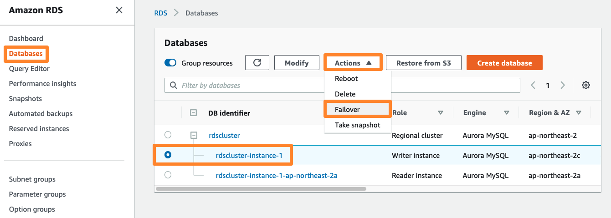

2. 클러스터를 장애 조치하겠냐는 질문이 나옵니다. Failover 버튼을 누릅니다.

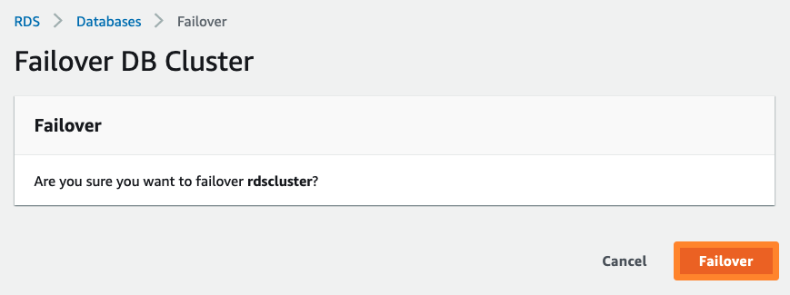

3. 리프레시 버튼을 누르면 DB 식별자의 rdscluster의 상태가 Failing-over로 변경됩니다. 잠시 후 리프레시 버튼을 눌러 보면, Reader 역할과 Writer 역할이 변경된 것을 보실 수 있습니다. 장애 조치가 완료되었습니다.

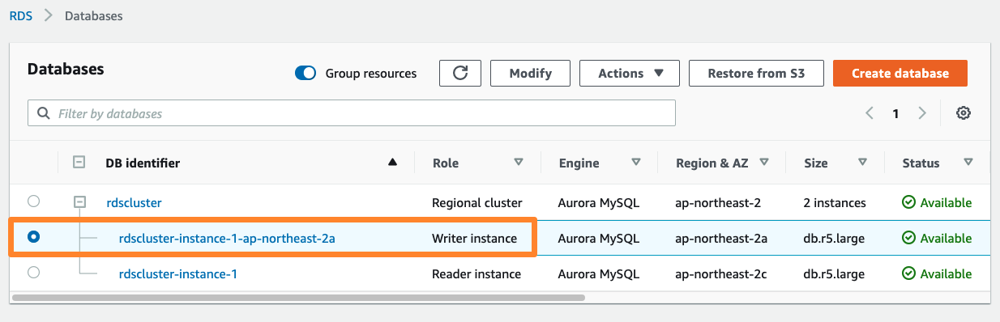

-----------------------------------

## RDS Snapshot 생성

: 운영 중인 RDS에 대한 Snapshot을 생성하겠습니다. Snapshot은 Database 인스턴스에 대한 백업을 위하여 사용자가 원하는 주기로 생성할 수 있으며, 언제든지 생성된 Snapshot을 기반으로 Database를 복원할 수 있습니다.

1. RDS 관리 콘솔에서 Databases를 선택하고, 스냅샷 작업을 수행할 인스턴스를 선택 합니다. 우측 상단 Actions > Take snapshot 을 선택합니다.

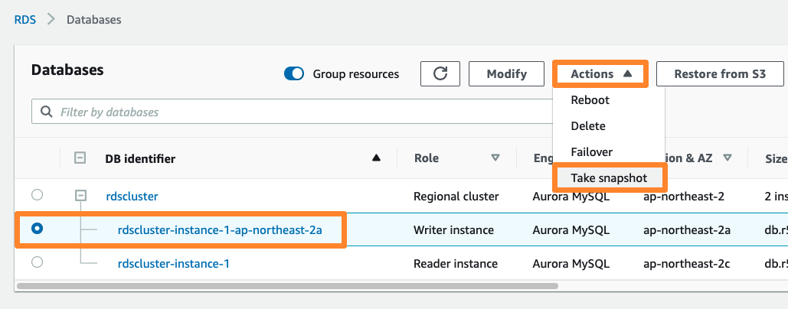

2. 스냅샷에 사용할 이름을 immersionday-snapshot 으로 입력합니다. Take Snapshot 버튼을 눌러 생성을 완료합니다.

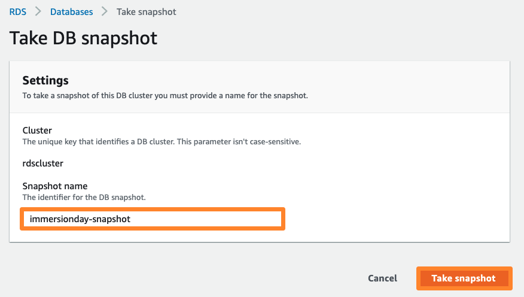

3. 좌측 RDS 메뉴에서 Snapshots을 선택하고 Snapshot의 생성 상태를 확인해 봅니다. 스냅샷의 상태는 최초 creating 상태이며, available 이 되면 해당 스냅샷을 이용하여 데이터베이스를 복원할 수 있습니다. 복원하는 방법은 원하는 스냅샷을 선택 하고 Actions 을 선택하면 해당 스냅샷으로 수행 가능한 작업을 확인 할 수 있습니다. Restore Snapshot 을 선택하면 작성된 스냅샷을 기반으로 데이터가 동일한 RDS 인스턴스를 생성할 수 있습니다. 이번 실습에서는 복원은 수행하지 않습니다.

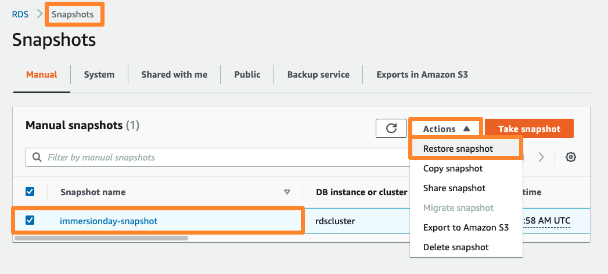

-----------------------------------

## RDS 인스턴스 규격 변경

: 운영 중인 RDS 인스턴스의 용량 증설 및 감소(Scale-Up/Scale-Down)는 RDS Management Console을 통하여 매우 간단하게 수행 할 수 있습니다.

1. 변경할 인스턴스를 선택 하고 Modify 을 클릭하여 RDS 인스턴스의 규격을 변경해 보겠습니다.

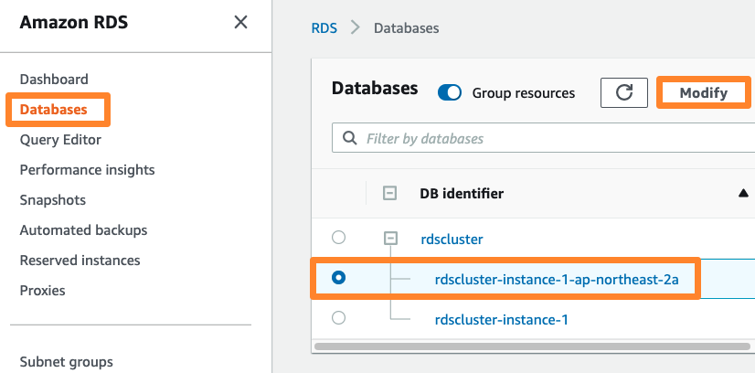

2. 인스턴스 클래스의 리스트 박스를 선택하여 변경하고자 하는 인스턴스의 규격을 선택할 수 있습니다. 여기선 db.r6g.large 를 선택해 보겠습니다.

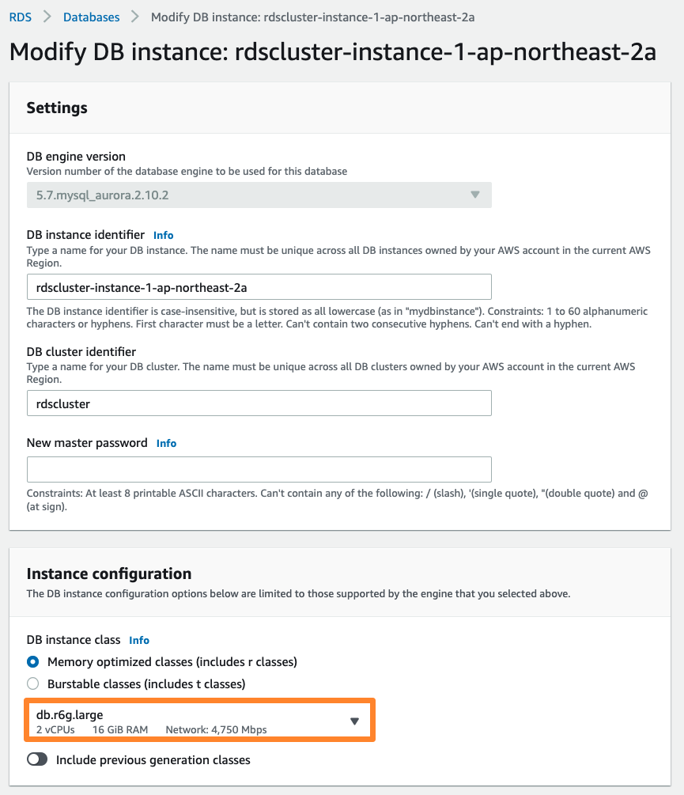

3. 맨 아래로 스크롤을 내리고 Continue 를 선택하면 변경 전후의 인스턴스 규격 확인하고 적용 시기를 선택하는 페이지로 이동합니다.

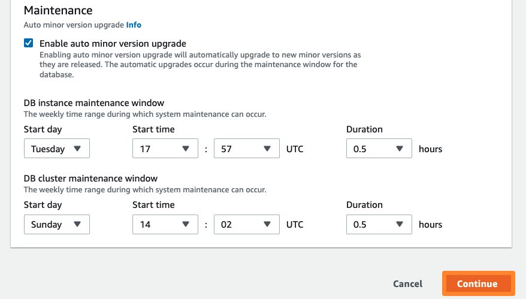

4. Apply immediately 를 선택합니다. 이 경우 RDS 에 대한 백업을 수행한 후 RDS의 인스턴스를 즉시 변경합니다. 그리고 Modify DB Instance 버튼을 클릭합니다. 인스턴스의 종류 및 백업할 데이터의 양에 따라 수분이 소요될 수 있습니다. 따라서, 일정 시간의 RDS 서비스의 중단을 예상해야 합니다(이중화 구성을 통하여 중단 시간을 최소화 할 수 있습니다).

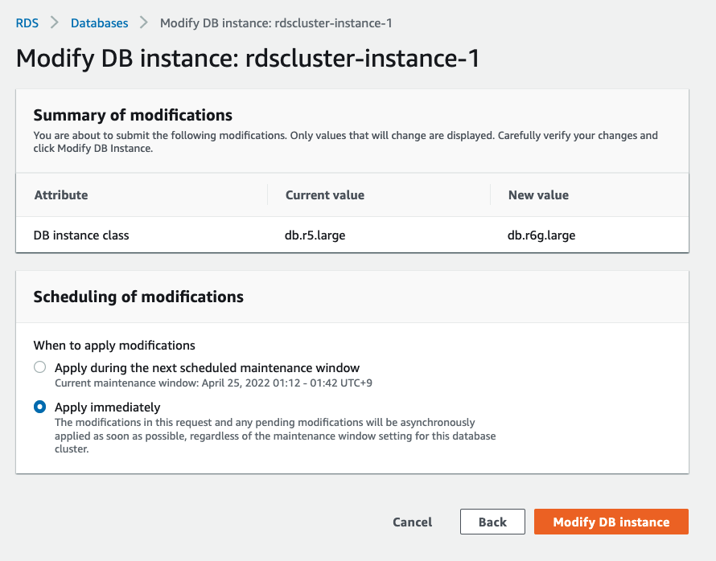
※ Apply during the next scheduled maintenance window 을 선택한 경우, 1주일 단위로 지정되어 있는 사용자의 유지관리 시간(Maintenance Window)에 해당 변경 작업을 수행합니다.

5. 인스턴스의 status가 Modifying 으로 바뀐 것을 볼 수 있습니다.

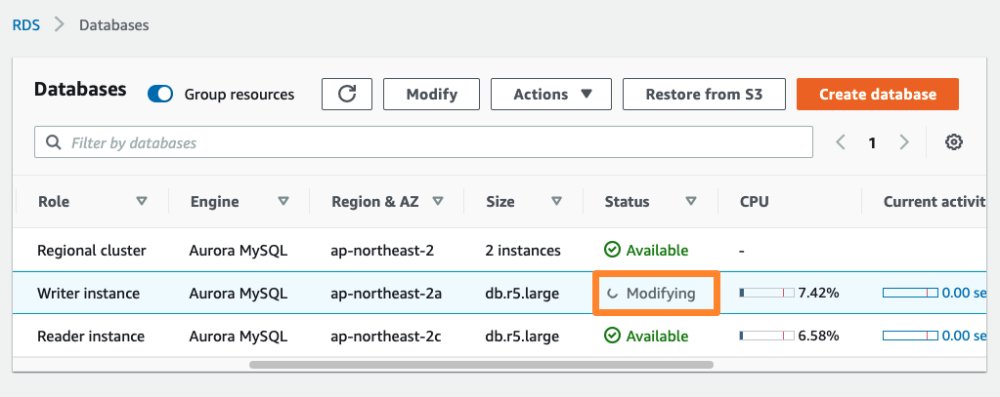

6. 다시 새로 고침을 눌러보면, Writer 인스턴스가 변경된 것을 볼 수 있습니다. 이는 아까 크기 변경을 위해 선택한 인스턴스가 Writer 인스턴스였기 때문입니다. RDS는 크기 변경 작업 전, Failover를 통해 Downtime을 최소화하도록 합니다. 잠시 기다리면, 아래와 같이 Available 상태로 변경이 완료된 것을 볼 수 있습니다.

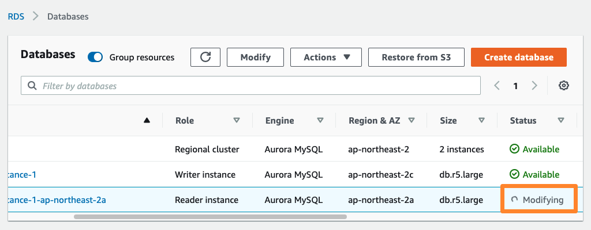

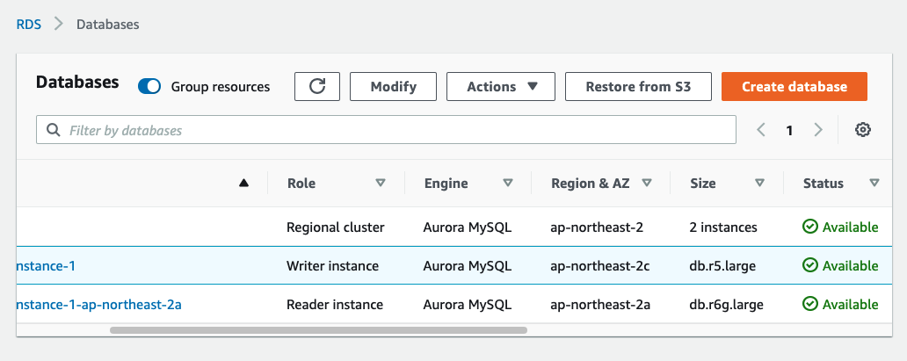

※ RDS는 언제든지 인스턴스의 크기를 변경할 수 있습니다. 하지만, 데이터베이스의 크기는 확장 후 줄이는(shrink) 것을 지원하지 않습니다.

---------------------------------------

## (옵션) RDS Aurora 연결

일반적인 Database 관리/운영에 사용되는 MySQL CLI를 통한 RDS 연결을 수행해 보도록 하겠습니다.

------------------------------------------------------

이를 위해서는,

VPC-Lab 내의 Public Subnet에 만들어 둔 AMI로 EC2 인스턴스를 생성합니다. 이 때, 네트워킹 옵션에서 Public IP를 허용해 주어야 합니다.

RDS Aurora의 보안 그룹 설정을 변경해 줍니다. 새로 생성한 EC2 인스턴스의 보안 그룹을 소스로 허용하도록 구성합니다.

방금 생성한 EC2 인스턴스에 SSH로 로그인한 후, MySQL Client를 통하여 RDS Aurora에 접속합니다. EC2 Web Server에는 EC2 배포과정에서 이미 MySQL Client가 설치되어 있습니다.

위 항목을 직접 구성해 보시는 것이 바로 도전 과제가 되겠습니다. 설정이 정상적으로 되었다면 아래와 같이 CLI 환경에서 접속하여 mysql 명령을 수행할 수 있습니다.

```

$ ssh -i AWS-ImmersionDay-Lab.pem ec2-user@”EC2 Host FQDN or IP”
Last login: Sun Feb 18 14:41:59 2018 from 112.148.83.236

       __|  __|_  )
       _|  (     /   Amazon Linux AMI
      ___|\___|___|

https://aws.amazon.com/amazon-linux-ami/2017.09-release-notes/


$ mysql -u awsuser -pawspassword -h awsdb.ccjlcjlrtga1.ap-northeast-2.rds.amazonaws.com

Welcome to the MySQL monitor.  Commands end with ; or \g.
Your MySQL connection id is 34
Server version: 5.6.10 MySQL Community Server (GPL)


Type 'help;' or '\h' for help. Type '\c' to clear the current input statement.

mysql> show databases;
+--------------------+
| Database           |
+--------------------+
| information_schema |
| immersionday       |
| mysql              |
| performance_schema |
+--------------------+
4 rows in set (0.01 sec)

mysql> use immersionday;
Reading table information for completion of table and column names
You can turn off this feature to get a quicker startup with -A

Database changed
mysql> show tables;
+------------------------+
| Tables_in_immersionday |
+------------------------+
| address                |
+------------------------+
1 row in set (0.01 sec)

mysql> select * from address;
+----+-------+--------------+---------------------+
| id | name  | phone        | email               |
+----+-------+--------------+---------------------+
|  1 | Bob   | 630-555-1254 | bob@fakeaddress.com |
|  2 | Alice | 571-555-4875 | alice@address2.us   |
+----+-------+--------------+---------------------+
2 rows in set (0.00 sec)

mysql>

```