# 스토리지 – Amazon S3

Amazon Simple Storage Service(이하 S3)는 언제 어디서나 데이터를 단순하게 처리할 수 있도록 하는 웹 서비스 기반 인터페이스를 제공합니다.

이번 실습은 사용자가 S3를 이용하여 데이터를 저장, 확인, 이동 및 삭제하는 기능을 익힐 수 있도록 구성되었습니다. 또한 S3의 정적 웹 사이트 호스팅 기능을 이용하여, 간단한 정적 웹 페이지를 호스팅하는 기능도 확인 가능합니다.

## 목표 구성도



---------------------------

## 실습 순서

* S3에 Bucket 생성
* 버킷에 오브젝트 추가하기
* 오브젝트 보기
* 정적 웹 사이트 호스팅 사용
* 오브젝트 이동
* 버킷 버저닝 활성화
* 오브젝트 및 버킷 삭제

--------------------------------

## S3에 Bucket 생성

: Amazon S3의 모든 오브젝트(Object)는 버킷(Bucket)내에 저장됩니다. Amazon S3에 데이터를 저장하기 전에 반드시 Bucket을 생성해야 합니다.

--------------------------------
## 버킷 생성

1. AWS Management Console에서 S3 서비스  로 접속한 다음 Create bucket을 눌러 버킷을 생성합니다.

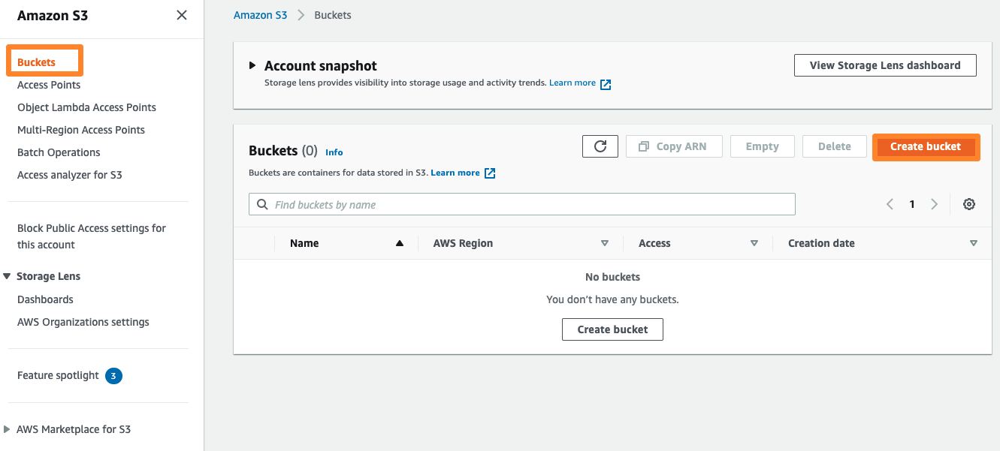

2. Bucket name 필드에 고유한 버킷 이름을 입력하십시오. 본 실습에서는 immersion-day-실습사용자이름 으로 입력하여 진행합니다. 입력한 버킷 이름은 Amazon S3내에서 중복될 수 없고 유일 해야 합니다. 조직 이름 또는 사용자 이름 등을 반영하여 유일한 버킷 이름을 생성하십시오. Region 드롭-다운 박스에서 버킷을 생성할 리전을 지정하십시오. 본 실습에서는 Asia Pacific (Seoul) 을 선택합니다. Object Ownership은 ACLs enabled로 변경합니다. Bucket settings for Block Public Access는 기본 값을 유지하고, 우측 하단의 Create bucket를 선택하십시오.

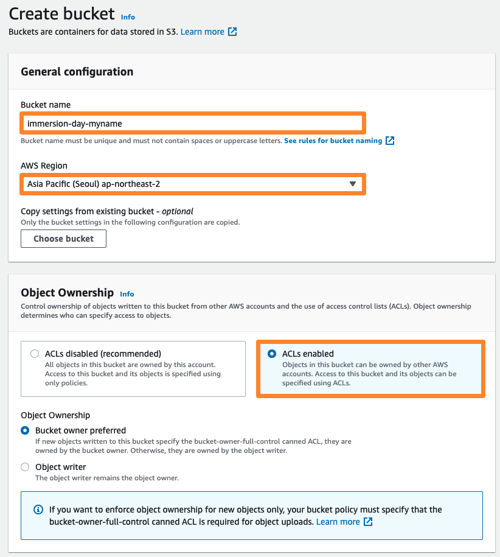

버킷 이름은 아래의 규칙을 반드시 준수해야 합니다.
* 소문자, 숫자, 점(.) 그리고 대쉬(-)를 포함 할 수 있습니다.
* 반드시 숫자 또는 문자로 시작해야 합니다.
* 최소 3자에서 최대 255문자의 길이로 지정이 가능합니다.
* IP주소와 같은 형식으로 지정할 수 없습니다. (e.g., 265.255.5.4)

※ 버킷이 생성되는 리전에 따라 추가적인 제약이 있을 수 있습니다. 버킷의 이름은 한 번 생성하면 변경이 불가능 하며, 버킷 내에 저장된 오브젝트를 지정하기 위하여 URL에 포함됩니다. 생성할 버킷의 이름이 적절한지 확인하시기 바랍니다.

3. Amazon S3에 버킷이 생성되었습니다.

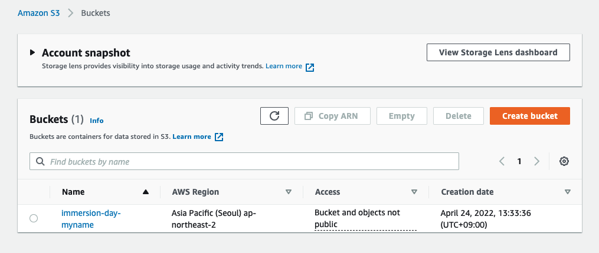

※ 버킷을 생성하는 데는 비용이 들지 않습니다. S3 버킷에 개체를 저장하는 데는 요금이 부과됩니다. 청구되는 요금은 사용 중인 지역, 개체의 크기, 한 달 동안 개체를 저장한 기간, 스토리지 클래스에 따라 달라집니다. 요청당 요금도 있습니다. 더 자세한 정보 

---------------------------------------

## 버킷에 오브젝트 추가하기

: 버킷이 정상적으로 생성 되었다면 오브젝트를 추가할 준비가 되었습니다. 오브젝트는 텍스트 파일, 이미지 파일 및 비디오 파일 등 모든 종류의 파일이 될 수 있습니다. Amazon S3에 파일을 추가할 때, 해당 파일에 대한 권한 및 접근 설정 등에 대한 정보를 메타데이터에 포함시킬 수 있습니다.

### 정적 웹 호스팅을 위한 오브젝트 추가

: 이번 실습은 S3를 통해, 정적 웹사이트를 호스팅합니다. 해당 정적 웹사이트는 특정 이미지를 클릭하면 VPC Lab에서 생성한 인스턴스로 리다이렉팅하는 역할을 합니다. 따라서 이미지 파일 1개, HTML 파일 1개, ALB DNS name을 준비합니다.

1. [aws.png](https://static.us-east-1.prod.workshops.aws/88a8dca7-a449-45ef-8175-384d9646aea5/static/common/s3_advanced_lab/aws.png?Key-Pair-Id=K36Q2WVO3JP7QD&Policy=eyJTdGF0ZW1lbnQiOlt7IlJlc291cmNlIjoiaHR0cHM6Ly9zdGF0aWMudXMtZWFzdC0xLnByb2Qud29ya3Nob3BzLmF3cy84OGE4ZGNhNy1hNDQ5LTQ1ZWYtODE3NS0zODRkOTY0NmFlYTUvKiIsIkNvbmRpdGlvbiI6eyJEYXRlTGVzc1RoYW4iOnsiQVdTOkVwb2NoVGltZSI6MTcxMTIwMTkzOX19fV19&Signature=oxdOakwik-%7EDrXY6TGdj9BE3qtNd1Xu%7EbFlFv8xJnQIyhR5utXjmHtJoqn5mGSXhpTM%7EG%7EQ8e%7E5yQiJBveS2UnCzV-aRevi2t0pblyHeUjMQZKHHEZz8Escn1-s34UA-tO6RjY-glibFWpVIKZC3UB95sxvBbis58dx5CTKtqbAXmnwBFYl3R0vBby6zzYRrOKF2c03o3XLF7Y3foSJnDRRBkxwesCEvgc%7E7nZVP%7Epx9xOqiwZjqBOdTATZNvigL3G9-vrhk3BGN0M67P4O5YbVzMvf%7EU-0HDBdwdUIgkWSrfE6y5t8qcHJ0bqd4kPvrVY3P32fti9G5Ocm0UD0dRg__)  이미지 파일을 다운로드하여 aws.png 로 저장 합니다.

2. 아래의 소스코드를 이용하여 index.html 을 작성합니다.

```html
<html>
    <head>
        <meta charset="utf-8">
        <title> AWS General Immersion Day S3 HoL </title>
    </head>
    <body>
        <center>
        <br>
        <h2> Click image to be redirected to the EC2 instance that you created </h2>
        
        </center>
    </body>
</html>

```

3. aws.png 파일을 S3로 업로드 합니다. 방금 생성한 S3 버킷 을 클릭 합니다.


4. Upload 버튼을 클릭하고 Add files 버튼을 클릭합니다. 파일 탐색기를 통해서 미리 다운로드 받아둔 aws.png 파일을 선택합니다. 또는 해당 파일을 화면으로 Drag & Drop 으로 가져다 놓습니다.

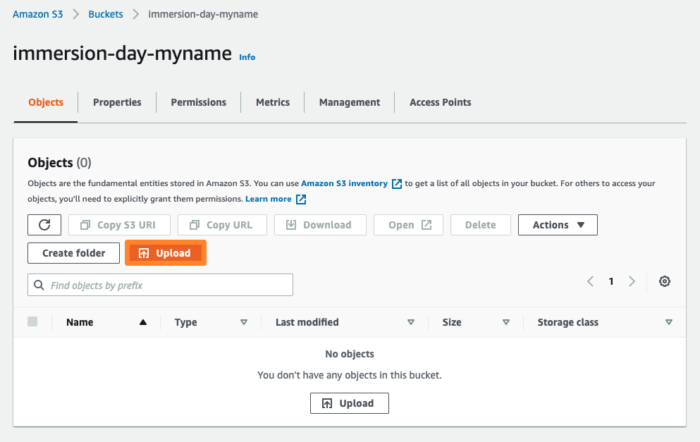

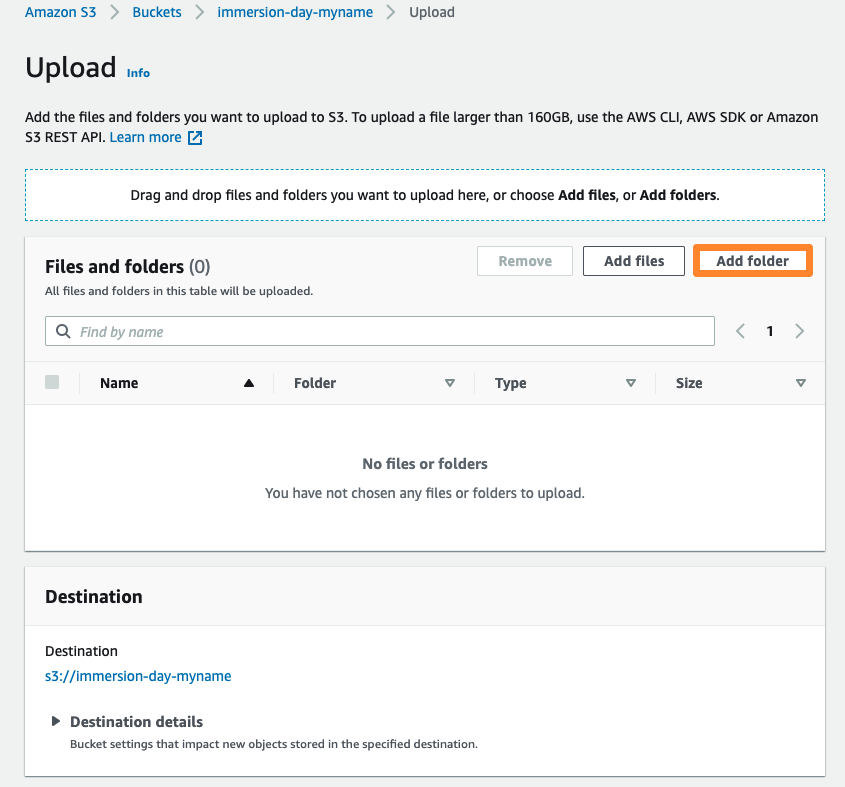

5. 업로드할 파일 정보 aws.png 파일을 확인한 후, 하단의 Upload 버튼을 클릭하여 업로드 합니다.

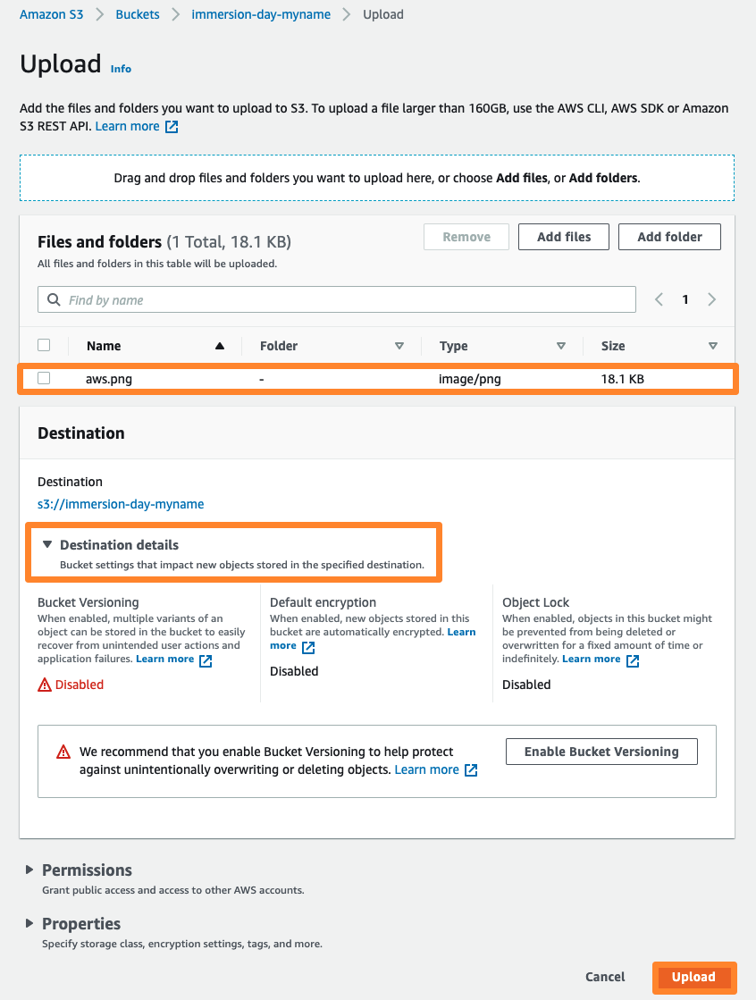

6. index.html에 이미지 URL을 기입하기 위해서 URL 정보를 확인합니다. 업로드 된 aws.png 파일을 선택한 후, 우측에 나오는 상세 정보에서 Object URL 정보를 복사합니다.

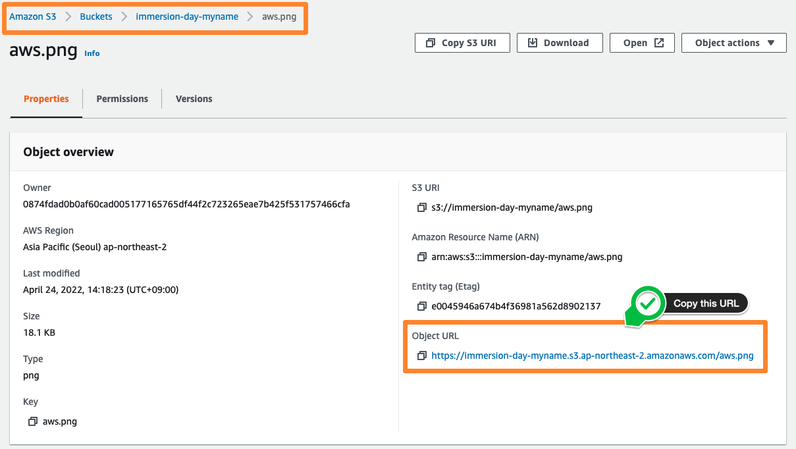

7. index.html에 이미지의 URL 부분에 복사해둔 Object URL 을 붙여 넣습니다. 그리고 이미지를 클릭하면 ALB로 이동하도록 오토 스케일링 웹 서비스 배포에서 생성한 로드밸런서의 ALB DNS Name(http://ALB  DNS Name) 을 지정합니다.

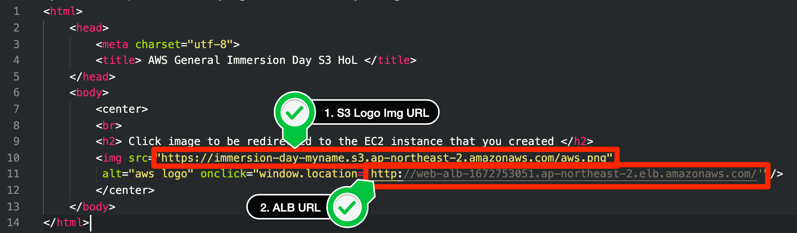

8. 이미지 업로드한 방법과 같이 index.html 파일도 S3에 업로드 합니다.

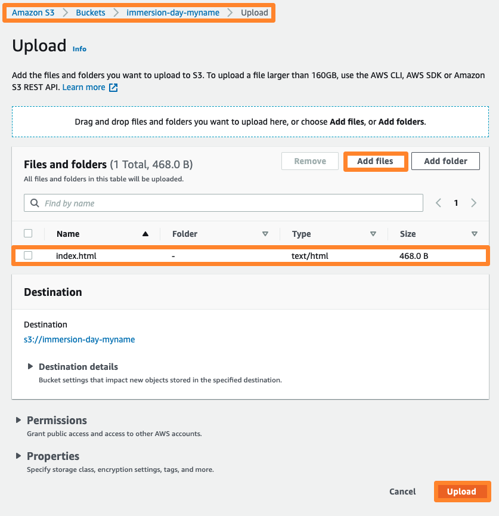

9. 업로드한 이미지를 확인하면 다음과 같습니다.

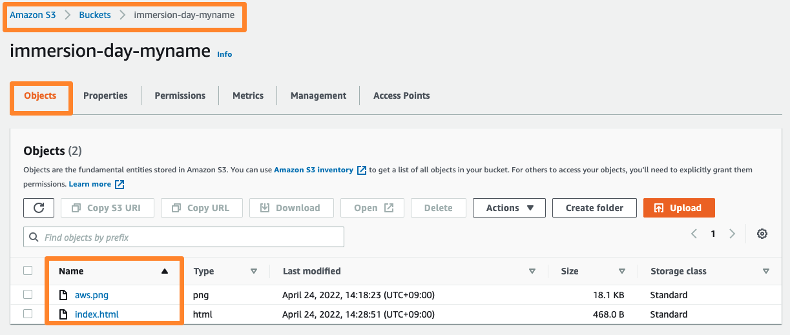

-----------------------------------------------

## 오브젝트 보기

: 버킷에 오브젝트를 추가하였으면, 이제 웹 브라우저에서 해당 오브젝트를 확인해 보겠습니다.

1. Amazon S3 Console에서 확인하고자 하는 오브젝트를 클릭 하십시오. 아래와 같이 오브젝트에 대한 상세 정보를 확인 할 수 있습니다.

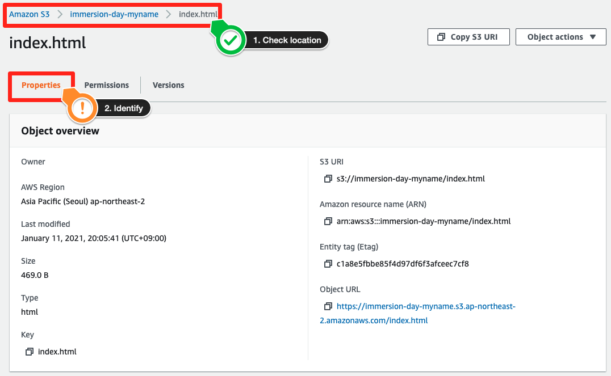

※ 기본적으로 S3 버킷에 있는 모든 오브젝트는 소유자 전용입니다(Private).
https://{Bucket}.s3.{region}.amazonaws.com/{Object} 와 같은 형식의 URL을 통해 해당 오브젝트를 확인하기 위해서는 외부사용자가 읽을 수 있도록 읽기 권한을 부여해야 합니다. 또는 해당 오브젝트에 대하여 인증 정보가 포함된 시그니처 기반의 Signed URL을 생성하여, 권한이 없는 사용자가 임시적으로 해당 오브젝트에 접근하게 할 수 있습니다.

2. 다시 이전 페이지로 돌아가 버킷의 Permissions 탭을 선택합니다. Block public access (bucket settings) 의 적용 여부를 수정하기 위해, 오른쪽 Edit 버튼을 누릅니다.

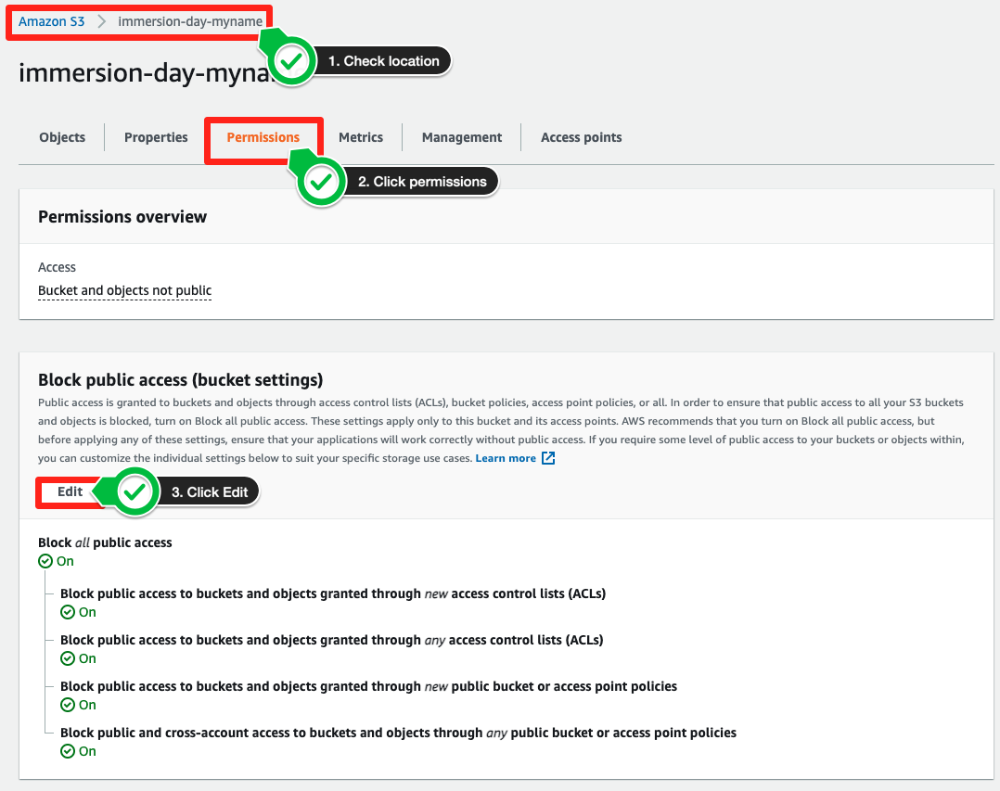

3. 맨 위 체크박스를 선택 해제 하고 Save changes 버튼을 누르세요.

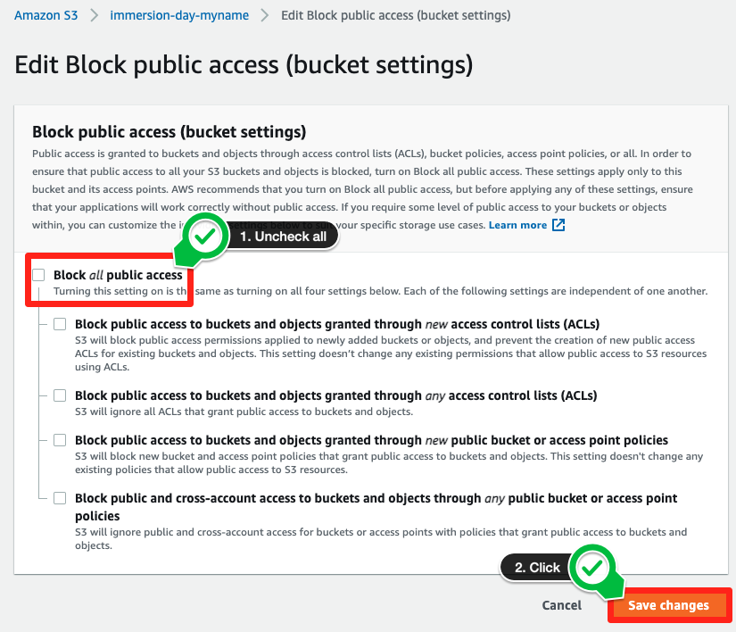

4. 버킷의 퍼블릭 액세스 차단 편집 팝업 창에서 confirm 을 입력하시고 Confirm 버튼을 누르세요.

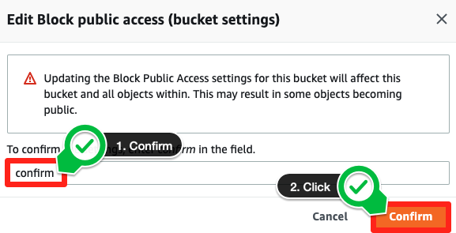

5. Objects 탭을 클릭하고, 업로드한 파일들을 선택 한 후 Action 드롭 다운 버튼을 클릭하고, Make public 버튼을 눌러서 퍼블릭으로 설정합니다.

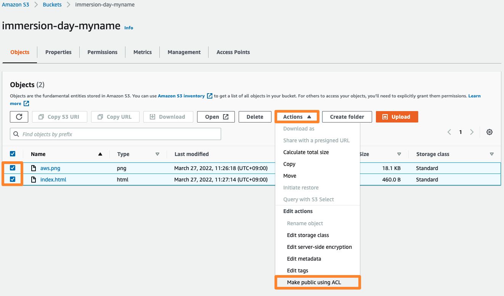

6. 확인 창이 팝업되면 다시 Make public 버튼을 눌러 확인해줍니다.

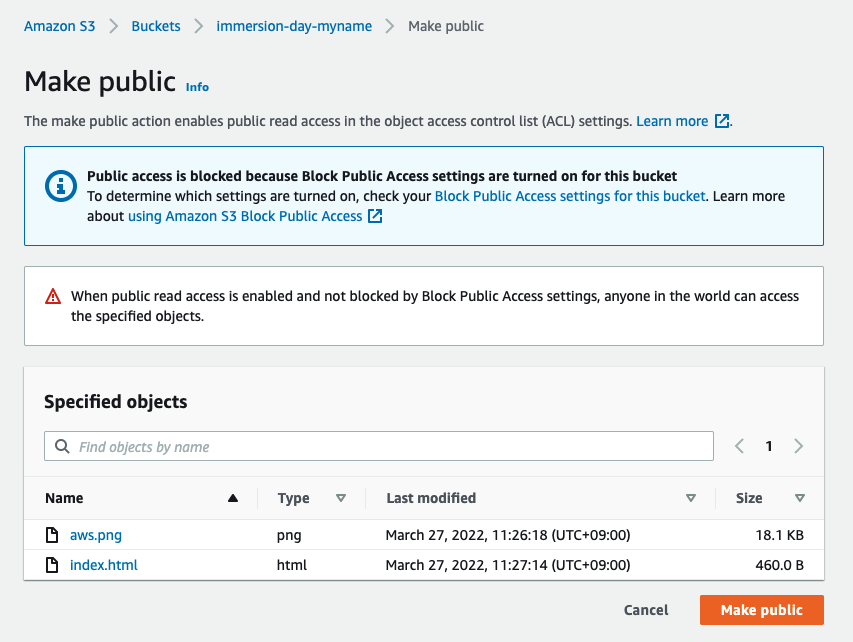

7. 버킷 페이지로 다시 돌아와 index.html을 선택하고, 세부 정보 표시 항목에서 Object URL 링크를 클릭합니다.

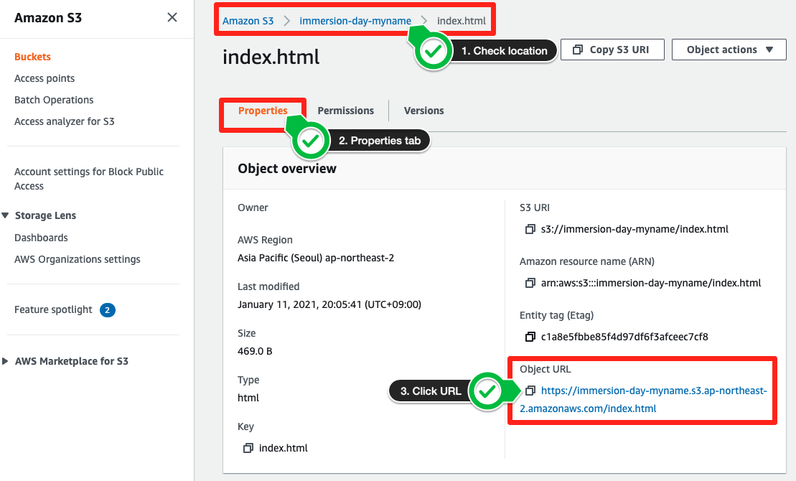

8. HTML 오브젝트 파일 객체 URL에 접속 하시면 아래와 같은 화면이 출력됩니다.

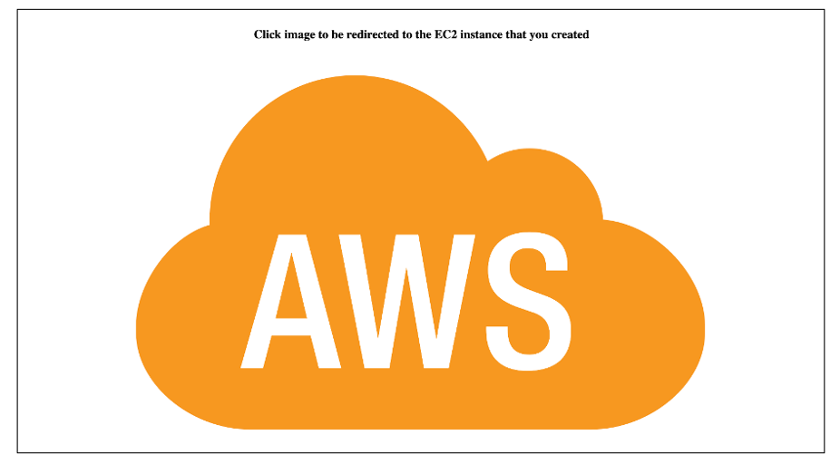

9. 이미지를 클릭 시, 생성한 인스턴스 페이지로 리다이렉트 됩니다.

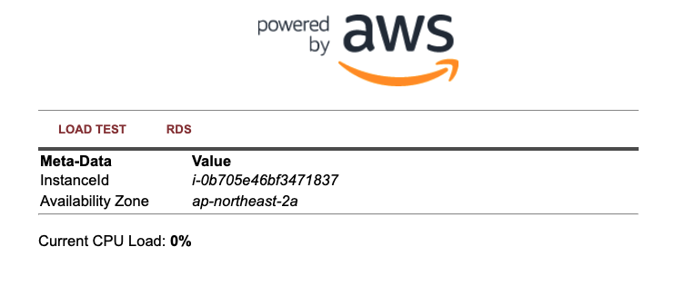


## References
AWS-General Immersion Day