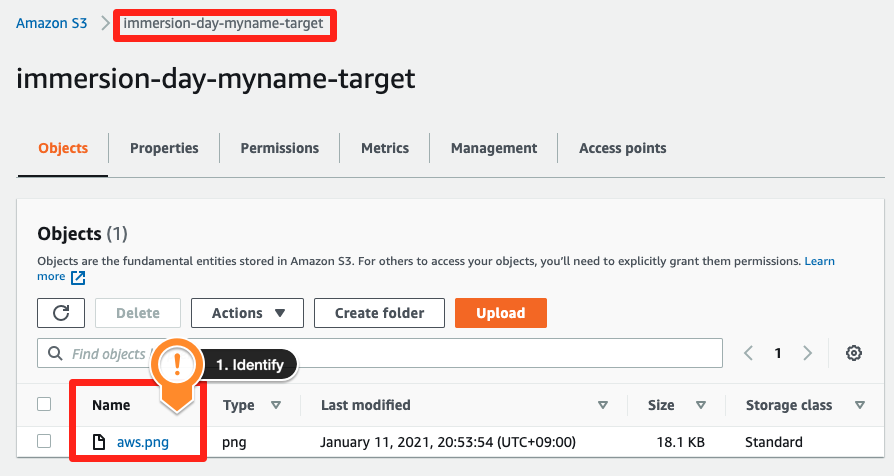

## 정적 웹 사이트 호스팅 사용

: Amazon S3를 이용하여 정적 웹 사이트를 호스팅할 수 있습니다.

----------------------------

## 정적 웹 사이트 설정

: 정적 웹 사이트란, 웹 페이지에 정적 콘텐츠(HTML, 이미지, 비디오) 또는 클라이언트 측 스크립트(Javascript)만을 포함하는 웹 사이트를 가리킵니다. 이와는 대조적으로 동적 웹 사이트의 경우 PHP, JSP 또는 ASP.NET과 같은 서버 측 스크립트를 포함한 서버 측 처리를 필요로 합니다. Amazon S3에서는 서버 측 스크립팅을 지원하지 않습니다. 동적 웹 사이트를 호스팅하고자 하는 경우, AWS의 EC2와 같은 다른 서비스를 사용하면 됩니다.

1. S3 콘솔에서 방금 생성한 버킷을 선택하고, Properties 탭을 클릭합니다. 스크롤을 내려 Static website hosting 의 Edit 버튼을 클릭합니다.

2. 정적 웹사이트 호스팅 기능 활성화 및 호스팅 타입 선택 그리고 index document 값에 index.html 값을 입력한 후, save changes 버튼을 클릭합니다.

3. Static website hosting 항목에 생성된 Bucket website endpoint를 클릭하여 정적 웹 사이트로 접속합니다.

4. 접속이 잘 됩니다. 이렇게 Amazon S3를 이용하여 정적 웹 사이트를 호스팅할 수 있습니다.

-------------------------------------

## 오브젝트 이동

: 지금까지의 과정에서 버킷에 오브젝트를 추가하고 이를 확인하는 기능을 확인했습니다. 이제, 오브젝트를 다른 버킷이나 폴더로 이동하는 기능을 확인하겠습니다.

1. 버킷 간 오브젝트 이동을 위하여 임시 버킷을 생성하십시오. (버킷 이름 : 기존생성버킷명-temp) 빠른 구성을 위하여 Block all public access 체크 박스를 해제 하십시오.

2. 아래의 알림 창에 체크하시고, Create bucket를 선택하십시오.

3. Amazon S3 Console에서 오브젝트가 있는 버킷(처음 생성한 버킷)을 선택하고 이동하고자 하는 오브젝트의 체크박스를 클릭하십시오. 상단의 Actions 메뉴를 선택하면 해당 오브젝트에 대하여 수행할 수 있는 다양한 기능들을 확인할 수 있습니다. 나열된 기능들 중 Move 을 선택합니다.

4. 아래와 같이 목적지를 버킷으로 선택한 후, Browse S3 버튼을 클릭합니다.

5. 팝업 창에서 버킷 이름을 클릭한 후, 대상(도착) 버킷을 선택합니다. Choose destination 버튼을 클릭합니다.

6. 대상 버킷에서 오브젝트가 이동한 것을 확인하세요.

※ 오브젝트를 이동시키더라도 기존에 설정된 권한은 그대로 유지됩니다.

-----------------------------------------

## 버킷 버저닝 활성화

: 동일한 버킷 내에 기존 파일을 최신 버전으로 갱신하지만, 기존 버전도 유지하고 싶은 경우 버킷 버저닝(Bucket Versioning) 을 사용 할 수 있습니다.

1. Amazon S3 Console에서 버저닝을 활성화하고자 하는 버킷을 선택하고 Properties 메뉴를 선택하십시오. Bucket Versioning의 Edit 버튼을 클릭합니다

2. Bucket Versioning 기능 활성화 라디오 버튼을 클릭한 뒤, Save changes를 클릭합니다.

3. 편집 가능한 파일을 선택하여 버저닝 기능이 활성화된 원본 파일을 일부 수정하여 저장 하고, 수정된 파일을 다시 버킷에 업로드하십시오. 본 실습에서는 index.html 파일을 수정한 뒤, 같은 이름으로 재업로드합니다.

4.변경된 파일의 업로드가 완료되면, S3 Console에서 해당 오브젝트를 클릭합니다. 오브젝트 상세 정보가 기재된 페이지에서 Versions 탭을 클릭하면, current version 정보를 확인할 수 있습니다.

----------------------------------------------

## 오브젝트 및 버킷 삭제

: 불필요한 비용을 막기 위하여 불필요한 오브젝트 및 버킷을 삭제할 수 있습니다.

1. Amazon S3 Console에서 삭제하고자 하는 버킷을 선택하고, Delete를 클릭하십시오. 삭제를 위한 대화 상자가 나타납니다.

2. 빈 버킷이 아니여서 버킷을 삭제할 수 없다는 경고문이 나옵니다. empty bucket configuration 을 선택하여 버킷을 비우는 작업을 수행합니다.

3. Empty bucket을 통해, 버킷 내의 모든 오브젝트를 한번에 삭제하는 작업을 수행합니다. permanently delete를 작성한 다음 Empty 버튼을 클릭합니다.

4. 위의 작업으로 빈 버킷을 만들었다면 1번 작업을 다시 수행합니다. 버킷 이름을 입력하고 Delete bucket 버튼을 누릅니다.

## References
AWS-General Immersion Day