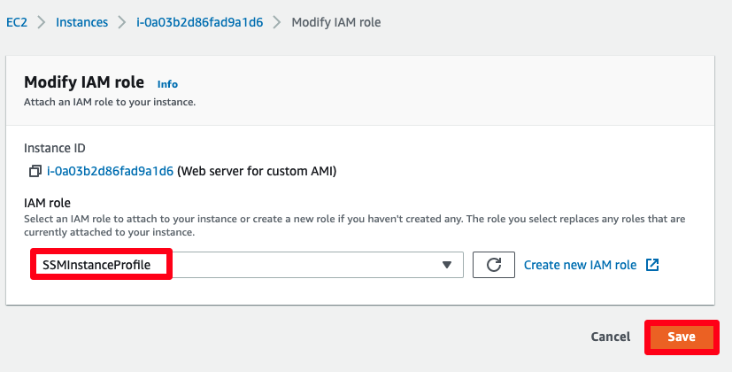

# 컴퓨트 – Amazon EC2
: Amazon Elastic Compute Cloud(Amazon EC2)는 안전하고 크기 조정이 가능한 컴퓨팅 파워를 클라우드에서 제공하는 웹 서비스입니다. 개발자가 더 쉽게 웹 규모의 클라우드 컴퓨팅 작업을 할 수 있도록 설계되었습니다. Amazon EC2의 간단한 웹 서비스 인터페이스를 통해 간편하게 필요한 용량을 얻고 구성할 수 있습니다. 컴퓨팅 리소스에 대한 포괄적인 제어권을 제공하며, Amazon의 검증된 컴퓨팅 환경에서 실행할 수 있습니다.

-------------------------
## 목표구성도
본 컴퓨트 실습은 앞서 네트워크 실습에서 생성한 VPC내 Private subnet들에 Auto Scaling Group을 이용하여 웹 서비스 인스턴스를 배포합니다. 이를 통해 고가용성이 보장되는 Web Service를 구성하여 외부 사용자가 Web Browser를 통하여 Sample Web Page에 접근할 수 있도록 구성합니다.


* 웹 서버 인스턴스 시작(Launching) 및 사용자 지정 데이터(User Data)의 실행
* 보안 그룹(Security Group)의 설정
* 커스텀 AMI(Amazon Machine Image) 생성
* ALB(Application Load Balancer) 생성
* 시작 템플릿(Launch Template) 구성
* Auto Scaling Group 구성
* Auto Scaling 테스트 및 수동 설정 변경
------------------------

## 실습 순서
1. 웹 서버 인스턴스의 시작
2. 오토 스케일링 웹 서비스 배포
3. 웹 서비스 확인 및 테스트

--------------------------

## 웹 서버 인스턴스의 시작
### 인스턴스 생성 및 웹서비스 접속

1. AWS 콘솔 검색 창에 EC2 를 입력하고 선택합니다. 그리고 좌측 메뉴 상단의 **EC2 Dashboard**를 클릭합니다. **Launch instance** 버튼을 누르고, 메뉴에서 **Launch instance** 를 선택합니다.


2. Name에 Web server for custom AMI 값을 넣습니다. 그리고 아래의 Amazon Machine Image에서 기본 값 설정을 확인합니다.
   


3. **Instance Type** 에서 `t2.micro`를 선택합니다.


4. Key pair의 경우, Proceed without a key pair로 선택합니다.


5. EC2가 위치할 공간을 설정하는 Network setting에서 Edit 버튼을 클릭합니다.


그리고 이전 실습에서 생성한 VPC-Lab-vpc를 선택하고 서브넷의 경우, public subnet을 선택합니다. Auto-assign public IP는 Enable로 설정합니다.


6. 바로 아래에서 네트워크 방화벽 역할을 하는 Security groups를 생성합니다. 보안 그룹은 방화벽 정책으로 허용하고자 하는 프로토콜과 주소를 지정하게 됩니다. 현재 생성하는 보안 그룹의 경우, 생성될 EC2에 적용되는 규칙입니다. Security group name과 Description에 Immersion Day - Web Server 를 입력 후, Add Security group rule을 선택하여 Type에 HTTP 를 지정하여 Web Service를 위한 TCP/80도 함께 허용합니다. 소스 주소의 경우 My IP를 선택합니다.


7. 나머지 모든 값들은 기본값을 사용하고, 화면 하단의 Advanced Details 탭을 클릭하여 확장하십시오. User data 입력란에 아래의 값을 입력 후, Launch instance를 선택 하십시오.


Meta Data 버전 드롭다운을 클릭하고 V2 only (token required) 을 선택합니다.


User data 필드에 다음 값을 입력하고 Launch instance을 선택합니다.


```yaml
#!/bin/sh

#Install a LAMP stack
dnf install -y httpd wget php-fpm php-mysqli php-json php php-devel
dnf install -y mariadb105-server
dnf install -y httpd php-mbstring

#Start the web server
chkconfig httpd on
systemctl start httpd

#Install the web pages for our lab
if [ ! -f /var/www/html/immersion-day-app-php7.zip ]; then
   cd /var/www/html
   wget -O 'immersion-day-app-php7.zip' 'https://static.us-east-1.prod.workshops.aws/88a8dca7-a449-45ef-8175-384d9646aea5/assets/immersion-day-app-php7.zip?Key-Pair-Id=K36Q2WVO3JP7QD&Policy=eyJTdGF0ZW1lbnQiOlt7IlJlc291cmNlIjoiaHR0cHM6Ly9zdGF0aWMudXMtZWFzdC0xLnByb2Qud29ya3Nob3BzLmF3cy84OGE4ZGNhNy1hNDQ5LTQ1ZWYtODE3NS0zODRkOTY0NmFlYTUvKiIsIkNvbmRpdGlvbiI6eyJEYXRlTGVzc1RoYW4iOnsiQVdTOkVwb2NoVGltZSI6MTcxMTIwMTkzOX19fV19&Signature=oxdOakwik-~DrXY6TGdj9BE3qtNd1Xu~bFlFv8xJnQIyhR5utXjmHtJoqn5mGSXhpTM~G~Q8e~5yQiJBveS2UnCzV-aRevi2t0pblyHeUjMQZKHHEZz8Escn1-s34UA-tO6RjY-glibFWpVIKZC3UB95sxvBbis58dx5CTKtqbAXmnwBFYl3R0vBby6zzYRrOKF2c03o3XLF7Y3foSJnDRRBkxwesCEvgc~7nZVP~px9xOqiwZjqBOdTATZNvigL3G9-vrhk3BGN0M67P4O5YbVzMvf~U-0HDBdwdUIgkWSrfE6y5t8qcHJ0bqd4kPvrVY3P32fti9G5Ocm0UD0dRg__'
   unzip immersion-day-app-php7.zip
fi

#Install the AWS SDK for PHP
if [ ! -f /var/www/html/aws.zip ]; then
   cd /var/www/html
   mkdir vendor
   cd vendor
   wget https://docs.aws.amazon.com/aws-sdk-php/v3/download/aws.zip
   unzip aws.zip
fi

# Update existing packages
dnf update -y

```
※ 사용자 데이터(User Data)는 최초 인스턴스 생성시 실행되는 사용자 정의 초기화 스크립트 입니다.

8. 인스턴스 생성이 진행 중이라는 정보가 화면에 표시가 됩니다. 우측 하단의 View Instances(인스턴스 보기) 를 선택하여 EC2 인스턴스의 목록을 확인할 수 있습니다.
9. 인스턴스 구성이 완료되면 인스턴스가 구동되고 있는 가용 영역, 외부에서 접근 가능한 IP 및 DNS 정보를 확인 할 수 있습니다.


10. 인스턴스의 Instance state 결과가 Running이 될 때까지 대기하십시오. 새로운 웹 브라우저 탭을 열고 URL 주소 입력하는 영역에, EC2 인스턴스의 퍼블릭 DNS 또는 IPv4 퍼블릭 IP를 입력하십시오. 아래와 같이 페이지가 보여지면 웹 서버 인스턴스가 정상적으로 구성된 것입니다.


-------------------------------------

### 인스턴스 접속

1. EC2 인스턴스 콘솔로 들어갑니다. 접속하고자 하는 인스턴스를 선택한 뒤, 가운데 Connect 버튼을 누릅니다.


2. Connect your instance 창에서 EC2 Instance Connect 탭을 선택한 뒤, 오른쪽 아래 Connect 버튼을 누릅니다.


3. 잠시 기다리고 나면, 아래와 같이 브라우저 기반 SSH 콘솔을 사용하실 수 있습니다. CLI 테스트 후 창을 닫으면 됩니다.


----------------------------------------
### Session Manager를 사용하여 리눅스 인스턴스에 접속
이어질 데이터베이스 실습에서 웹 서버에 부여된 IAM Role을 사용하여 RDS에 접속합니다. 이에 Session Manager를 사용하여 리눅스 인스턴스에 접근하기 를 참고하여 EC2 인스턴스에 IAM Role을 부여합니다.


----------------------------------------------------------------------------------

# (옵션) Session Manager를 사용하여 리눅스 인스턴스에 접근하기
Session Manager는 대화형 원클릭 브라우저 기반 셸 또는 AWS CLI를 통해 Amazon EC2 인스턴스를 관리할 수 있는 AWS Systems Manager의 기능입니다. Session Manager를 사용하여 계정의 인스턴스에 세션을 시작할 수 있습니다. 세션이 시작된 후, 다른 연결 유형을 통해 bash 명령을 실행할 수 있습니다.

## Systems Manager를 위한 IAM 인스턴스 프로파일 생성
1. AWS 콘솔창에 접속한 후 IAM 콘솔 을 엽니다. 네비게이션 항목에서 Roles를 선택한 후, Create role을 클릭합니다.


2. Select type of trusted entity에서 AWS service를 선택합니다. 바로 아래에 이 role을 사용할 서비스인 EC2를 선택합니다. 그리고 Next 버튼을 클릭합니다.


3. 해당 IAM Role에 부착할 IAM Policy를 선택하는 페이지에서 아래와 같은 작업을 수행합니다: 검색바를 사용하여 AmazonSSMManagedInstanceCore를 찾은 다음, select box를 클릭한 후, Next를 클릭합니다.


4. Role name에 SSMInstanceProfile를 입력합니다. Create role를 클릭합니다. 그러면 Roles 창으로 돌아오게 됩니다.


※ 방금 생성한 Role 이름을 기록합니다. Systems Manager를 사용하여 관리할 인스턴스에 해당 Role을 부여합니다.

## 기존의 인스턴스에 Systems Manager 인스턴스 프로파일 부착(콘솔)

1. AWS 콘솔창에 접속한 후, Amazon EC2 콘솔 을 엽니다.
2. 네비게이션 항목에서 Instances 아래에 Instances를 선택합니다. 실습 때 생성한 EC2 인스턴스를 클릭합니다.


3. Actions 메뉴에서 Security 선택 후, Modify IAM role를 클릭합니다.


4. IAM Role에서 방금 생성한 SSMInstanceProfile 인스턴스 프로파일을 선택합니다.


5. Save 버튼을 누릅니다.



## Session Manager를 사용하여 리눅스 인스턴스 연결하기

1. EC2 인스턴스 콘솔에서 방금의 인스턴스를 선택한 후, Connect 버튼을 클릭합니다.


2. Connect to instance 페이지에서 Session Manager를 선택합니다. 아래의 내용을 참고하세요.


3. Session Manager 사용에 대한 이점이 담겨있는 Session Manager usage section 내용을 검토합니다.

4. Connect를 선택합니다. 새로운 세션이 새로운 탭에서 시작될겁니다. 세션이 시작된 후, bash command를 실행할 수 있습니다.


------------------------------------------------

### 커스텀 AMI 생성
: AWS EC2 콘솔에서는 생성된 인스턴스를 이용하여 이미지를 만들고, 추후 인스턴스 생성 시 이 이미지를 사용할 수 있습니다. 이를 커스텀 AMI라고 부릅니다.
여기서는 앞서 생성한 웹 서버 인스턴스를 이용하여 AMI를 만들어 보겠습니다.

1. EC2 콘솔에서 아까 생성한 인스턴스를 선택하고, Actions > Image and templates > Create Image 를 선택합니다.


2. Create Image 창에서 아래와 같이 입력하고, Create image를 눌러 이미지를 생성합니다.


3. 이미지 생성 요청이 완료되었다는 창을 확인합니다.
4. 좌측 콘솔 메뉴에서 IMAGES 아래 AMIs 버튼을 찾아 클릭합니다. 방금 요청한 AMI의 Status 가 생성 중(Pending) 이거나, 완료되면 사용가능(Available)한 상태인 것을 확인할 수 있습니다.


--------------------------------------------

### 인스턴스 종료 (Terminate)
: 방금 생성한 EC2 인스턴스를 이용하여 오토스케일링에 사용하기 위하여 커스텀 AMI(골든 이미지) 생성을 완료하였습니다. 따라서, 현재 생성한 EC2 인스턴스는 더 이상 필요가 없어 졌으므로, 종료(Termination)해 보도록 하겠습니다. (다음 오토 스케일링 웹 서비스 배포에서 커스텀 AMI를 이용하여 웹 서버를 새로 만들 예정입니다.)

1. EC2 대시보드에서 Instances 탭으로 들어갑니다. 그리고 삭제하고자 하는 인스턴스를 선택합니다. 이후 Instance state -> Terminate instance 를 클릭합니다


2. 경고 창이 뜨면, 우측 하단의 Terminate를 눌러 삭제합니다.


3. Instance State가 Shutting down으로 변경됩니다. 이후 곧 terminated로 변경됩니다. 삭제가 완료되었습니다. 인스턴스 삭제 로깅을 위하여 일정 시간은 보일 수 있습니다.

----------------------------------------

## 현재까지의 아키텍처 구성

