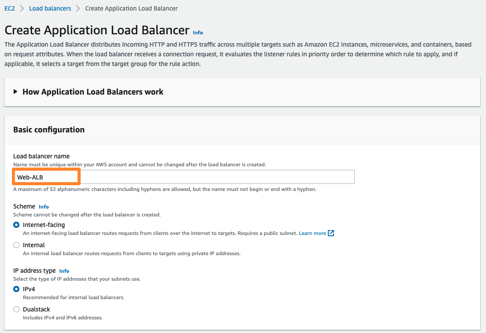
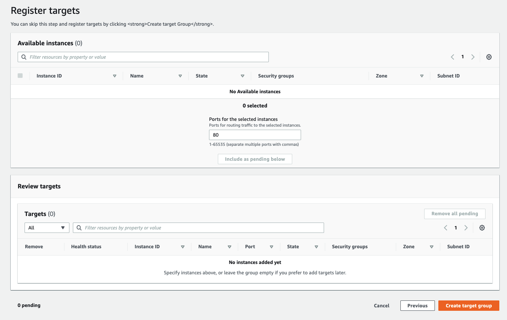
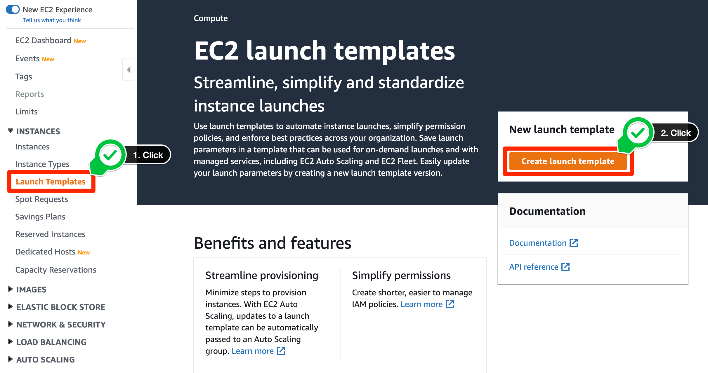

# 오토 스케일링 웹 서비스 배포
: 네트워크 실습에서 생성한 네트워크 인프라 위에 부하에 따라 자동적으로 Scale out/in 이 가능하고 고가용성이 보장되는 웹 서비스를 배포해 보겠습니다. 여기서는 이전 장에서 만들어 둔 웹 서버 AMI와 VPC Lab에서 구성한 네트워크 인프라를 사용합니다.

## Application Load Balancer 구성
AWS Elastic Load Balancing은 Application Load Balancer, Network Load Balancer, Gateway Load Balancer의 세 가지 유형의 로드 밸런서를 지원합니다. 본 실습에서는 HTTP 요청을 부하 분산 처리하는 Application Load Balancer를 구성하고 설정합니다.

------------------------------------

1. EC2 관리 콘솔로 들어갑니다. 좌측 메뉴에서 스크롤을 내려 Load Balancing 항목 아래 Load Balancers  를 클릭하고, 가운데 위의 Create Load Balancer 를 클릭합니다. Select load balancer type 창에서 Application Load Balancer 의 Create 버튼을 클릭합니다.

2. 로드 밸런서의 이름을 정해 줍니다. 여기서는 Name에 Web-ALB로 이름을 지정해 줍니다. 다른 설정들은 기본값으로 둡니다.

3. 스크롤을 조금 내리면, 가용 영역을 설정하는 란이 나옵니다. 사전에 구성한 VPC가 VPC-Lab-vpc 로 선택되어 있는지 확인한 후, 로드 밸런서가 사용할 가용 영역 ap-northeast-2a를 선택하고, Public subnet을 찾아 지정합니다. 마찬가지로 ap-northeast-2c도 선택하고 Public subnet을 지정해 줍니다.

4. Security groups 항목에서 Create new security group 하이퍼링크를 클릭합니다. 보안 그룹 이름으로 web-ALB-SG을 입력하고 VPC 정보를 확인합니다. Add rule 버튼을 클릭하고 HTTP를 Type으로 Anywhere-IPv4을 Source로 선택합니다. 그리고 보안 그룹을 생성합니다.

5. 다시 로드밸런서 페이지로 돌아와 리프레시 버튼을 클릭한 후, 방금 생성한 web-ALB-SG을 선택합니다. default 보안 그룹은 제거합니다.

6. Listeners and routing 항목에서 Create target group 하이퍼링크를 클릭합니다. web-TG을 타겟 그룹 이름으로 입력하고 아래의 화면과 같이 셋팅이 되어 있는지 확인합니다. 그 다음 Next 버튼을 클릭합니다.

7.인스턴스를 등록하는 단계입니다. 하지만 앞서 말씀드린 것처럼 현재 등록할 타겟이 없습니다. Create target group을 클릭합니다.

8.다시 로드밸런서 페이지로 돌아와 리프레시 버튼을 클릭한 후, 방금 생성한 web-TG를 선택합니다. 두 번째 화면과 설정이 같은지 확인합니다. 그리고 Create load balancer 버튼을 클릭합니다.

----------------------------------------

## 시작 템플릿 구성
: ALB를 만들었으니 이제 로드 밸런서 뒤에 인스턴스들을 배치할 차례입니다. Auto Scaling Group에서 시작할 Amazon EC2 인스턴스를 구성하려면 시작 템플릿, 시작 구성, 또는 EC2 인스턴스 를 사용할 수 있습니다. 여기서는 시작 템플릿을 사용하여 Auto Scaling 그룹을 생성해 보겠습니다.

시작 템플릿은 한 리소스 내의 모든 시작 파라미터를 한꺼번에 구성하도록 되어 있어 인스턴스 생성에 필요한 단계 수를 줄입니다. 또한 시작 템플릿은 Auto Scaling, 스팟 집합, 스팟 및 온디맨드 인스턴스에 대한 지원을 통해 Best Practice 를 더욱 쉽게 구현할 수 있습니다. 이를 통해 비용을 보다 편리하게 관리하고 보안을 향상시키며, 배포 오류 위험을 최소화하는 데 도움이 됩니다.

시작 템플릿에는 AMI 및 인스턴스 유형과 같이 Amazon EC2가 인스턴스를 시작하는 데 필요한 정보가 포함되어 있습니다. Auto Scaling 그룹은 이를 참조하여 확장(Scale out) 이벤트가 발생할 때 새로운 인스턴스들을 추가하게 됩니다. 만약 Auto Scaling 그룹에서 시작할 EC2 인스턴스의 구성을 변경해야 한다면, 시작 템플릿의 새 버전을 생성하여 Auto Scaling 그룹에 지정하면 됩니다. 필요에 따라 Auto Scaling 그룹에서 EC2 인스턴스를 시작하는 데 사용하는 시작 템플릿의 특정 버전을 선택할 수도 있습니다. 이 설정은 언제든지 변경할 수 있습니다.

--------------------------------------------

## 보안 그룹 생성

1.EC2 콘솔의 좌측 메뉴에서 Network & Security 칸의 Security Groups를 선택하고, 우측 상단의 Create Security Group 을 클릭합니다. 보안 그룹 생성 화면에서 아래 내용들을 채워 넣습니다. 해당 보안 그룹의 경우, ALB 뒷단에 배치할 EC2 인스턴스에 부여할 방화벽 정책입니다.

2.스크롤을 내려 Inbound rules 을 수정합니다. 먼저 Add rule 을 눌러 Inbound rules 수정 창을 추가하시고, Type에는 HTTP를 입력합니다. Source로는 검색창에 ALB라고 입력하시면 ALB 생성 시 만든 보안 그룹이 검색됩니다. 이를 클릭하여, ALB에서 들어오는 HTTP 트래픽만 받도록 보안 그룹을 구성해 줍니다.

3. Outbound rules는 기존 설정 그대로 두고, 오른쪽 아래 Create Security Group 버튼을 눌러 보안 그룹을 생성해 줍니다. 이를 통해 인터넷에서 ALB를 통해 인스턴스로 들어오는 HTTP 연결(TCP 80)에 대해서만 트래픽을 허용하는 보안 그룹을 생성하였습니다.

-------------------------------------------

## 시작 템플릿 생성

1. EC2 콘솔에 접속, 좌측 메뉴에서 Launch Templates을 찾아 선택하고, Create Launch Template을 클릭합니다.

   
2. 시작 템플릿 설정을 하나하나 진행해 보겠습니다. 먼저 Launch template name 과 Template version description 을 아래와 같이 설정하고, Auto Scaling guidance의 Provide guidance 항목의 체크박스를 선택 합니다. 이 체크박스를 선택하여 생성하는 템플릿이 Amazon EC2 Auto Scaling에서 활용되도록 설정합니다.
   

3. 아래로 스크롤을 내려 시작 템플릿 콘텐츠를 설정합니다. AMI 선택시, 이전 실습에서 생성한 Web Server v1를 선택합니다. 다음으로 인스턴스 유형에는 t2.micro를 입력하여 선택해 줍니다. 서비스용 웹 서버를 올리는 것이므로 SSH 접근은 하지 않을 예정입니다. 따라서 키 페어는 사용하지 않습니다. 

4. 다른 부분들은 기본값으로 두고, Network Settings 부분을 보겠습니다. 보안 그룹 란에는 검색 창에 ASG-Web-Inst-SG를 입력하여 ALB 트래픽만 받는 보안 그룹을 선택해 주겠습니다.

5. Storage는 별도 설정 없이 기본값을 따르겠습니다. 아래로 내려가 Instance tags를 정의하겠습니다. Add tag를 누르고, Key에 Name을, Value에 Web Instance를 입력해 줍니다. Tag volumes도 클릭하여 선택해 줍니다.

6. 마지막으로 Advanced details 탭에서 IAM instance profile을 SSMInstanceProfile로 설정합니다. 이외의 다른 설정들은 모두 기본값으로 두고, 우측 하단의 Create launch template 버튼을 눌러 시작 템플릿을 생성합니다.

7. 우측 Summary에서 설정한 값들을 확인한 후, Create launch template 을 눌러 템플릿을 생성합니다.

----------------------------------------------

## Auto Scaling Group 구성

1. EC2 콘솔로 들어가 좌측 메뉴 맨 하단의 Auto Scaling Groups를 선택합니다. 그리고 Create Auto Scaling group 버튼을 눌러 Auto Scaling Group을 생성합니다.

2. 먼저 Auto Scaling 그룹의 이름을 지정합니다. 여기서는 Web-ASG라고 지정해 보겠습니다. 이후 아래의 시작 템플릿 란에서 방금 만든 템플릿, Web을 선택해 줍니다. 시작 템플릿의 기본 설정들이 아래로 펼쳐져 보입니다. 확인 후 우측 하단 Next 버튼을 누릅니다.

3. 그 다음 네트워크 구성을 설정합니다. VPC에는 VPC-Lab-vpc을 선택하고, Subnets 란에 Private subnet 1과 Private subnet 2를 골라줍니다. 설정이 완료되면 Next 버튼을 누릅니다.

.png)

4. 다음으로는 로드 밸런싱 설정을 진행합니다. 먼저, Attach to an existing load balancer를 선택합니다. 이후 Choose a target group for your load balancer란에서 ALB 생성 시 만든 web-TG를 선택합니다. 맨 아래쪽의 Monitoring에서 Enable group metrics collection within CloudWatch의 체크 박스를 선택합니다. 이를 통해 Auto Scaling 그룹의 상태를 확인할 수 있는 그룹 지표(Metric)을 CloudWatch에서 확인할 수 있도록 합니다. 우측 하단의 Next 버튼을 누릅니다.

.png)

5. Configure group size and scaling policies 단계에서는 Auto Scaling 그룹의 Scaling 정책을 구성합니다. Group size 란에서 Desired capacity, Minimum capacity를 각각 2로 지정하고, Maximum capacity를 4로 지정합니다. 인스턴스 수를 평상시 2개로 유지하고, 정책에 따라 최소 2개, 최대 4개까지의 스케일링을 허용합니다.

6. 아래 조정 정책 란에서는 Target tracking scaling policy을 선택하고, Target value에 30을 입력합니다. CPU 평균 사용률이 전체 30%가 유지될 수 있도록 인스턴스 수를 조정하는 정책입니다. 다른 설정들은 모두 기본값으로 두고, 우측 하단 Next 버튼을 누릅니다.

7. Add notifications 단계는 기본값으로 둔 채 Next를 눌러 넘어갑니다. Add tags 단계에서는 간단히 이름 태그를 지정하겠습니다. Add tag를 누르고, Key에 Name을, Value에 ASG-Web-Instance를 입력한 후 Next을 클릭합니다.

8. 마지막 검토 단계에서 관련된 설정들을 리뷰한 후, 우측 하단의 Create Auto Scaling Group 버튼을 눌러 주세요.
9. Auto Scaling 그룹이 만들어졌습니다. Auto Scaling 그룹 콘솔에서 아래와 같이 생성된 Auto Scaling 그룹을 확인할 수 있습니다.

10. Auto Scaling 그룹을 통해 생성된 인스턴스들은 EC2 인스턴스 메뉴에서도 확인해 볼 수 있습니다.

.png)

----------------------------------------
### 현재까지의 아키텍처 구성

## References
AWS-General Immersion Day