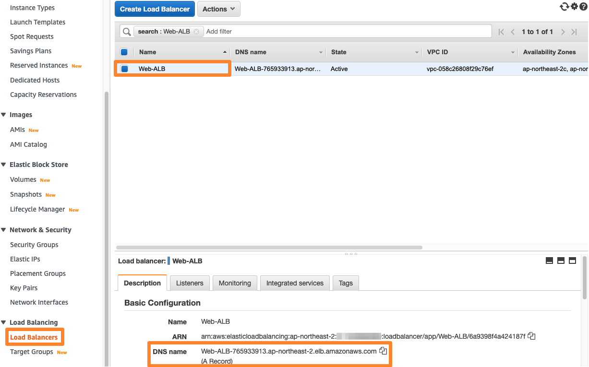
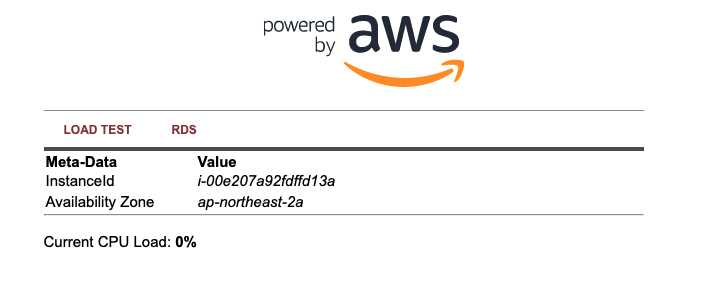
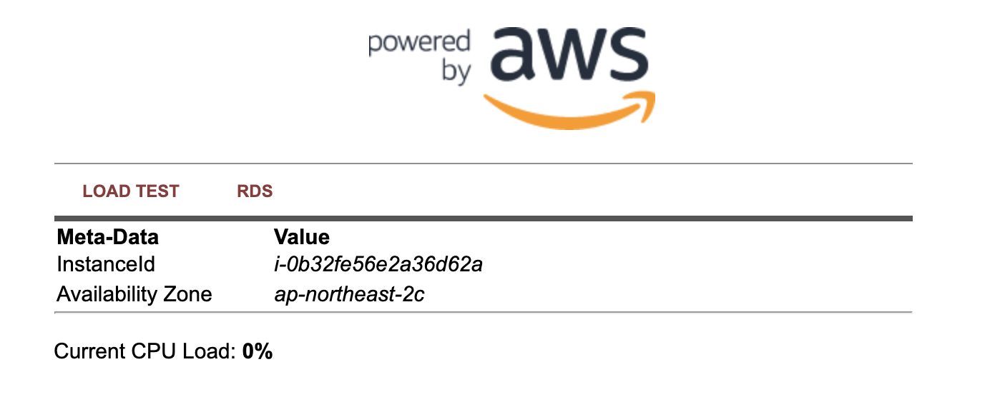
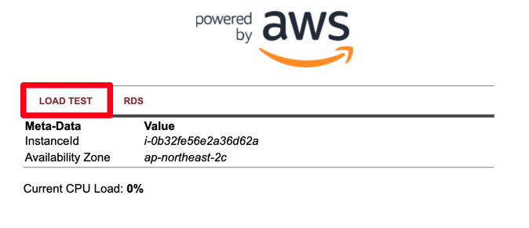
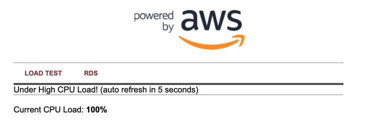
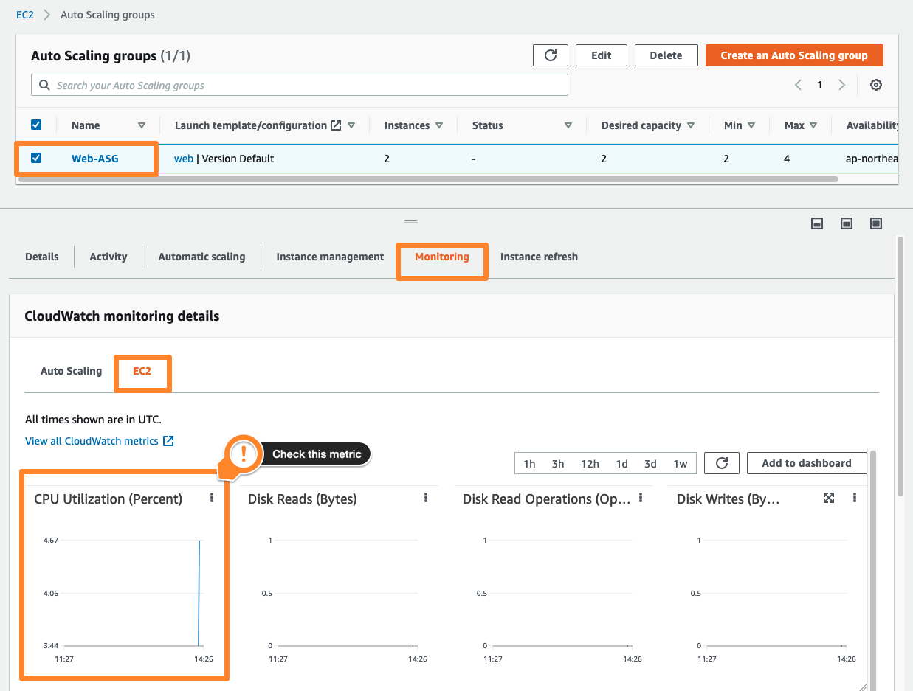
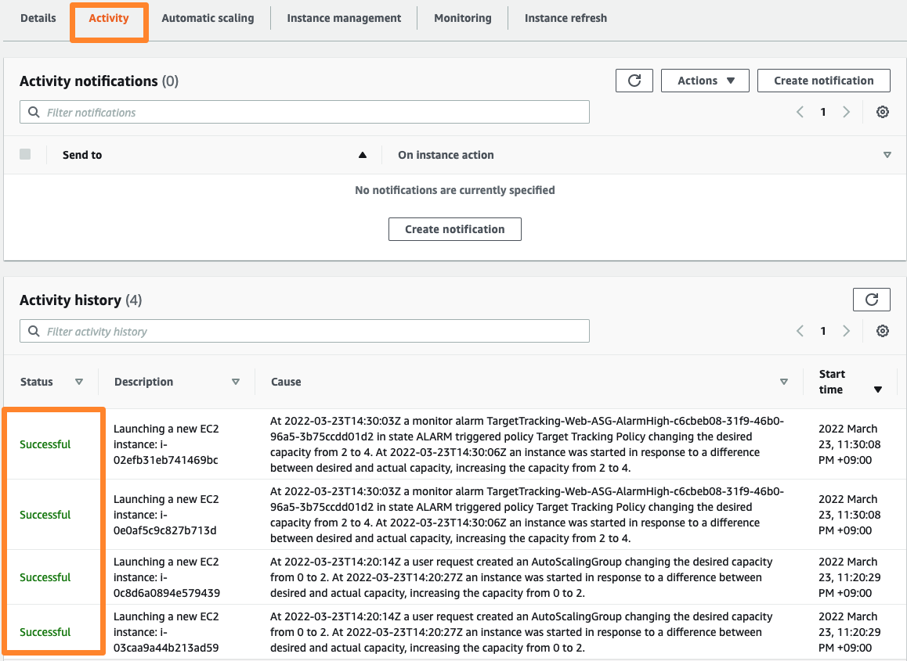
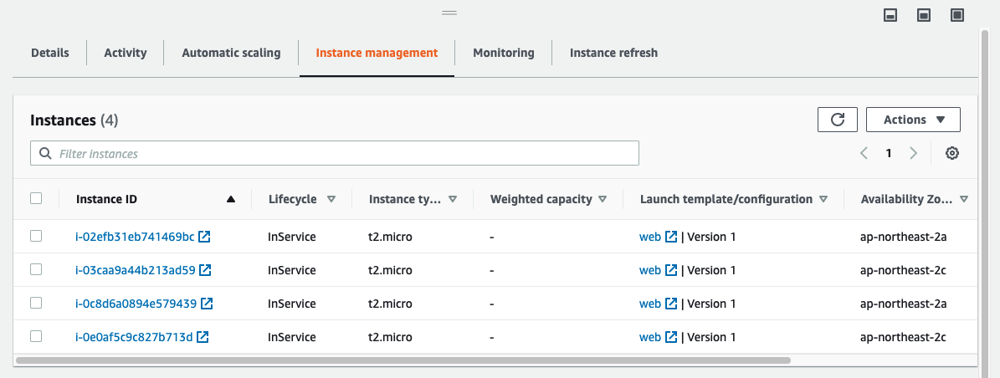

# 웹 서비스 확인 및 테스트
: 이제 구성한 서비스가 정상적으로 동작하는지 테스트해 보겠습니다. 먼저 정상적으로 웹 사이트에 접속 가능한지, 로드 밸런서가 동작하는지 확인한 후, 웹 서버에 부하를 주어 Auto Scaling이 동작하는지 확인해 보겠습니다.

--------------------------------

## 웹 서비스 및 로드 밸런서 동작 확인

1. 해당 웹 서비스에 구성한 Application Load Balancer를 통해 접속하기 위해, EC2 콘솔에서 Load Balancers 메뉴를 클릭하고, 아까 생성한 Web-ALB를 선택해 줍니다. 여기서 기본 구성의 DNS 이름 을 복사해 줍니다.

2. 브라우저에서 새 탭을 열고 복사한 DNS 이름 을 붙여 넣습니다. 아래와 같이 EC2 Lab에서 본 웹 서비스가 동작하는 것을 확인할 수 있습니다. 아래 그림의 경우 ap-northeast-2a 의 웹 인스턴스에서 해당 웹 페이지를 서비스하고 있다는 것을 확인할 수 있습니다.

3. 여기서 새로 고침 버튼을 눌러 보면, 아래와 같이 웹 페이지를 서비스하는 호스트가 다른 가용 영역의 인스턴스 (ap-northeast-2c) 로 바뀐 것을 볼 수 있습니다. 이는 ALB 타겟 그룹의 라우팅 알고리즘이 기본적으로 Round Robin 방식으로 동작하기 때문입니다.

4. 현재 Auto Scaling 그룹에는 각 인스턴스의 CPU 사용률 30%가 조정 목표로 설정되어 있습니다.
* 인스턴스들의 평균 CPU 사용률이 30% 미만 인 경우 인스턴스 숫자를 줄이고,
* 인스턴스들의 평균 CPU 사용률이 30%를 이상 이면 인스턴스를 추가 배치, 부하를 분산 하여 인스턴스들의 평균 CPU 사용률이 30%가 되도록 조정 정책이 동작합니다.

5. 이제 실제로 부하를 주어 Auto Scaling이 잘 동작하는지 확인해 보겠습니다. 상기 웹 페이지에서 LOAD TEST 메뉴를 클릭합니다. 화면이 바뀌고 가해진 부하가 보입니다. 페이지 좌측 상단의 로고를 클릭해 보면 각 인스턴스에 부하가 걸린 것을 확인할 수 있습니다.

<부하 발생 전>

<부하 발생 후>

※ CPU 부하를 발생시키는 원리는 CPU Idle 값이 30이 넘어가면, 임의의 파일을 만들고 압축하고 압축을 해제하는 작업을 하도록 PHP 코드가 5초 주기로 동작합니다. ALB에 의해서 트래픽이 분산되어 동작되기 때문에 부하를 걸어주고 나면 계속적으로 다른 인스턴스에도 부하가 발생하게 됩니다.

6. EC2 콘솔의 좌측 메뉴에서 Auto Scaling Groups에 들어가, Monitoring 탭을 누릅니다. 아래 Enabled metrics에서 EC2를 누르고, 우측 타임프레임을 1시간으로 설정해 줍니다. 이후 잠시 기다리면 CPU Utilization (Percent) 그래프가 변화하는 것을 보실 수 있습니다.

7. 5분(300초) 정도 기다린 후 Activity 탭을 눌러 보면, 조정 정책에 따라 EC2 인스턴스를 추가 배치하는 것을 보실 수 있습니다.

8. Instance management 탭을 클릭해 보니, 두 개의 인스턴스가 추가적으로 생겨나 총 4개의 인스턴스가 동작중인 것을 볼 수 있습니다.

9. 아까 복사해 둔 ALB DNS를 이용하여 웹 페이지에 접속, 새로 고침을 해 보면 없었던 두 개의 인스턴스에서 웹 페이지를 호스팅하는 것을 확인할 수 있습니다. 새로 생겨난 인스턴스이기 때문에 현재 CPU Load는 0% 입니다. 각각 다른 가용 영역에 생성된 것도 확인 가능합니다. 만약 0%가 아니라면, 부하가 계속 걸리는 상황이기 때문에 100% 이상으로 보일 수 있습니다.

## References
AWS-General Immersion Day