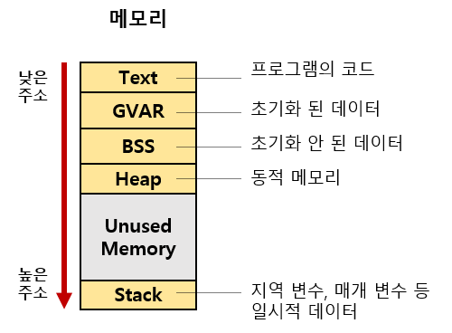

# 프로세스 (Process)
: 프로세스란 컴퓨터의 메모리에 올라와 실행되고 있는 프로그램의 인스턴스. 즉 컴퓨터에서 실행되고 있는 프로그램을 얘기하며 운영체제로 부터 자원을 할당받는 단위라고 볼 수 있다. 

## 프로세스의 메모리 구조

1. Text(Code) 영역 
   - 실행할 `프로그램의 코드`가 CPU에서 수행할 수 있는 기계어로 번역되어 저장되는 공간. 낮은 메모리 주소를 가지며 컴파일시 결정되며 중간에 코드를 바꿀 수 없도록 Read-Only로 설정됨 
2. Data 영역 (GVAR, BSS)
   - `전역 변수, static 변수(정적변수)가 저장되는 공간`으로 프로그램이 시작될때 할당되어 프로그램 종료시 소멸된다. GVAR 영역과 BSS 영역으로 나뉘어 지며, 
   `BSS 영역`에는 초기화 되지 않은 데이터가 저장되고, `GVAR 영역`에는 초기화된 데이터가 저장된다.
3. Heap 영역
   - `동적으로 할당되는 메모리 영역`. 프로그래머가 필요할 때 마다 사용하는 동적인 영역이다. Heap 영역의 경우 Stack 영역과 같은 공간을 공유하기 때문에 서로의 영역에 따라 사이즈가 조절된다.
   - Heap 영역이 클수록 Stack의 영역은 좁아지고, Stack의 영역이 커질수록 Heap의 영역은 좁아진다. 각 영역이 서로의 영역을 침범하게 되면 Stack Overflow, Heap Overflow가 발생하게 된다. 
4. Stack 영역
   - `지역 변수, 매개 변수등 임시적으로 사용되는 데이터를 저장하는 공간`으로 함수가 호출되면 영역을 할당했다가 함수의 호출이 종료되면 반환된다. 
   - 프로세스가 메모리에 로드 될때 스택의 사이즈가 고정되기 때문에 재귀함수의 호출이 너무 깊거나, 지역변수의 할당이 메모리를 초과하게 되면 Stack Overflow가 발생하게 된다.
   - 영역의 이름처럼 Stack 자료구조를 사용하며 LIFO(후입선출)의 형식을 따른다.
# 스레드 (Thread)
: 스레드란 프로세스내에서 실행되는 흐름의 단위를 말하며, 한 프로세스내에서 실행 흐름이 여러개로 나뉘는 것을 멀티 스레드라고 한다. 

## 멀티 프로세스
: 하나의 프로그램을 여러개의 프로세스로 구성하는 것을 말한다. 단, 프로세스 끼리는 메모리를 공유하지 않고 각각 할당받기 때문에 시분할 시스템에서 실행중인 프로세스와 대기중인 프로세스를 교체하는 `Context Switching 비용이 비싸고, 자원소모가 큰편`이다.  
하지만 프로세스끼리는 자원을 공유하지 않기 때문에 하나의 프로세스에 문제가 생겨도 다른 프로세스에는 영향을 주지 않는다는 점이 장점이다. 
ex. Chrome

## 멀티 스레드
: 하나의 프로그램을 여러개의 스레드로 구성하는 것을 말한다. 멀티 프로세스와 달리 스레드끼리는 메모리의 Code, Data, Heap 영역을 공유하기 때문에 `Context Switching 비용이 저렴하고 자원의 소모가 비교적 적은 편`이다. 
단, 메모리를 공유하기 때문에 스레드간의 동기화 문제가 발생할 수 있고, 하나의 스레드에 문제가 생기면 전체 프로세스가 영향을 받는다는 단점이 있다. 
ex. Internet Explorer (IE) 

