# JPA - 연관 관계

## 단방향 연관 관계
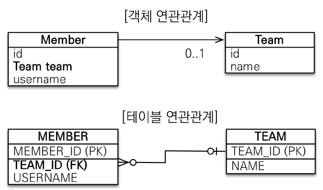<br>
객체를 테이블에 맞춰 데이터 중심으로 모델링하게 되면, 테이블의 경우 외래키를 사용한 조인으로 데이터를 탐색하는 방식임.<br>
객체는 참조를 사용해서 연관된 객체를 찾기때문에 데이터 중심으로 모델링하게 되면 객체 참조의 이점을 활용할 수 없게 된다. <br>
- 객체를 테이블에 맞춰 모델링 : Team 정보를 알려면, 멤버의 team_id를 찾은 후 Team 테이블을 다시 조회<br>
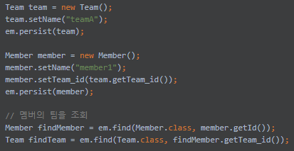 
- 객체 지향 모델링 : 테이블을 조회하지 않아도, Team에 바로 접근 가능 <br>
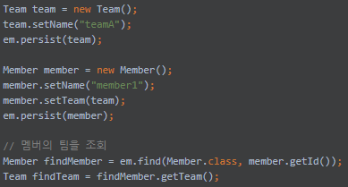
## 양방향 연관 관계
단방향 매핑만으로도 연관 관계 매핑은 완료할 수 있지만, 개발에선 역방향으로 객체를 탐색해야하는 경우가 많음.<br>
그런 경우를 위해 JPA에서 양방향 매핑을 지원함. 하지만 최대한 단방향 매핑을 사용하고, 필요한 경우에만 추가하는 걸 권장.<br>
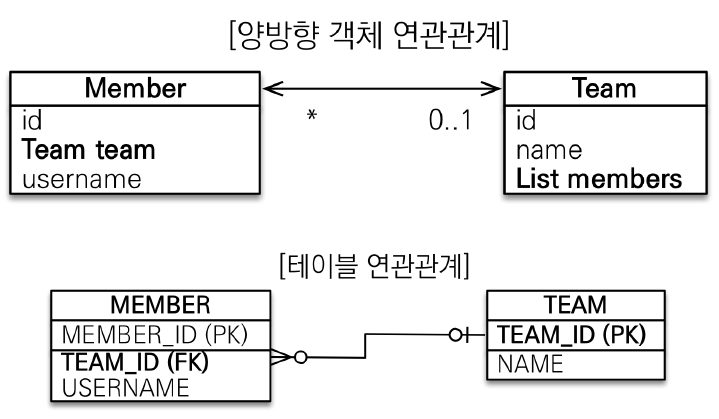

### 다대일 단방향 (N:1)
가장 많이 사용하는 연관 관계로, `다(N)`쪽에 `@ManyToOne` 어노테이션으로 표시하며, `@JoinColumn`으로 해당 테이블에 저장될 외래키의 name을 설정할 수 있다. <br>
@JoinColumn의 referencedColumnName 속성을 이용하면 외래키로 참조할 컬럼값을 설정할 수 있으며, 생략할 경우 연관 관계에 있는 엔티티의 pk값을 대상 컬럼으로 설정한다.<br>
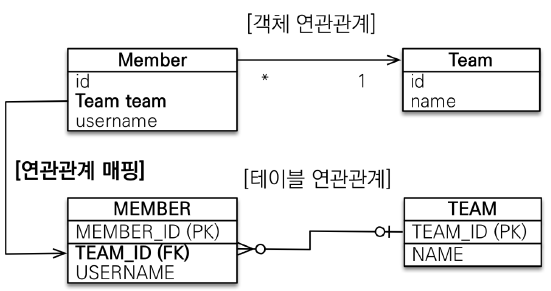
```java
@Entity
public class Member {
    private Long id;
    private String name;
    
    @ManyToOne
    @JoinColumn(name = "team_id", referencedColumnName = "")
    private Team team;
    
}

@Entity
public class Team {
    private Long team_id;
}
```

### 다대일 양방향 (N:1)
다대일 단방향과 유사하나, 양쪽에서 서로 참조할 수 있도록 개발하는 것으로, 외래키가 있는 쪽을 연관 관계의 주인으로 잡는다.<br>
단, 연관관계의 주인이 아닌쪽에서는 읽기전용 매핑이 된다.<br>
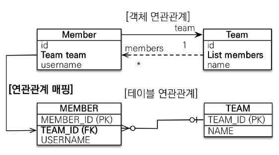
```java
@Entity
public class Member {
    private Long id;
    private String name;
    
    @ManyToOne
    @JoinColumn(name = "team_id") // 연관관계의 주인
    private Team team;
    
}

@Entity
public class Team {
    private Long team_id;
    
    @OneToMany(mappedBy = "team") // 연관관계의 주인이 아님. 읽기전용 매핑
    private List<Member> members = new ArrayList<>();
}
```
### 일대다 단방향 (1:N)
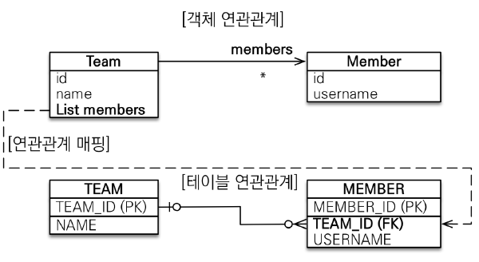<br>
다대일 관계의 반대되는 것으로, 일(1)이 연관 관계의 주인이되는 구조.<br>
실제 테이블에서는 외래키가 N쪽에 있는 구조이기 때문에, 객체 구조와 테이블 구조가 많이 달라짐.<br>
일대다 단방향에서는 @JoinColumn을 사용하지 않으면, JPA에서 자체적으로 중간 테이블을 생성해서 join-table 전략으로 실행함. 그래서 꼭 @JoinColumn을 세팅해줘야함. 
- 단점
   - 엔티티가 관리하는 외래키가 다른 테이블에 있음
   - 연관관계 관리를 위해 UPDATE 쿼리가 추가로 실행됨
- 따라서, `일대다 매핑보다는 다대일 양방향 매핑을 사용하는 것을 추천.`
```java
@Entity
public class Member {
    private Long id;
    private String name;

}

@Entity
public class Team {
    private Long team_id;
    
    @OneToMany
    @JoinColumn(name = "team_id")
    private List<Member> members = new ArrayList<>();
}
```
### 일대다 양방향 (1:N)
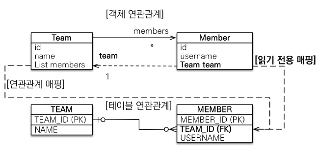<br>
JPA에서 공식적으로 지원하는 것은 아님. N쪽에 @JoinColumn을 세팅해서 읽기전용필드로 만든 다음, 양방향 처럼 사용하는 방법 <br>
추천하는 방법은 아님. 다대일 양방향을 사용하는 것을 추천.
```java
@Entity
public class Member {
    private Long id;
    private String name;
    
    @ManyToOne
    @JoinColumn(name = "team_id", insertable = false, updatable = false)
    private Team team;
}

@Entity
public class Team {
    private Long team_id;
    
    @OneToMany
    @JoinColumn(name = "team_id")
    private List<Member> members = new ArrayList<>();
}
```
### 일대일 단방향 (1:1) - 주 테이블에 외래키 세팅
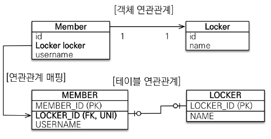<br>
일대일 관계는 외래키 세팅을 어느쪽에 해도 상관없음. 일대일 관계는 외래키에 유니크 제약조건이 추가된다.<br>
- 장점 :주 테이블에 외래키가 있기때문에, 주 테이블만 조회해도 대상 테이블의 데이터 유무를 확인가능함. 
- 단점 : 값이 없으면 외래키에 null값을 허용하게 됨
```java
@Entity
public class Member {
    private Long id;
    private String name;
    
    @OneToOne
    @JoinColumn(name = "LOCKER_ID")
    private Locker locker;
}

@Entity
public class Locker {
    @Id @GeneratedValue
    private Long id;
    private String name;

}
```

### 일대일 양방향 (1:1) - 주 테이블에 외래키 세팅
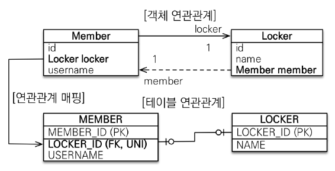<br>

```java
@Entity
public class Member {
    @Id @GeneratedValue
    private Long id;
    private String name;
    
    @OneToOne
    @JoinColumn(name = "LOCKER_ID")
    private Locker locker;
}

@Entity
public class Locker {
    @Id @GeneratedValue
    private Long id;
    private String name;

    @OneToOne
    @JoinColumn(mappedBy = "locker")
    private Member member;
}
```
### 일대일 양방향 (1:1) - 대상 테이블에 외래키 세팅
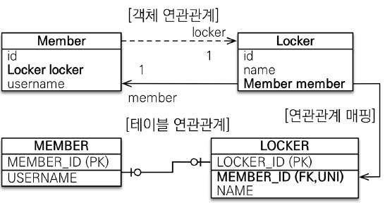<br>
- 장점 : 테이블의 연관 관계를 일대다로 변경하거나 하는 경우, 테이블 구조를 유지할 수 있다.
- 단점 : JPA의 프록시 기능의 한계로 지연 로딩으로 세팅해도 항상 즉시 로딩됨. (-> 외래키값이 대상 테이블에 있기때문에 데이터를 계속 조회 해야하므로 즉시 로딩된다)
```java
@Entity
public class Member {
    @Id @GeneratedValue
    private Long id;
    private String name;
    
    @OneToOne
    @JoinColumn(mappedBy = "locker")
    private Locker locker;
}

@Entity
public class Locker {
    @Id @GeneratedValue
    private Long id;
    private String name;

    @OneToOne
    @JoinColumn(name = "MEMBER_ID")
    private Member member;
}
```
### 다대다 (N:M) - 되도록 쓰지않는게 좋음
객체에서는 컬렉션을 사용해서 객체 2개로 다대다 관계가 표현 가능하지만, 관계형 데이터베이스에서는 정규화된 테이블 2개로는 다대다 관계를 표현할 수 없음. 추가적인 테이블을 사용해서 일대다 - 다대일로 처리해서 풀어야함.<br>
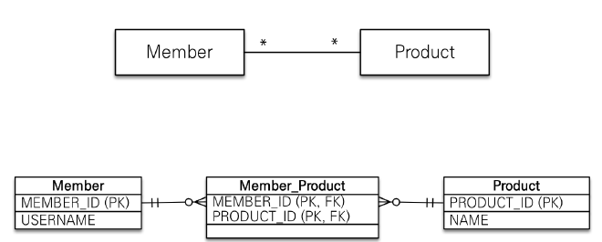
```java
@Entity
public class Product {
    @Id @GeneratedValue
    private Long id;
    private String name;
    
//    @ManyToMany(mappedBy = "products") 양방향 매핑을 하고 싶은 경우 mappedBy 세팅을 해주면 됨
//    private List<Member> members = new ArrayList<>();
}
@Entity
public class Member {
    @Id @GeneratedValue
    private Long id;
    private String name;

    @ManyToMany
    @JoinTable(name = "MEMBER_PRODUCT")
    private List<Product> products = new ArrayList<>();
}

```
- 다대다를 해결하는 방법
  - 중간 연결 테이블을 엔티티로 만들면 됨.<br>
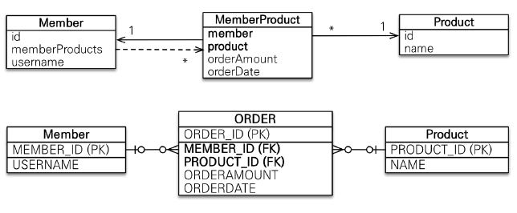
```java
@Entity
public class MemberProduct {
  @Id @GeneratedValue
  private Long id;
  
  @ManyToOne
  @JoinColumn(name = "member")
  private Member member;

  @ManyToOne
  @JoinColumn(name = "product")
  private Product product;

}
@Entity
public class Product {
    @Id @GeneratedValue
    private Long id;
    private String name;
    
    @OneToMany(mappedBy = "product")
    private List<MemberProduct> members = new ArrayList<>();
}
@Entity
public class Member {
    @Id @GeneratedValue
    private Long id;
    private String name;

    @OneToMany(mappedBy = "member")
    private List<MemberProduct> memberProducts = new ArrayList<>();
}
```