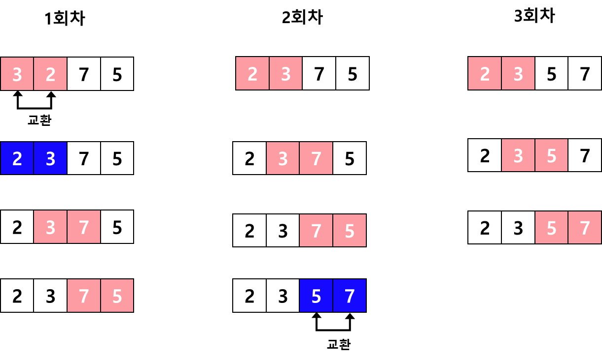

# 버블 정렬 (Bubble Sort)
인접한 두 원소를 서로 비교하여 값을 교환하는 방식의 알고리즘으로, 추가적인 공간을 필요로 하지 않는 In-Place Sort에 해당한다.<br>
추가적으로 중복된 값이 있어도 항상 순서가 동일하게 정렬되는 Stable Sort에 해당되기도 한다.
## 정렬이 되는 과정


## 시간복잡도 - O(N²)
n-1회 반복(대략 N) * n번째까지 인접한 두 값을 비교하여 교환(N) = N²
## 구현 (Java)
```java
public class BubbleSort {
    public int[] sort(int[] arr) {
        int cnt = arr.length - 1;
        while (cnt > 0) {
            cnt--;
            for (int i = 1; i < arr.length; i++) {
                if (arr[i - 1] > arr[i]) {
                    swap(arr, i);
                }
            }
        }
        return arr;
    }
    
    public void swap(int[] arr, int idx) {
        int tmp = arr[idx - 1];
        arr[idx - 1] = arr[idx];
        arr[idx] = tmp;
    }
}

```
