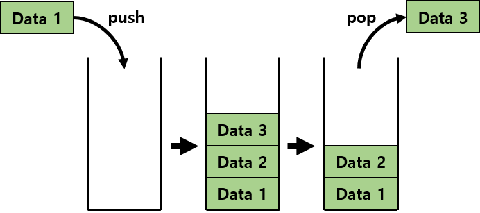

# 스택 (Stack)
<br>
한쪽 끝에서만 원소를 추가하거나 삭제할 수 있는 자료구조로, 가장 먼저 들어간 원소가 가장 마지막에 나오는 First In Last Out의 특징을 갖고있다.

## 스택의 성질
1) 원소의 추가 : O(1)
2) 원소의 제거 : O(1)
3) 제일 상단의 원소 확인 : O(1)

## 스택의 구현
```java
public class Stack<T> {
    private Node<T> top;
    
    public void push(T t) {
        Node<T> node = new Node<>(t);
        node.next = top;
        top = node;
    }
    
    public T pop() {
        if(top == null) throw new EmptyStackException();
        T val = top.val;
        top = top.next;
        return val;
    }
    
    public T top() {
        if(top == null) throw new EmptyStackException();
        return top.val;
    }
    
    class Node<T> {
        private T vla;
        private Node<T> next;
        
        public Node(T val) {
            this.val = val;
        }
    }
}

```