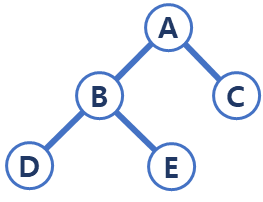

# 이진 트리
각각의 노드가 최대 두 개의 자식 노드를 가지는 트리 자료구조로, 일종의 방향성 그래프이다.<br>

## 이진 트리 탐색
이진 트리의 `모든 노드를 방문하거나, 방문하여 어떤 작업을 하는 것을 이진 트리 탐색`이라고 하며 탐색에는 대표적으로 4가지의 방법이 있다.
* `in-order traversal(중위 순회)`
  * 왼쪽 자식노드(L) - 루트 노드(P) - 오른쪽 자식노드(R) 순서로 방문
    * ex) D - B - E - A - C
* `pre-order traversal(전위 순회)`
  * 루트 노드(P) - 왼쪽 자식노드(L) - 오른쪽 자식노드(R) 순서로 방문
    * ex) A - B - D - E - C
* `post-order traversal(후위 순회)`
  * 왼쪽 자식노드(L) - 오른쪽 자식노드(R) - 루트 노드(P) 순서로 방문
    * ex) D - E - B - C - A
* `level-order traversal(레벨 순회)`
  * 루트 노드 - 루트 노드로부터 깊이 1인 노드들 - 루트 노드로부터 깊이 2인 노드들 ··· 루트 노드로 부터 깊이 N인 노드들 순서로 방문
    * ex) A - B - C - D - E
    
### 각 순회 방법 구현

```java
class Node {
  public String data;
  public Node left;
  public Node right;
}

class Tree {
  public Node root;

  public void setRoot(Node root) {
    this.root = root;
  }

  public Node getRoot() {
    return root;
  }
  public Node makeNode(Node left, int data, Node right) {
    Node node = new Node();
    node.data = data;
    node.left = left;
    node.right = right;
  }
  public void inOrder(Node node) {
      if(node != null) {
        inOrder(node.left);
        System.out.print(node.data + " ");
        inOrder(node.right);
      }
  }
  
  public void preOrder(Node node) {
      if(node != null) {
        System.out.print(node.data + " ");
        preOrder(node.left);
        preOrder(node.right);
      }
  }
  
  public void postOrder(Node node) {
    if (node != null) {
        preOrder(node.left);
        preOrder(node.right);
        System.out.print(node.data + " ");
    }
  }
  
  public void levelOrder(Node node) {
    Queue<Node> queue = new ArrayDeque<>();
    queue.offer(node);

    while (!queue.isEmpty()) {
      Node node1 = queue.poll();
      System.out.print(node1.data + " ");

      if(node1.left != null) queue.offer(node1.left);
      if(node1.right != null) queue.offer(node1.right);
    }
  }
}

public class Test {
  public static void main(String[] args) {
    Tree tree = new Tree();
    Node n1 = tree.makeNode(null, "D", null);
    Node n2 = tree.makeNode(null, "E", null);
    Node n3 = tree.makeNode(n1, "B", n2);
    Node n4 = tree.makeNode(null, "C", null);
    Node n5 = tree.makeNode(n3, "A", n4);
    
    tree.setRoot(n5);
    
    tree.inOrder(tree.getRoot());

    tree.preOrder(tree.getRoot());
    
    tree.postOrder(tree.getRoot());
  }
}

```
