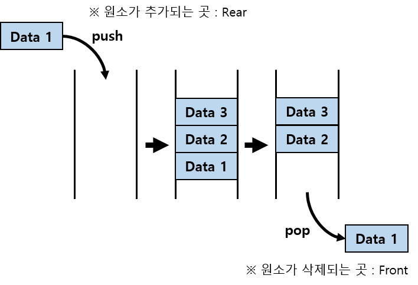

# 큐 (Queue)
<br>
한쪽 끝에서 원소를 추가하고 반대편 끝에서 원소를 삭제하는 형태의 자료구조로, 가장 먼저 들어간 원소가 가장 먼저나오는 First In First Out의 특징을 갖고있다.

## 큐의 성질
1) 원소의 추가 : O(1)
2) 원소의 삭제 : O(1)
3) 제일 앞/뒤의 원소 확인 : O(1)

## 큐의 구현
```java
public class Queue<T> {
    private Node<T> front;
    private Node<T> last;
    
    public void push(T t) {
        Node<T> node = new Node<>(t);
        if(last != null) {
            last.next = node;
        }
        last = node;
        if(front == null) {
            front = last;
        }
    }
    
    public T pop() {
        if(front == null) throw new NoSuchElementException();
        T val = front.val;
        front = front.next;
        
        if(front == null) {
            last = null;
        }
        return val;
    }
    
    public T front() {
        if(front == null) throw new NoSuchElementException();
        return front.val;
    }
    
    public T back() {
        if(last == null) throw new NoSuchElementException();
        return last.val;
    }
    
    public boolean isEmpty() {
        return front == null;
    }
     
    class Node<T> {
        private T val;
        private Node<T> next;
        
        public Node(T val) {
            this.val = val;
        }
    }
}

```