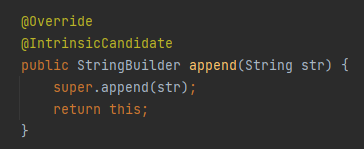
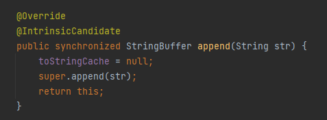

# String
자바에서 문자열을 다루는 대표적인 클래스로, 불변성(immutable)의 특징을 가지고 있다. 
불변한다는 특징때문에 문자열을 추가하거나, 재정의 할때마다 String 인스턴스가 메모리에 새로 생성되므로 
문자열의 추가, 수정, 삭제가 빈번한 경우 String 클래스를 계속해서 사용하면 메모리의 낭비가 발생할 수 있다.

# StringBuilder 
문자열을 다루는 클래스라는 점에서는 String과 동일하나, String과 달리 가변적인 특징을 가지고 있어 
문자열의 추가, 수정, 삭제가 일어나도 새로운 객체가 생성되는게 아니라 동일한 객체내에서 추가, 수정, 삭제가 일어나므로 
문자열을 변경해야하는 일이 빈번한 경우 사용하기에 적합하다.  
멀티 스레드에 대한 Synchronized 처리가 되어있지 않기때문에 단일 스레드에서는 StringBuffer보다 성능이 뛰어난 편이다. 

# StringBuffer
StringBuilder와 마찬가지로 가변적인 특징을 가지고 있어 문자열의 삭제, 추가에 적합한 클래스이다. 
다만 멀티스레드를 지원하지 않는 StringBuilder와 달리 StringBuffer의 경우 Synchronized 처리를 통해 멀티스레드 환경에서도 정상적인 동작을 보장한다.

## StringBuilder vs StringBuffer
멀티 스레드 환경인 경우에는 동기화에 대한 처리가 필요하기 때문에 StringBuffer의 사용을 권장하나, 
단일 스레드의 환경임을 가정했을 경우 StringBuffer는 추가나 삭제등의 연산을 수행할 때 Synchronized 처리를 매번 수행하기때문에 
Synchronized 처리가 안된 StringBuilder를 사용하는 것이 성능면에서 이점을 얻을 수 있다.
|   |String |StringBuilder   | StringBuffer   |
|---|---|---|
|다중 스레드 지원여부| O | X | O |
|불변 여부| O | X | X |